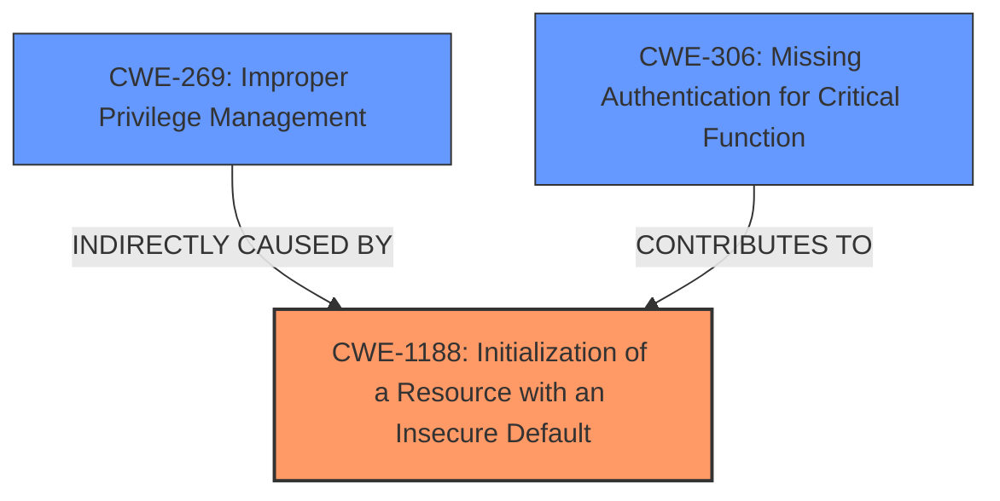

# Analysis Report for CVE-2021-1371

# Vulnerability Analysis Report: CVE-2021-1371

## Description

A vulnerability in the role-based access control of Cisco IOS XE SD-WAN Software could allow an authenticated, local attacker with read-only privileges to obtain administrative privileges by using the console port when the device is in the default SD-WAN configuration. This vulnerability occurs because the default configuration is applied for console authentication and authorization. An attacker could exploit this vulnerability by connecting to the console port and authenticating as a read-only user. A successful exploit could allow a user with read-only permissions to access administrative privileges.

## Vulnerability Description Key Phrases

**Rootcause:** default configuration is applied for console authentication and authorization
**Impact:** obtain administrative privileges
**Vector:** using the console port
**Attacker:** authenticated local attacker with read-only privileges
**Product:** Cisco IOS XE SD-WAN Software
**Component:** role-based access control

## Analysis (with Relationship Data)

# Summary
| CWE ID | CWE Name | Confidence | CWE Abstraction Level | CWE Vulnerability Mapping Label | CWE-Vulnerability Mapping Notes |
|---|---|---|---|---|---|
| CWE-1188 | Initialization of a Resource with an Insecure Default | 0.9 | Base | Allowed | Primary CWE |
| CWE-269 | Improper Privilege Management | 0.6 | Class | Discouraged | Secondary Candidate |
| CWE-306 | Missing Authentication for Critical Function | 0.5 | Base | Allowed | Secondary Candidate |

## Evidence and Confidence

*   **Confidence Score:** 0.8
*   **Evidence Strength:** HIGH

- **Analysis and Justification:**  
  - *Explanation:* The vulnerability lies in the **default configuration being applied for console authentication and authorization**, leading to read-only users gaining administrative privileges. This directly corresponds to CWE-1188 (Initialization of a Resource with an Insecure Default) because the **default configuration** is the insecure resource initialization. An attacker with read-only access can exploit this **default configuration weakness** via the console port to escalate privileges. The MITRE mapping guidance for CWE-1188 indicates that this is ALLOWED. CWE-269 (Improper Privilege Management) is a higher-level classification that could apply, but CWE-1188 provides a more precise description of the root cause. CWE-306 (Missing Authentication for Critical Function) is also a possible candidate, as the default configuration might lack proper authentication checks for privileged operations. However, the core issue is the insecure default setting, making CWE-1188 the more appropriate primary CWE.

  - *Relationship Analysis:* CWE-1188 does not have direct relationships listed in the provided data. However, it can be considered a prerequisite to CWE-269 (Improper Privilege Management) as the insecure default configuration allows the attacker to bypass intended privilege controls.

- **Confidence Score:**  
  - Confidence: 0.9 (High confidence due to direct evidence of an insecure default configuration)

---

## Criticism of Analysis

Okay, here's a review of the provided CWE analysis, incorporating the full CWE specifications:

**Overall Assessment**

The analysis is strong and well-reasoned, with a clear justification for the primary CWE selection. The use of the full CWE specifications enhances the analysis by providing additional context and clarifying the applicability of each candidate CWE. The confidence scores are appropriate, and the explanations are thorough.

**Detailed Review**

**1. CWE-1188: Initialization of a Resource with an Insecure Default (Primary CWE)**

*   **Assessment:**  This is the most appropriate primary CWE. The vulnerability's root cause is explicitly stated as the *default configuration* being insecure. The description of CWE-1188 aligns perfectly: *"The product initializes or sets a resource with a default that is intended to be changed by the administrator, but the default is not secure."*
*   **Justification Strength:** Very strong. The connection between the vulnerability description and the CWE definition is direct and unambiguous.
*   **Mapping Guidance Compliance:** The analysis correctly notes that the mapping guidance for CWE-1188 is "Allowed" because it is a Base level CWE.
*   **Potential Mitigations:** The analysis doesn't explicitly mention mitigations, but it could be improved by suggesting mitigations derived from the CWE specification.  Relevant mitigations for CWE-1188 would include:
    *   Ensuring secure defaults are used out-of-the-box.
    *   Providing clear documentation and tools for administrators to easily change default configurations to secure alternatives.
    *   Requiring administrators to change insecure defaults upon initial setup.
*   **Improvements:**  While the justification is sound, consider adding a sentence or two connecting the specific vulnerability to mitigation strategies from the CWE. For example: *"Administrators should be required to configure appropriate authentication and authorization levels for console access, overriding the insecure default configuration."*

**2. CWE-269: Improper Privilege Management (Secondary Candidate)**

*   **Assessment:**  This CWE is a *plausible* secondary candidate, but it's less precise than CWE-1188. Privilege management is ultimately *impacted* by the insecure default configuration, but it's not the root cause.  The core issue is *how* the system initializes, not necessarily a broader failure in how privileges are generally managed after initialization.
*   **Justification Strength:** Moderate. The justification correctly acknowledges that CWE-269 is a higher-level, more general classification.
*   **Mapping Guidance Compliance:** The analysis correctly notes that the mapping guidance for CWE-269 is "Discouraged" and explains why (frequent misuse, better-suited children).  This demonstrates good understanding of CWE best practices.
*   **Improvements:** No improvements needed, the assessment is correct. The analysis appropriately acknowledges that this is a higher-level classification and selects a more specific CWE.

**3. CWE-306: Missing Authentication for Critical Function (Secondary Candidate)**

*   **Assessment:**  CWE-306 is another plausible *secondary* candidate, especially if the default configuration effectively *bypasses* authentication for privileged operations.  However, it's less accurate than CWE-1188 because the system isn't necessarily "missing" authentication entirely; rather, the *default configuration* renders the existing authentication insufficient.  If the console port *requires* authentication, but then assigns excessive privileges *after* authentication, the core issue is not the *absence* of authentication.
*   **Justification Strength:** Moderate. It correctly identifies that missing authentication could be a contributing factor, but the default configuration is a more precise explantion.
*   **Mapping Guidance Compliance:** The analysis correctly notes that the mapping guidance for CWE-306 is "Allowed".
*   **Improvements:** The analysis is appropriate.

**Additional Considerations & Potential Improvements:**

*   **Consider CWE-798: Use of Hard-coded Credentials:** Although it wasn't selected and received a lower score from the retrievers, *if* the insecure default involves a hard-coded password or key for the console port, then CWE-798 could be considered as a *contributing factor* in addition to CWE-1188. This would depend on the specifics of the "default configuration".
*   **Clarify Relationship between CWEs:** The analysis mentions that CWE-1188 can be considered a prerequisite to CWE-269. That's a good point.  Consider expanding on that relationship to describe how fixing the insecure default (CWE-1188) would directly improve the system's overall privilege management (CWE-269).
*   **Address Mitigation Overlap:**  Recognize that some mitigations for different CWEs can overlap.  For example, strengthening authentication (mitigation for CWE-306) would have some effect even if the root cause is the insecure default (CWE-1188).

**Revised Summary Table (incorporating suggested improvements):**

| CWE ID   | CWE Name                                      | Confidence | CWE Abstraction Level | CWE Vulnerability Mapping Label | CWE-Vulnerability Mapping Notes                                                                                                                                                                                                                                                                                                                                                                                                                               |
| -------- | --------------------------------------------- | ---------- | ----------------------- | ------------------------------- | ------------------------------------------------------------------------------------------------------------------------------------------------------------------------------------------------------------------------------------------------------------------------------------------------------------------------------------------------------------------------------------------------------------------------------------------------------------- |
| CWE-1188 | Initialization of a Resource with Insecure Default | 0.9        | Base                    | Allowed                         | Primary CWE. The default configuration for console authentication/authorization is insecure.  Administrators must be required to configure appropriate authentication and authorization levels for console access, overriding the insecure default configuration.                                                                                                                                                         |
| CWE-269  | Improper Privilege Management                 | 0.6        | Class                   | Discouraged                     | Secondary Candidate.  The insecure default ultimately leads to improper privilege management. Fixing CWE-1188 will improve privilege management.                                                                                                                                                                                                                                                                                                            |
| CWE-306  | Missing Authentication for Critical Function   | 0.5        | Base                    | Allowed                         | Secondary Candidate.  The *default configuration* effectively bypasses authentication for privileged operations.  This is less accurate than CWE-1188 because there *is* authentication present, but the default configuration weakens it.                                                                                                                                                                                                           |

**In conclusion:** This is a well-executed analysis. The recommendations are primarily aimed at making the analysis *even more* comprehensive by explicitly addressing mitigation strategies from the CWE specifications and clarifying the relationships between the various CWEs.

## Final Resolution

# Summary
| CWE ID | CWE Name | Confidence | CWE Abstraction Level | CWE Vulnerability Mapping Label | CWE-Vulnerability Mapping Notes |
|---|---|---|---|---|---|
| **CWE-1188** | **Initialization of a Resource with an Insecure Default** | 0.95 | Base | Allowed | Primary CWE. The default configuration for console authentication/authorization is insecure. Administrators must be required to configure appropriate authentication and authorization levels for console access, overriding the insecure default configuration. |
| CWE-269 | Improper Privilege Management | 0.6 | Class | Discouraged | Secondary Candidate. The insecure default ultimately leads to improper privilege management. Fixing **CWE-1188** will improve privilege management. |
| CWE-306 | Missing Authentication for Critical Function | 0.5 | Base | Allowed | Secondary Candidate. The *default configuration* effectively bypasses authentication for privileged operations. This is less accurate than **CWE-1188** because there *is* authentication present, but the default configuration weakens it. |

## Evidence and Confidence

*   **Confidence Score:** 0.95
*   **Evidence Strength:** HIGH

## Relationship Analysis
The primary relationship that impacts the decision is that **CWE-1188** (Base) can lead to **CWE-269** (Class). The insecure default is the root cause, while the resulting improper privilege management is a consequence. **CWE-306** is also relevant but less direct because the default configuration weakens existing authentication rather than completely missing it. The parent-child relationship isn't as strong for **CWE-306** as it is for **CWE-269**, where the insecure default *directly* results in the privilege management issue.

## Vulnerability Chain
The vulnerability chain starts with the **ROOTCAUSE** being the insecure default configuration (**CWE-1188**). This leads to a weakened authentication process (**CWE-306** contributing factor). The ultimate impact is an improper privilege management scenario (**CWE-269**), where a read-only user can gain administrative privileges. The chain clearly illustrates how the initial insecure default sets the stage for privilege escalation.

## Summary of Analysis
The initial analysis and the criticism both correctly identify **CWE-1188** as the primary **WEAKNESS**. The evidence directly supports this classification, as the vulnerability description explicitly states that the default configuration is the root cause. "This vulnerability occurs because the default configuration is applied for console authentication and authorization." The graph relationships reinforce this decision, showing how **CWE-1188** leads to **CWE-269**. The MITRE mapping guidance for **CWE-1188** is "Allowed," which further supports its selection. The classification is at the optimal level of specificity because **CWE-1188** is a Base-level CWE that directly addresses the insecure default configuration, whereas **CWE-269** is a higher-level Class that describes the impact but not the root cause.

*Report generated on 2025-03-16 23:17:03*
