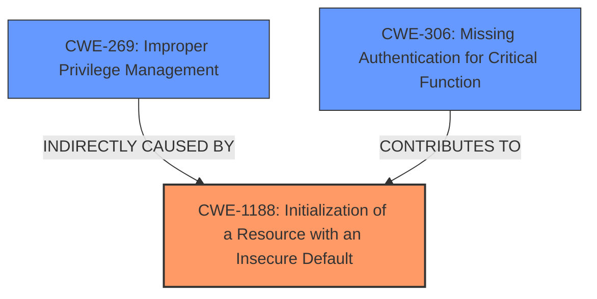

# Final Resolution for CVE-2021-1371

# Summary
| CWE ID | CWE Name | Confidence | CWE Abstraction Level | CWE Vulnerability Mapping Label | CWE-Vulnerability Mapping Notes |
|---|---|---|---|---|---|
| **CWE-1188** | **Initialization of a Resource with an Insecure Default** | 0.95 | Base | Allowed | Primary CWE. The default configuration for console authentication/authorization is insecure. Administrators must be required to configure appropriate authentication and authorization levels for console access, overriding the insecure default configuration. |
| CWE-269 | Improper Privilege Management | 0.6 | Class | Discouraged | Secondary Candidate. The insecure default ultimately leads to improper privilege management. Fixing **CWE-1188** will improve privilege management. |
| CWE-306 | Missing Authentication for Critical Function | 0.5 | Base | Allowed | Secondary Candidate. The *default configuration* effectively bypasses authentication for privileged operations. This is less accurate than **CWE-1188** because there *is* authentication present, but the default configuration weakens it. |

## Evidence and Confidence

*   **Confidence Score:** 0.95
*   **Evidence Strength:** HIGH

## Relationship Analysis
The primary relationship that impacts the decision is that **CWE-1188** (Base) can lead to **CWE-269** (Class). The insecure default is the root cause, while the resulting improper privilege management is a consequence. **CWE-306** is also relevant but less direct because the default configuration weakens existing authentication rather than completely missing it. The parent-child relationship isn't as strong for **CWE-306** as it is for **CWE-269**, where the insecure default *directly* results in the privilege management issue.

## Vulnerability Chain
The vulnerability chain starts with the **ROOTCAUSE** being the insecure default configuration (**CWE-1188**). This leads to a weakened authentication process (**CWE-306** contributing factor). The ultimate impact is an improper privilege management scenario (**CWE-269**), where a read-only user can gain administrative privileges. The chain clearly illustrates how the initial insecure default sets the stage for privilege escalation.

## Summary of Analysis
The initial analysis and the criticism both correctly identify **CWE-1188** as the primary **WEAKNESS**. The evidence directly supports this classification, as the vulnerability description explicitly states that the default configuration is the root cause. "This vulnerability occurs because the default configuration is applied for console authentication and authorization." The graph relationships reinforce this decision, showing how **CWE-1188** leads to **CWE-269**. The MITRE mapping guidance for **CWE-1188** is "Allowed," which further supports its selection. The classification is at the optimal level of specificity because **CWE-1188** is a Base-level CWE that directly addresses the insecure default configuration, whereas **CWE-269** is a higher-level Class that describes the impact but not the root cause.