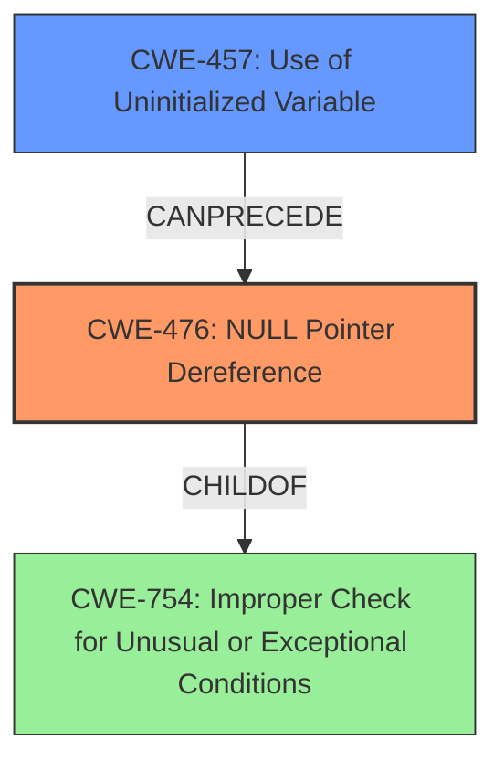

# Final Resolution for CVE-2021-1405

# Summary
| CWE ID  | CWE Name                                           | Confidence | CWE Abstraction Level | CWE Vulnerability Mapping Label | CWE-Vulnerability Mapping Notes |
| :-------- | :------------------------------------------------- | :--------- | :-------------------- | :------------------------------ | :------------------------------ |
| CWE-476 | **NULL Pointer Dereference**                           | 0.95       | Base                  | Allowed                         | Primary CWE                     |
| CWE-457 | **Use of Uninitialized Variable**                | 0.85       | Variant               | Allowed                         | Secondary Candidate             |

## Evidence and Confidence

*   **Confidence Score:** 0.92
*   **Evidence Strength:** HIGH

## Relationship Analysis
The primary **WEAKNESS** is CWE-476 **(NULL Pointer Dereference)**, which occurs when the code attempts to dereference a pointer that is unexpectedly NULL. This is directly supported by the vulnerability description, which mentions a "**NULL pointer read**". The **ROOTCAUSE** for this is CWE-457 **(Use of Uninitialized Variable)**. An uninitialized variable results in a NULL pointer, triggering the dereference.

## Vulnerability Chain
The vulnerability chain starts with the **ROOTCAUSE** of CWE-457 **(Use of Uninitialized Variable)**. Due to **missing initialization**, a pointer variable contains a NULL value. Subsequently, the code attempts to dereference this NULL pointer, leading to CWE-476 **(NULL Pointer Dereference)**, which results in a denial-of-service (DoS) due to the crash of the ClamAV scanning process.

## Summary of Analysis
The initial analysis correctly identified CWE-476 **(NULL Pointer Dereference)** as the primary **WEAKNESS**, given the explicit mention of "**NULL pointer read**" in the vulnerability description. The initial analysis also correctly identified CWE-456 **(Missing Initialization of a Variable)** as a secondary candidate, but I am updating this to CWE-457 **(Use of Uninitialized Variable)**, which is more precise and maps directly to the **ROOTCAUSE** of the vulnerability. The vulnerability description states that the vulnerability is due to "**improper variable initialization**" that may result in a "**NULL pointer read**".

The relationship analysis confirms that CWE-476 is a base-level CWE, and its parent, CWE-754 (Improper Check for Unusual or Exceptional Conditions), is a more general condition. The chain relationship clarifies that CWE-457 can precede CWE-476, representing the progression from the **ROOTCAUSE** to the direct impact.

The retriever results provide additional context, but many of those CWEs are speculative and not directly supported by the vulnerability description.

The selection of CWE-476 and CWE-457 provides an optimal level of specificity, directly addressing the **NULL pointer dereference** and its underlying **ROOTCAUSE** of using an uninitialized variable, respectively.