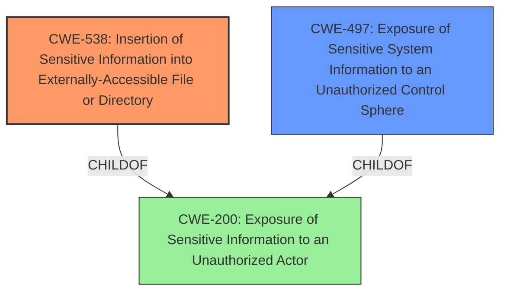

# Final Resolution for CVE-2021-1406

# Summary

| CWE ID  | CWE Name                                                               | Confidence | CWE Abstraction Level | CWE Vulnerability Mapping Label | CWE-Vulnerability Mapping Notes |
| ------- | ---------------------------------------------------------------------- | ---------- | --------------------- | ------------------------------- | ----------------------------- |
| CWE-538 | Insertion of Sensitive Information into Externally-Accessible File or Directory | 0.95       | Base                  | Primary                         | Allowed                       |
| CWE-497 | Exposure of Sensitive System Information to an Unauthorized Control Sphere | 0.70       | Base                  | Secondary                       | Allowed                       |

## Evidence and Confidence

*   **Confidence Score:** 0.90
*   **Evidence Strength:** HIGH

## Relationship Analysis

The primary CWE is CWE-538, which is a child of CWE-200 (Information Exposure). The secondary CWE is CWE-497 which is also a child of CWE-200. Both CWEs accurately describe the vulnerability, but CWE-538 is more specific because it involves downloadable files. The parent-child relationship confirms that both are related to information exposure, but CWE-538 provides more granular detail. There are no chain relationships applicable here.

## Vulnerability Chain

The vulnerability chain starts with the **ROOTCAUSE** which is the **improper inclusion of sensitive information (hashed credentials) in downloadable files** (**CWE-538**). An authenticated attacker with elevated privileges can then issue specific commands to access these files. The impact is the exposure of sensitive information (**CWE-497**), allowing the attacker to obtain hashed credentials of system users.

## Summary of Analysis

The initial analysis correctly identified CWE-538 as the primary weakness because the vulnerability description explicitly mentions the inclusion of sensitive information in downloadable files. The criticism reinforced this decision and suggested additional considerations.

"The vulnerability is due to **improper inclusion of sensitive information in downloadable files**. An attacker could exploit this vulnerability by authenticating to an affected device and issuing a specific set of commands. A successful exploit could allow the attacker to obtain hashed credentials of system users."

The graph relationships show that both CWE-538 and CWE-497 are children of CWE-200, confirming their relevance to information exposure. However, CWE-538 is more specific because it details the method of exposure (downloadable files), making it the optimal choice for the primary classification.

The selected CWEs are at the optimal level of specificity because CWE-538 directly reflects the **ROOTCAUSE** of the vulnerability, and CWE-497 captures the broader impact of information exposure. Higher-level CWEs like CWE-200 would be too generic, while lower-level CWEs might not fully capture the essence of the vulnerability.