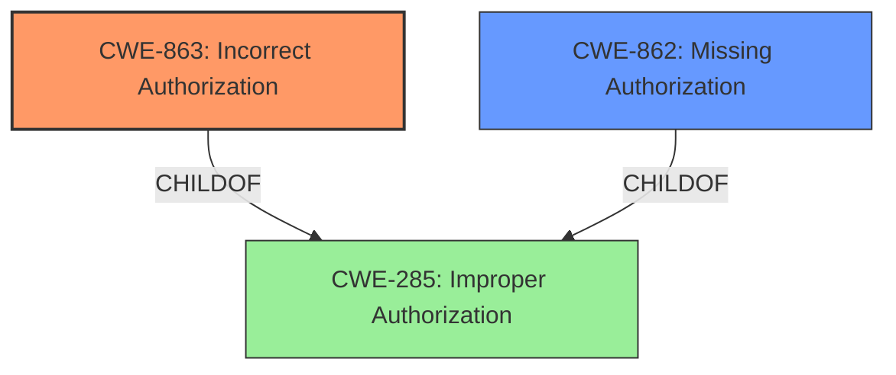

# Final Resolution for CVE-2021-1561

# Summary
| CWE ID | CWE Name | Confidence | CWE Abstraction Level | CWE Vulnerability Mapping Label | CWE-Vulnerability Mapping Notes |
|---|---|---|---|---|---|
| **CWE-863** | **Incorrect Authorization** | 0.8 | Class | Primary CWE | The product performs an authorization check when an actor attempts to access a resource or perform an action, but it does not correctly perform the check. |
| CWE-862 | Missing Authorization | 0.6 | Class | Secondary Candidate | The product does not perform an authorization check when an actor attempts to access a resource or perform an action. |

## Evidence and Confidence

*   **Confidence Score:** 0.8
*   **Evidence Strength:** MEDIUM

## Relationship Analysis
The initial analysis pointed to CWE-285 (Improper Authorization), a Class-level CWE. The criticism correctly suggested exploring its children, CWE-862 (Missing Authorization) and CWE-863 (Incorrect Authorization), for more specificity.

CWE-863 is a child of CWE-285, offering a more specific classification. The chain of reasoning is: the vulnerability exists because authorization is not working correctly, and since the attacker is authenticated, some form of authorization must be present but flawed. Therefore, CWE-863 is a more precise fit. CWE-862 would be appropriate if *no* authorization check were performed, but the authentication requirement implies some authorization attempt.

## Vulnerability Chain
The vulnerability chain starts with **CWE-863 (Incorrect Authorization)**. This leads to unauthorized access to another user's spam quarantine settings, potentially allowing the attacker to modify these settings (disabling security controls) or view email messages. The root cause is the **incorrect authorization** check, and the impact is unauthorized access and modification of data.

## Summary of Analysis
The initial analysis correctly identified an authorization issue but selected a high-level CWE. The criticism provided valuable insight into refining the classification by considering the children of CWE-285.

The vulnerability description states that "access to the spam quarantine feature is not properly restricted," which initially led to the selection of CWE-285. However, the fact that the attacker is "authenticated" suggests that some form of authorization *is* in place, but it's not functioning correctly. This makes **CWE-863 (Incorrect Authorization)** a more accurate and specific classification.

The graph relationships, particularly the child-of relationship between CWE-863 and CWE-285, were crucial in making this decision. The mapping guidance for CWE-285 discourages its use due to its high-level nature, further supporting the shift to a more specific CWE.

The retriever results also support this decision. Although CWE-639 (Authorization Bypass Through User-Controlled Key) was suggested, there isn't enough information to make this determination.

Therefore, based on the evidence and the relationship analysis, **CWE-863 (Incorrect Authorization)** is the most appropriate primary CWE for this vulnerability.