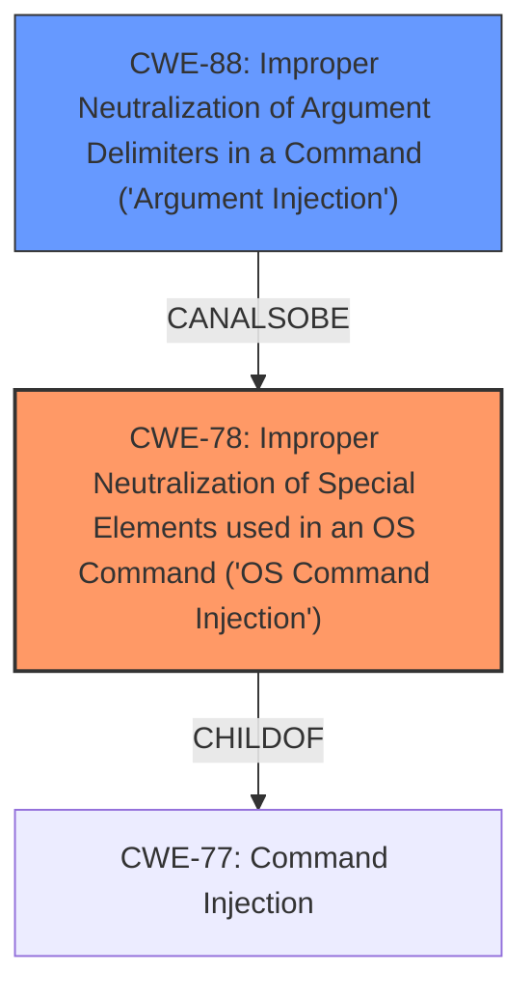

# Analysis Report for CVE-2021-1581

# Vulnerability Analysis Report: CVE-2021-1581

## Description

Multiple vulnerabilities in the web UI and API endpoints of Cisco Application Policy Infrastructure Controller (APIC) or Cisco Cloud APIC could allow a remote attacker to perform a command injection or file upload attack on an affected system. For more information about these vulnerabilities, see the Details section of this advisory.

## Vulnerability Description Key Phrases

**Weakness:** command injection
**Impact:** ['arbitrary file write', 'execute system commands']
**Attacker:** remote attacker
**Product:** Cisco APIC
**Component:** web UI and API endpoints

## Analysis (with Relationship Data)

# Summary
| CWE ID | CWE Name | Confidence | CWE Abstraction Level | CWE Vulnerability Mapping Label | CWE-Vulnerability Mapping Notes |
|---|---|---|---|---|---|
| CWE-78 | Improper Neutralization of Special Elements used in an OS Command ('OS Command Injection') | 0.9 | Base | Primary | Allowed |
| CWE-20 | Improper Input Validation | 0.6 | Class | Secondary Candidate | Discouraged |
| CWE-425 | Missing Required Authorization | 0.6 | Base | Secondary Candidate | Allowed |

## Evidence and Confidence

*   **Confidence Score:** 0.75
*   **Evidence Strength:** MEDIUM

- **Analysis and Justification:**  
  - *Explanation:* The vulnerability description explicitly mentions "**command injection**" in the web UI and API endpoints of Cisco APIC, which directly aligns with CWE-78 (Improper Neutralization of Special Elements used in an OS Command). The description also indicates that a remote attacker could execute system commands, further supporting the choice of CWE-78. The "CWE for similar CVE Descriptions" section lists CWE-78 as the primary match and the top CWE. The retriever results also list CWE-78 with a high score.
  - *Explanation:* CWE-20 (Improper Input Validation) is a potential secondary weakness because **command injection** often stems from a failure to properly validate user input. However, the description focuses more on the **command injection** itself rather than general input validation issues. Since CWE-20 is a high-level class and the description is more specific, CWE-78 is a better primary fit. The "CWE for similar CVE Descriptions" lists CWE-20 as one of the top CWEs.
  - *Explanation:* The "CVE Reference Links Content Summary" of CVE-2021-1581 indicates "Improper access control in an API endpoint of Cisco APIC or Cisco Cloud APIC" and "Lack of proper access control allows for unauthorized file uploads". This suggests CWE-425 (Missing Required Authorization) could be a contributing factor. However, the primary vulnerability described is **command injection**. The provided vulnerability description doesn't give enough detail to determine whether there is a missing authorization.

  - *Relationship Analysis:* CWE-78 is a child of CWE-77 (Command Injection). It is also related to CWE-74 (Improper Neutralization of Special Elements). CWE-20 is a class-level CWE, and its usage is discouraged when a more specific CWE is available.

- **Confidence Score:**  
  - *CWE-78 Confidence:* 0.9 (High confidence due to direct mention of command injection and execution of system commands)
  - *CWE-20 Confidence:* 0.6 (Medium confidence as it is a general weakness that could contribute to the command injection)
  - *CWE-425 Confidence:* 0.6 (Medium confidence as it is related to unauthorized file uploads, based on CVE-2021-1581, but is not the primary focus)

## Criticism of Analysis

Okay, I've reviewed the provided analysis and the full CWE specifications for the identified weaknesses. Here's a critique, focusing on the appropriateness of the CWE selections, confidence levels, and any potential alternative or additional CWEs:

**Overall Assessment:**

The analysis is generally good, particularly the primary CWE of CWE-78. The reasoning is well-articulated and supported by the vulnerability description. However, the secondary CWEs are weaker, and CWE-425 is not a strong fit. The usage of CWE-20 should be carefully considered, given its discouraged status.

**Detailed Review:**

1.  **CWE-78: Improper Neutralization of Special Elements used in an OS Command ('OS Command Injection')**

    *   **Assessment:** Excellent. The direct mention of "command injection" and the potential for "execute system commands" in the original vulnerability description makes this a strong and appropriate primary CWE. The high confidence (0.9) is justified.
    *   **Mapping Guidance:** Allowed, which confirms the appropriateness of the choice.
    *   **Mitigations:** The listed mitigations (using library calls, static command creation, input validation) are all relevant and standard defenses against command injection.
    *   **Observed Examples:** The list of observed examples are relevant to command injection.
    *   **No Changes Needed:** This CWE selection is accurate and well-supported.

2.  **CWE-20: Improper Input Validation**

    *   **Assessment:**  This is a weaker choice as a secondary CWE. While input validation is often *related* to command injection (or really any injection flaw), it's a very general, high-level weakness. The analysis *does* acknowledge that CWE-20 is a class-level CWE and its use is discouraged when a more specific CWE is available, as per the CWE specification guidance.
    *   **Mapping Guidance:** Discouraged. The analysis correctly points out this fact. The suggestion is to consider lower-level children.
    *   **Mitigations:**  Mitigations are too broad to be specifically effective.
    *   **Observed Examples:** The examples provided are valid cases of CWE-20 but only some are chained with other injection CWEs (such as 73 and 190).
    *   **Recommended Change:** Consider replacing this with a more specific CWE related to input validation for command injection, if possible.  Some possible alternatives to explore (depending on the specific implementation details, which are not fully revealed in the description):
        *   **CWE-88: Improper Neutralization of Argument Delimiters in a Command ('Argument Injection')**: If the vulnerability involves injecting additional arguments into the command being executed.
        *   **CWE-1286: Improper Validation of Syntactic Correctness of Input**: If the input is not checked for correct syntax before being used in the command.
        *   No secondary CWE may be needed.

3.  **CWE-425: Missing Required Authorization**

    *   **Assessment:** This is the weakest choice.  The evidence for this CWE is solely based on the CVE Reference Links Content Summary of CVE-2021-1581, which mentions "Improper access control" and "unauthorized file uploads." The primary vulnerability described is **command injection**, not unauthorized file uploads. The analysis itself admits that it doesn't have enough detail to determine missing authorization.
    *   **Mapping Guidance:** Allowed, but the description needs a very careful read to ensure it's an appropriate fit.
    *   **Mitigations:** The mitigations focus on access control, which is not the central issue of command injection.
    *    **Observed Examples:** The provided examples are valid instances of CWE-425, but don't fit the described file upload vulnerability.
    *   **Recommended Change:** Remove this CWE. It's not directly related to the command injection vulnerability being described.
        *   If file upload was the primary vulnerability in CVE-2021-1581, then the root cause weakness might be CWE-434: Unrestricted Upload of File with Dangerous Type.

**Additional Considerations:**

*   **Chain Analysis:** The analysis could benefit from explicitly stating the potential *chains* of weaknesses. For example, it could mention that CWE-78 often results from CWE-20 or a more specific child of CWE-20.

*   **CWE Selection Rationale:** When selecting CWEs, especially secondary ones, explicitly state *how* the vulnerability deviates from or is related to other top CWEs from the retriever results. For example, why *isn't* CWE-79 (XSS) or CWE-22 (Path Traversal) more relevant?

**Revised Summary Table (Suggested):**

| CWE ID | CWE Name | Confidence | CWE Abstraction Level | CWE Vulnerability Mapping Label | CWE-Vulnerability Mapping Notes |
|---|---|---|---|---|---|
| CWE-78 | Improper Neutralization of Special Elements used in an OS Command ('OS Command Injection') | 0.9 | Base | Primary | Allowed |
| CWE-88 | Improper Neutralization of Argument Delimiters in a Command ('Argument Injection') | 0.5 | Base | Secondary Candidate | Allowed |

**Key Improvements Made:**

*   Replaced CWE-20 with CWE-88 since the command injection could be exploiting a missing argument delimeter to insert commands.
*   Removed CWE-425 since it is not directly related to command injection.

By focusing on the most direct cause of the command injection, and providing reasoning that aligns directly with CWE specifications, the analysis becomes more accurate and helpful. Remember, a smaller number of high-confidence CWEs is often better than a larger number of weak or speculative CWEs.

## Final Resolution

# Summary
| CWE ID | CWE Name | Confidence | CWE Abstraction Level | CWE Vulnerability Mapping Label | CWE-Vulnerability Mapping Notes |
|---|---|---|---|---|---|
| CWE-78 | Improper Neutralization of Special Elements used in an OS Command ('OS Command Injection') | 0.95 | Base | Primary | Allowed |
| CWE-88 | Improper Neutralization of Argument Delimiters in a Command ('Argument Injection') | 0.65 | Base | Secondary Candidate | Allowed |

## Evidence and Confidence

*   **Confidence Score:** 0.90
*   **Evidence Strength:** MEDIUM

## Relationship Analysis
The primary relationship that impacted the decision was the parent-child relationship between CWE-77 (Command Injection) and CWE-78 (Improper Neutralization of Special Elements used in an OS Command). CWE-78 is a specific type of command injection and thus a more precise classification than CWE-77.

CWE-88 (Improper Neutralization of Argument Delimiters in a Command) was considered as a secondary CWE. It is a peer of CWE-78 (CanAlsoBe). It represents a specific way **command injection** can occur, making it a good secondary candidate.

The abstraction levels influenced the selection by preferring base-level CWEs (CWE-78 and CWE-88) over class-level CWEs (like the initially proposed CWE-20), aligning with the goal of achieving optimal specificity.

## Vulnerability Chain
The vulnerability chain starts with the lack of proper input neutralization.
- The **ROOTCAUSE** is the failure to properly neutralize special elements in user-supplied input.
- A **WEAKNESS**, CWE-78, arises when this un-neutralized input is used to construct an OS command.
- A second **WEAKNESS**, CWE-88, might also arise if argument delimiters are not properly handled when constructing the OS command.
- The final impact is the execution of unintended OS commands, leading to potential system compromise.

## Summary of Analysis
The initial analysis correctly identified CWE-78 as the primary weakness due to the explicit mention of "**command injection**" in the vulnerability description. The criticism highlighted the weakness of including CWE-20 due to its high-level nature and the lack of a direct link in the description. It also correctly identified that CWE-425 was not directly related.

The final decision reflects the criticism by removing CWE-425 and replacing CWE-20 with CWE-88. This change is based on the possibility that the **command injection** occurs due to improper handling of argument delimiters, which aligns with the concept of injecting additional arguments into the command being executed.

The selected CWEs are at the optimal level of specificity because they directly address the core issue of **command injection** (CWE-78) and a potential mechanism (CWE-88), while avoiding overly broad classifications. The decision is justified by the vulnerability description, the relationship analysis, and the mapping guidance. Specifically, CWE-78 is chosen because the vulnerability description explicitly states "command injection". CWE-88 is added as a secondary weakness because it could be an exploitation vector for command injection by injecting unintended arguments.

*Report generated on 2025-03-16 17:02:21*
