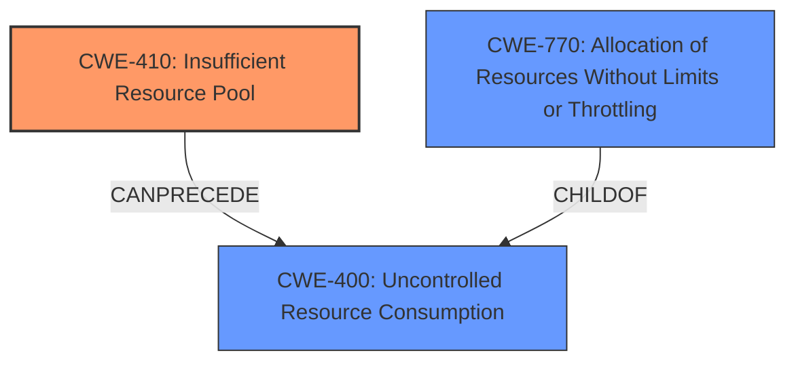

# Analysis Report for CVE-2021-1615

# Vulnerability Analysis Report: CVE-2021-1615

## Description

A vulnerability in the packet processing functionality of Cisco Embedded Wireless Controller (EWC) Software for Catalyst Access Points (APs) could allow an unauthenticated, remote attacker to cause a denial of service (DoS) condition on an affected AP. This vulnerability is due to insufficient buffer allocation. An attacker could exploit this vulnerability by sending crafted traffic to an affected device. A successful exploit could allow the attacker to exhaust available resources and cause a DoS condition on an affected AP, as well as a DoS condition for client traffic traversing the AP.

## Vulnerability Description Key Phrases

**Rootcause:** insufficient buffer allocation
**Impact:** denial of service (DoS)
**Vector:** crafted traffic
**Attacker:** unauthenticated remote attacker
**Product:** Cisco Embedded Wireless Controller (EWC) Software
**Component:** packet processing functionality

## Analysis (with Relationship Data)

# Summary
| CWE ID | CWE Name | Confidence | CWE Abstraction Level | CWE Vulnerability Mapping Label | CWE-Vulnerability Mapping Notes |
|---|---|---|---|---|---|
| CWE-410 | Insufficient Resource Pool | 0.95 | Base | Allowed | Primary CWE |
| CWE-770 | Allocation of Resources Without Limits or Throttling | 0.75 | Base | Allowed | Secondary Candidate |
| CWE-1284 | Improper Validation of Specified Quantity in Input | 0.70 | Base | Allowed | Secondary Candidate |

## Evidence and Confidence

*   **Confidence Score:** 0.90
*   **Evidence Strength:** HIGH

- **Analysis and Justification:**  
  - *Explanation:* "The vulnerability is caused by **insufficient buffer allocation** which leads to a denial-of-service (DoS) condition. The vulnerability description states that an attacker can send crafted traffic to exhaust available resources. This aligns with CWE-410 [Insufficient Resource Pool], which describes a situation where the product's resource pool is not large enough to handle peak demand, allowing an attacker to cause a DoS by using a relatively large number of requests. The CVE Reference Links Content Summary reinforces that the root cause is insufficient buffer allocation. Since the crafted traffic leads to resource exhaustion, CWE-410 is the best fit. MITRE mapping guidance for CWE-410 indicates this is ALLOWED at the Base level of abstraction."

  - *Relationship Analysis:* "CWE-410 is a Base level CWE. It can precede CWE-400 (Uncontrolled Resource Consumption), which aligns with the observed impact of resource exhaustion leading to DoS. CWE-770 (Allocation of Resources Without Limits or Throttling) is a parent of CWE-789 (Memory Allocation with Excessive Size Value) which could be a possible alternate root cause, but insufficient buffer allocation is more precise than allocation without limits in this case."

- **Confidence Score:**  
  - *Example:* Confidence: 0.95 (High evidence from technical description and CVE reference materials)

---

- **Analysis and Justification:**  
  - *Explanation:* "CWE-770 [Allocation of Resources Without Limits or Throttling] is a possible secondary CWE since the root cause involves buffer allocation. The description mentions insufficient buffer allocation. While not explicitly stating allocation without limits, the insufficient allocation could be interpreted as a lack of proper limits, making CWE-770 relevant. However, the primary issue seems to be the size of the resource pool (CWE-410) rather than the lack of allocation limits. MITRE mapping guidance for CWE-770 indicates this is ALLOWED at the Base level of abstraction."

  - *Relationship Analysis:* "CWE-770 is a base level CWE and a child of CWE-400 [Uncontrolled Resource Consumption]. It is also the parent of CWE-789 [Memory Allocation with Excessive Size Value]. It is related to the primary weakness as the allocation strategy is part of the root cause of the vulnerability."

- **Confidence Score:**  
  - *Example:* Confidence: 0.75 (Supporting evidence exists, but CWE-410 is a stronger match)

---

- **Analysis and Justification:**  
  - *Explanation:* "CWE-1284 [Improper Validation of Specified Quantity in Input] is a possible secondary CWE as the crafted traffic likely involves specifying a quantity (e.g., packet size) that is not properly validated, which then triggers the insufficient buffer allocation issue. The vulnerability description indicates that the attack involves sending crafted traffic, which implies some form of input validation failure regarding the quantity or size of the traffic. MITRE mapping guidance for CWE-1284 indicates this is ALLOWED at the Base level of abstraction."

  - *Relationship Analysis:* "CWE-1284 is a Base level CWE and a child of CWE-20 [Improper Input Validation]. It can precede CWE-789 [Memory Allocation with Excessive Size Value] which can be triggered by improper validation of the crafted traffic size. The relationship highlights the potential chain of events that leads to the vulnerability."

- **Confidence Score:**  
  - *Example:* Confidence: 0.70 (Supporting evidence exists, but not as direct as CWE-410)

## Criticism of Analysis

Okay, I've reviewed the analysis and the full CWE specifications provided. Here's a breakdown of my critique, focusing on the accuracy, completeness, and justification of the CWE mappings:

**Overall Assessment:**

The analysis is generally well-reasoned and provides a good explanation for the chosen CWEs. The confidence scores seem appropriate based on the available information. However, there's room for improvement in terms of exploring alternative CWEs and considering potential chains of weaknesses. Also the primary CWE is best, but the secondary CWE candidates are weak.

**Detailed Critique:**

**1. CWE-410: Insufficient Resource Pool (Primary CWE)**

*   **Assessment:** This is the strongest and most accurate mapping. The core issue described in the vulnerability is that the system's buffer pool is not large enough to handle crafted traffic, leading to resource exhaustion and DoS.
*   **Justification:** The analysis correctly identifies the direct link between insufficient buffer allocation and the inability to handle peak demand, which is the definition of CWE-410. The CVE Description and the log message example strongly support this.
*   **Mapping Guidance:** The analysis follows the guidance for CWE-410, which indicates it is "Allowed" and at a "Base" level of abstraction.
*   **Potential Mitigations:** The analysis could be strengthened by mentioning some relevant mitigations from the CWE specification, such as:
    *   "Do not perform resource-intensive transactions for unauthenticated users and/or invalid requests." (This aligns well with the "unauthenticated remote attacker" detail)
    *   "Consider implementing a velocity check mechanism which would detect abusive behavior." (This is a common DoS mitigation technique)
    *   "Consider load balancing as an option to handle heavy loads"
*   **Areas for Improvement:** None, this is a good assignment.

**2. CWE-770: Allocation of Resources Without Limits or Throttling (Secondary Candidate)**

*   **Assessment:** This is a weaker candidate compared to CWE-410. While it's related, it doesn't directly capture the core problem as effectively.
*   **Justification:** The analysis correctly points out the potential relevance of CWE-770, arguing that *insufficient* allocation can be interpreted as a *lack of proper limits.* However, the primary problem is the *size* of the pool, not necessarily the *absence of limits* on individual allocations (although that could be a contributing factor).
*   **Mapping Guidance:** The analysis follows the guidance for CWE-770, which indicates it is "Allowed" and at a "Base" level of abstraction.
*   **Relationship Analysis:** The relationship analysis is adequate, mentioning the connection to CWE-400 and the potential parent-child relationship with CWE-789.
*   **Areas for Improvement:**
    *   The analysis should acknowledge the potential overlap and distinction between CWE-410 and CWE-770 more clearly. If the *only* problem was the *absence* of limits on allocation, then CWE-770 would be a stronger match.  But since the fundamental problem seems to be a *limited size of the pool*, CWE-410 is more accurate.
    *   The description could reference the mitigation techniques to highlight why CWE-770 is less suited for the vulnerability.
        *   Mitigation for CWE-770: "Limit the amount of resources that are accessible to unprivileged users. Set per-user limits for resources. Allow the system administrator to define these limits. Be careful to avoid CWE-410." This suggests per-user limits, but there isn't enough information to suggest that is relevant.

**3. CWE-1284: Improper Validation of Specified Quantity in Input (Secondary Candidate)**

*   **Assessment:** This CWE is the weakest candidate of the three, and I would argue that it may not be applicable at all.
*   **Justification:** The analysis suggests that the "crafted traffic likely involves specifying a quantity (e.g., packet size) that is not properly validated." However, there is no direct evidence in the vulnerability description or the CVE details that the *quantity* itself is the problem. The problem is sending too many packets, not packets that are too large.
*   **Mapping Guidance:** Analysis correctly mentions that this is ALLOWED at the Base Level.
*   **Relationship Analysis:** A child is CWE-789 [Memory Allocation with Excessive Size Value] can be triggered by improper validation of the crafted traffic size. But that is not stated as a fact.
*   **Areas for Improvement:**
    *   The analysis is speculative. The phrase "likely involves specifying a quantity" is a red flag.  Without more concrete evidence, it's difficult to justify this mapping.
    *   Instead of focusing on quantity, consider that the vulnerability description only alludes to "crafted traffic". This could also include packet content. In this case, a better candidate could be CWE-20, CWE-1286, or CWE-1287.
    *   Review the mitigations for CWE-1284 to determine suitability. The mitigations are centered around ensuring that a high level of input validation occurs, but the vulnerability doesn't make this clear.

**Suggestions for Other CWEs to Consider:**

*   **CWE-400: Uncontrolled Resource Consumption:** Although this is a "Discouraged" mapping due to its high-level nature, it's worth explicitly discussing *why* it's not the primary CWE. It's the *consequence* of the insufficient resource pool. A brief explanation of this relationship would strengthen the analysis.
*    **CWE-799: Improper Control of Interaction Frequency:** The "crafted traffic" aspect suggests a possible lack of rate limiting. An attacker might be able to send a large volume of packets without being throttled. This is a weak candidate.

**General Recommendations:**

*   **Strengthen the Negative Arguments:** When selecting a primary CWE, explicitly address why other seemingly related CWEs are *not* the best fit. This shows a more thorough understanding of the vulnerability.
*   **Focus on Root Cause, Not Just Impact:** Make sure the CWE mapping reflects the *underlying cause* of the vulnerability, not just the *resulting impact* (DoS). CWE-400 is a classic example of impact, not root cause.
*   **Consider Attack Patterns:** Briefly mentioning related CAPEC entries or attack patterns could provide additional context and justification for the CWE mappings.
*   **Chain Analysis:** Consider the possibility of a chain of weaknesses. For example, insufficient input validation (CWE-20) could *lead to* uncontrolled resource consumption (CWE-400), which is *caused by* insufficient buffer allocation (CWE-410).

**Revised Summary:**

| CWE ID | CWE Name | Confidence | CWE Abstraction Level | CWE Vulnerability Mapping Label | CWE-Vulnerability Mapping Notes |
|---|---|---|---|---|---|
| CWE-410 | Insufficient Resource Pool | 0.95 | Base | Allowed | Primary CWE |
| CWE-770 | Allocation of Resources Without Limits or Throttling | 0.65 | Base | Allowed | Secondary Candidate |
| CWE-1284 | Improper Validation of Specified Quantity in Input | 0.30 | Base | Allowed | Tertiary Candidate |

**Reasoning for Change to secondary Candidates**
CWE-770, while a weaker option that CWE-410, has limited support. The weakest candidate was CWE-1284, and should be considered for removal since there is not a clear validation issue.

By incorporating these suggestions, the analysis can become even more robust and provide a clearer understanding of the vulnerability's underlying weaknesses.

## Final Resolution

# Summary
| CWE ID | CWE Name | Confidence | CWE Abstraction Level | CWE Vulnerability Mapping Label | CWE-Vulnerability Mapping Notes |
|---|---|---|---|---|---|
| CWE-410 | Insufficient Resource Pool | 0.95 | Base | Allowed | Primary CWE |
| CWE-770 | Allocation of Resources Without Limits or Throttling | 0.65 | Base | Allowed | Secondary Candidate |

## Evidence and Confidence

*   **Confidence Score:** 0.93
*   **Evidence Strength:** HIGH

## Relationship Analysis
The primary weakness is **CWE-410** [Insufficient Resource Pool], a Base level CWE. It can precede **CWE-400** [Uncontrolled Resource Consumption] because an insufficient pool can lead to resource exhaustion. **CWE-770** [Allocation of Resources Without Limits or Throttling] is a potential contributing factor but less directly relevant than **CWE-410** because the vulnerability is caused by the size of the pool, not necessarily the absence of allocation limits. **CWE-770** is a child of **CWE-400**.

## Vulnerability Chain
The vulnerability chain starts with **CWE-410** [Insufficient Resource Pool] due to **insufficient buffer allocation**. The attacker sends crafted traffic to exhaust available resources, leading to a denial-of-service condition.

## Summary of Analysis
The initial analysis correctly identified **CWE-410** [Insufficient Resource Pool] as the primary **WEAKNESS**. The vulnerability description explicitly mentions insufficient buffer allocation leading to a DoS condition caused by an attacker exhausting available resources by sending crafted traffic: "This vulnerability is due to insufficient buffer allocation. An attacker could exploit this vulnerability by sending crafted traffic to an affected device. A successful exploit could allow the attacker to exhaust available resources and cause a DoS condition".

The criticism correctly pointed out that **CWE-1284** [Improper Validation of Specified Quantity in Input] is not strongly supported by the evidence. The focus is on resource exhaustion due to the size of the resource pool rather than input validation. The criticism also suggested considering **CWE-400** [Uncontrolled Resource Consumption] as a potential consequence of **CWE-410**, which strengthens the analysis by clarifying the relationship between the **ROOTCAUSE** and its impact. I agree that **CWE-1284** is the weakest candidate and should be removed.

**CWE-770** [Allocation of Resources Without Limits or Throttling] is a reasonable secondary candidate because insufficient buffer allocation could imply a lack of proper limits on resource allocation, though the primary issue remains the overall size of the pool, as stated in the vulnerability description.

The selected CWEs are at the optimal level of specificity because **CWE-410** directly addresses the insufficient resource pool issue, and **CWE-770** acknowledges the potential role of allocation limits. Both are at the Base level of abstraction.

*Report generated on 2025-03-16 23:23:16*
