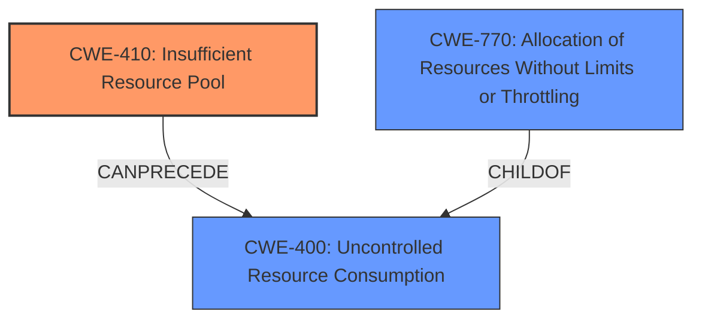

# Final Resolution for CVE-2021-1615

# Summary
| CWE ID | CWE Name | Confidence | CWE Abstraction Level | CWE Vulnerability Mapping Label | CWE-Vulnerability Mapping Notes |
|---|---|---|---|---|---|
| CWE-410 | Insufficient Resource Pool | 0.95 | Base | Allowed | Primary CWE |
| CWE-770 | Allocation of Resources Without Limits or Throttling | 0.65 | Base | Allowed | Secondary Candidate |

## Evidence and Confidence

*   **Confidence Score:** 0.93
*   **Evidence Strength:** HIGH

## Relationship Analysis
The primary weakness is **CWE-410** [Insufficient Resource Pool], a Base level CWE. It can precede **CWE-400** [Uncontrolled Resource Consumption] because an insufficient pool can lead to resource exhaustion. **CWE-770** [Allocation of Resources Without Limits or Throttling] is a potential contributing factor but less directly relevant than **CWE-410** because the vulnerability is caused by the size of the pool, not necessarily the absence of allocation limits. **CWE-770** is a child of **CWE-400**.

## Vulnerability Chain
The vulnerability chain starts with **CWE-410** [Insufficient Resource Pool] due to **insufficient buffer allocation**. The attacker sends crafted traffic to exhaust available resources, leading to a denial-of-service condition.

## Summary of Analysis
The initial analysis correctly identified **CWE-410** [Insufficient Resource Pool] as the primary **WEAKNESS**. The vulnerability description explicitly mentions insufficient buffer allocation leading to a DoS condition caused by an attacker exhausting available resources by sending crafted traffic: "This vulnerability is due to insufficient buffer allocation. An attacker could exploit this vulnerability by sending crafted traffic to an affected device. A successful exploit could allow the attacker to exhaust available resources and cause a DoS condition".

The criticism correctly pointed out that **CWE-1284** [Improper Validation of Specified Quantity in Input] is not strongly supported by the evidence. The focus is on resource exhaustion due to the size of the resource pool rather than input validation. The criticism also suggested considering **CWE-400** [Uncontrolled Resource Consumption] as a potential consequence of **CWE-410**, which strengthens the analysis by clarifying the relationship between the **ROOTCAUSE** and its impact. I agree that **CWE-1284** is the weakest candidate and should be removed.

**CWE-770** [Allocation of Resources Without Limits or Throttling] is a reasonable secondary candidate because insufficient buffer allocation could imply a lack of proper limits on resource allocation, though the primary issue remains the overall size of the pool, as stated in the vulnerability description.

The selected CWEs are at the optimal level of specificity because **CWE-410** directly addresses the insufficient resource pool issue, and **CWE-770** acknowledges the potential role of allocation limits. Both are at the Base level of abstraction.