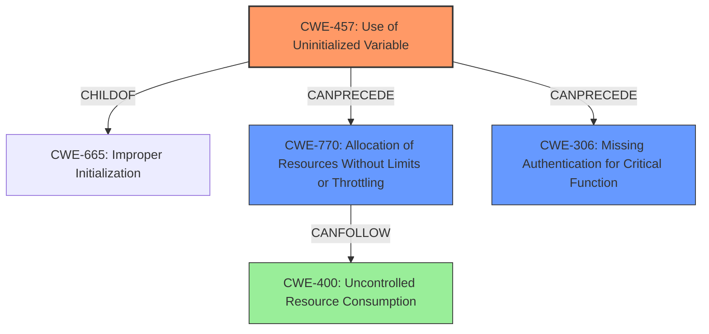

# Final Resolution for CVE-2021-1619

# Summary
| CWE ID | CWE Name | Confidence | CWE Abstraction Level | CWE Vulnerability Mapping Label | CWE-Vulnerability Mapping Notes |
|---|---|---|---|---|---|
| CWE-457 | Use of Uninitialized Variable | 0.9 | Variant | Primary | Allowed |
| CWE-770 | Allocation of Resources Without Limits or Throttling | 0.6 | Base | Secondary | Allowed |
| CWE-306 | Missing Authentication for Critical Function | 0.4 | Base | Secondary | Allowed |

## Evidence and Confidence

*   **Confidence Score:** 0.7
*   **Evidence Strength:** MEDIUM

## Relationship Analysis
The primary weakness is CWE-457, which is a variant of CWE-665 (Improper Initialization), indicating a hierarchical relationship where CWE-457 is more specific. The secondary weaknesses, CWE-770 and CWE-306, are related to the impacts of the vulnerability. CWE-770 (Allocation of Resources Without Limits or Throttling) stems from the memory corruption, potentially leading to DoS, representing a chain relationship. CWE-306 (Missing Authentication for Critical Function) highlights the authentication bypass, although it is a consequence rather than a direct cause. The abstraction levels (Variant for CWE-457, Base for CWE-770 and CWE-306) are appropriate for representing the root cause and its impacts.

## Vulnerability Chain
The vulnerability chain starts with an **uninitialized variable** (CWE-457) in the AAA function. This leads to potential memory corruption, which can then cause uncontrolled resource allocation (CWE-770), ultimately resulting in a denial of service (DoS). The **uninitialized variable** also allows bypassing authentication (CWE-306), enabling unauthorized access to install, manipulate, or delete device configurations.

## Summary of Analysis
The analysis and criticism both highlight the importance of the **uninitialized variable** as the root cause, which is correctly classified as CWE-457. The criticism suggests replacing CWE-400 with CWE-770, which is a more specific representation of the resource allocation issue. The evidence provided supports this decision. The CVE description clearly states: "This vulnerability is due to an **uninitialized variable**." The retriever results also list CWE-457 with a high score, further supporting this classification. The graph relationships influenced the final selection by showing how the **uninitialized variable** can lead to other weaknesses, such as uncontrolled resource allocation and authentication bypass. The selected CWEs are at the optimal level of specificity, with CWE-457 being a variant and CWE-770 and CWE-306 being base-level CWEs that represent the specific impacts of the vulnerability.