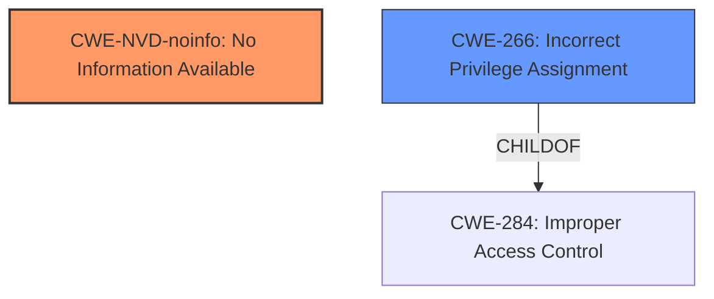

# Final Resolution for CVE-2021-1661

# Summary
| CWE ID | CWE Name | Confidence | CWE Abstraction Level | CWE Vulnerability Mapping Label | CWE-Vulnerability Mapping Notes |
|---|---|---|---|---|---|
| CWE-NVD-noinfo | No Information Available | 0.7 | N/A | Primary | There is no information available to determine the CWE. |
| CWE-266 | Incorrect Privilege Assignment | 0.3 | Base | Secondary | Investigate if any permission assignment is incorrect for the component. However, no direct evidence supports this at present. |

## Evidence and Confidence

*   **Confidence Score:** 0.7
*   **Evidence Strength:** LOW

## Relationship Analysis
The primary relationship considered is the parent-child relationship within the CWE structure. Given the limited information, we focused on identifying potential base-level CWEs that could be related to the high-level "Elevation of Privilege" impact. The analysis also considered peer relationships to identify alternative classifications, such as CWE-426 (Untrusted Search Path) and CWE-276 (Incorrect Default Permissions), which could be related if the installer uses external libraries or creates files with insecure permissions.

## Vulnerability Chain
The chain of root cause and weaknesses is highly speculative due to the lack of detailed information.
  - Potential Chain: Incorrect Privilege Assignment (CWE-266) -> Improper Access Control (CWE-284) -> Elevation of Privilege.
  - Missing Links: Specific details on how the privilege assignment leads to the elevation.

## Summary of Analysis
The analysis is primarily based on the limited information provided in the vulnerability description: "Windows Installer Elevation of Privilege Vulnerability."

The initial analysis and the criticism both highlight the challenge of assigning a specific CWE without more details. The primary recommendation of CWE-NVD-noinfo aligns with the lack of available information. The criticism correctly points out that CWE-269 is discouraged when only "privilege escalation" is available, as this is only an impact and not the root cause.

The retriever results offer a wealth of potential CWEs that *could* be involved, based on similar vulnerabilities.

The final decision involves keeping CWE-NVD-noinfo as the primary CWE due to the lack of specific information. CWE-266 is chosen as a secondary potential CWE. The confidence score is 0.7. This is based on the possibility that Incorrect Privilege Assignment is the cause, pending further information.

The selected CWEs are at the optimal level of specificity given the available evidence. More detailed information would be required to identify a more specific CWE.