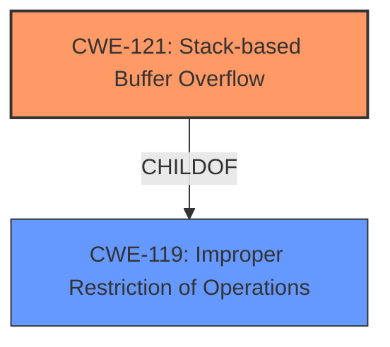

# Analysis Report for CVE-2021-20048

# Vulnerability Analysis Report: CVE-2021-20048

## Description

A Stack-based buffer overflow in the SonicOS SessionID HTTP response header allows a remote authenticated attacker to cause Denial of Service (DoS) and potentially results in code execution in the firewall. This vulnerability affected SonicOS Gen 5, Gen 6 and Gen 7 firmware versions.

## Vulnerability Description Key Phrases

**Rootcause:** Stack-based buffer overflow
**Impact:** ['Denial of Service (DoS)', 'code execution']
**Attacker:** remote authenticated attacker
**Product:** SonicOS
**Version:** Gen 5, Gen 6 and Gen 7 firmware versions
**Component:** SessionID HTTP response header

## Analysis (with Relationship Data)

# Summary
| CWE ID | CWE Name | Confidence | CWE Abstraction Level | CWE Vulnerability Mapping Label | CWE-Vulnerability Mapping Notes |
|---|---|---|---|---|---|
| CWE-121 | Stack-based Buffer Overflow | 0.95 | Variant | Allowed | Primary CWE |
| CWE-119 | Improper Restriction of Operations within the Bounds of a Memory Buffer | 0.60 | Class | Discouraged | Secondary Candidate |

## Evidence and Confidence

*   **Confidence Score:** 0.90
*   **Evidence Strength:** HIGH

- **Analysis and Justification:**  
  - *Explanation:* The vulnerability description explicitly states a **"Stack-based buffer overflow"** in the SonicOS SessionID HTTP response header. This directly corresponds to CWE-121 (Stack-based Buffer Overflow), which is a Variant-level CWE and is ALLOWED per MITRE guidance. The vulnerability allows a remote authenticated attacker to cause Denial of Service (DoS) and potentially execute code. CWE-119 (Improper Restriction of Operations within the Bounds of a Memory Buffer) is a more general Class-level CWE, and while it encompasses the vulnerability, CWE-121 is a more specific and appropriate classification. The "Top CWEs" section also lists CWE-787. However, this CWE is too general and it is better to use CWE-121 as it calls out that it is stack based.

  - *Relationship Analysis:* CWE-121 is a variant of the more general CWE-787 (Out-of-bounds Write) and CWE-119. The relationship highlights that the out-of-bounds write occurs specifically on the stack. There are no direct relationships for CWE-121.

- **Confidence Score:**  
  - Confidence: 0.95 (High confidence due to the explicit mention of "Stack-based buffer overflow" in the vulnerability description.)
---

## Criticism of Analysis

Okay, I've reviewed the provided analysis and the complete CWE specifications for the referenced weaknesses. Here's my critique:

**Overall Assessment:**

The primary CWE mapping to CWE-121 (Stack-based Buffer Overflow) is **correct and well-justified**. The explanation is clear, and the confidence score is appropriate. The analysis correctly identifies why CWE-119 is too general and less appropriate. The analysis is strong overall.

**Detailed Critique:**

*   **CWE-121 (Stack-based Buffer Overflow):**
    *   **Strengths:**
        *   The analysis directly links the "Stack-based buffer overflow" phrase in the vulnerability description to CWE-121.  This is the strongest and most direct evidence.
        *   The justification for choosing CWE-121 over the more general CWE-119 and CWE-787 is solid. It correctly explains why a more specific CWE is preferred when available.
        *   The high confidence score (0.95) reflects the explicitness of the vulnerability description.
    *   **Areas for Slight Improvement:**
        *   The analysis could briefly mention how stack-based overflows manifest (return address overwrite, etc.) as noted in the 'Additional Notes' of the CWE specifications. This could bolster the analysis. While it isn't necessary, it would show a deeper understanding.

*   **CWE-119 (Improper Restriction of Operations within the Bounds of a Memory Buffer):**
    *   **Strengths:**
        *   The analysis correctly identifies CWE-119 as a more general category.
        *   It accurately follows the MITRE mapping guidance by "discouraging" CWE-119 and recommending the use of its children (like CWE-121).
    *   **Areas for Potential Consideration (Low Impact):**
        *   While not incorrect to include it, the inclusion of CWE-119 adds little value. If the goal is to be as precise as possible, omitting it entirely would be a reasonable choice. However, including it as a secondary candidate is not detrimental as long as the rationale is clear.

*   **Top CWEs from Retriever Results**
    * The original analyzer input included CWE-787 based on the Top CWEs from Retriever Results but it was correctly determined that the description called out that it was stack based.

*   **CWE Examples from Database**
    * The CWE examples from the database provide context for the type of vulnerability and its implications.

**Addressing Retriever Results & Alternative CWEs:**

The Retriever Results section identifies other potential CWEs. It's important to understand why these were *not* chosen, even though they have reasonably high scores:

*   **CWE-120 (Buffer Copy without Checking Size of Input):**  While related, this CWE focuses specifically on the *copying* of data without size checks. The description doesn't explicitly mention copying. A more generic overflow caused by other means (e.g., direct manipulation of memory) is possible.
*   **CWE-1284 (Improper Validation of Specified Quantity in Input):** This could be a *contributing* factor if the size of the input is not validated before being used in the buffer overflow. However, it's not the direct cause, so it's not a primary CWE. The root cause is still the buffer overflow itself.
*   **CWE-190 (Integer Overflow or Wraparound):** This *could* be part of a chain if an integer overflow leads to an undersized buffer allocation, then to the stack-based overflow. However, the description lacks this level of detail. If further investigation reveals an integer overflow plays a role, this should be added as a secondary CWE in a chain.
*   **CWE-770 (Allocation of Resources Without Limits or Throttling):** Not directly relevant based on the description. This is typically related to DoS vulnerabilities where resources are exhausted, but the core issue here is the buffer overflow.
*  **CWE-1285 (Improper Validation of Specified Index, Position, or Offset in Input):** Similar to CWE-1284, may be part of the vulnerability, but not the root cause.
*  **CWE-193 (Off-by-one Error):** Can be a contributing factor, but rare. Would require more information on how the overflow occurred.
*  **CWE-122 (Heap-based Buffer Overflow):** Explicitly stated it was stack-based so not applicable.
*  **CWE-126 (Buffer Over-read):** Overread not specified, but is a common vulnerability type related to overflows.
*  **CWE-674 (Uncontrolled Recursion):** Not related to buffer overflows.

**Recommendations:**

1.  **Maintain the Focus on Specificity:** The analysis is strong because it prioritizes the most specific and accurate CWE (CWE-121). Continue to follow this principle.
2.  **Briefly Expand on Overflow Manifestations:** Mention the potential ways a stack-based overflow can manifest (return address overwrite, etc.) to demonstrate a thorough understanding.

**In summary, the analysis is excellent. The primary CWE mapping is accurate, the justification is clear, and the confidence level is appropriate. The suggestions above are minor refinements that would further strengthen the analysis.**

## Final Resolution

# Summary 
| CWE ID | CWE Name | Confidence | CWE Abstraction Level | CWE Vulnerability Mapping Label | CWE-Vulnerability Mapping Notes |
|---|---|---|---|---|---|
| CWE-121 | Stack-based Buffer Overflow | 0.95 | Variant | Allowed | Primary CWE |

## Evidence and Confidence

*   **Confidence Score:** 0.95
*   **Evidence Strength:** HIGH

## Relationship Analysis
The primary relationship considered was the parent-child relationship between CWE-121 (Stack-based Buffer Overflow) and its parent CWE-119 (Improper Restriction of Operations within the Bounds of a Memory Buffer). Since the vulnerability description explicitly mentions "Stack-based buffer overflow," CWE-121 was chosen for its higher specificity. No chain relationships were identified based on the provided information.

## Vulnerability Chain
The vulnerability chain starts with a flaw that allows a remote authenticated attacker to send a crafted HTTP request. This leads to a **CWE-121 (Stack-based Buffer Overflow)** when the SonicOS processes the SessionID HTTP response header. The overflow can cause a Denial of Service (DoS) and potentially code execution.

## Summary of Analysis
The initial analysis and criticism both agree that **CWE-121 (Stack-based Buffer Overflow)** is the most appropriate primary CWE. The vulnerability description explicitly mentions "Stack-based buffer overflow," which directly aligns with the CWE name and description. The selection of CWE-121 is further supported by its Variant abstraction level, which provides greater specificity than its parent CWE, **CWE-119 (Improper Restriction of Operations within the Bounds of a Memory Buffer)**.

The decision is primarily based on the explicit statement in the vulnerability description: "A Stack-based buffer overflow in the SonicOS SessionID HTTP response header...". This statement provides direct evidence for classifying the vulnerability as CWE-121.

The graph relationships confirm that CWE-121 is a child of CWE-119, but the higher specificity of CWE-121 makes it a more suitable choice. The provided evidence does not suggest any vulnerability chains or alternative classifications. Therefore, **CWE-121 (Stack-based Buffer Overflow)** is the optimal classification based on the available evidence and relationship analysis.

*Report generated on 2025-03-17 22:49:45*
