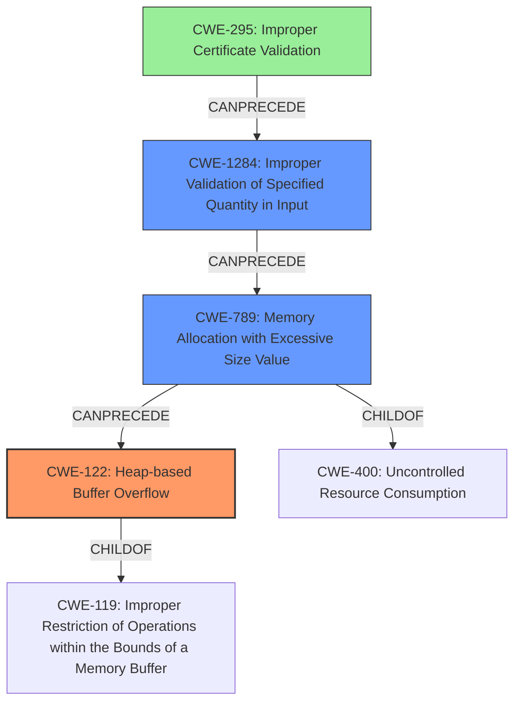

# Analysis Report for CVE-2021-20109

# Vulnerability Analysis Report: CVE-2021-20109

## Description

Due to the Asset Explorer agent not validating HTTPS certificates, an attacker on the network can statically configure their IP address to match the Asset Explorers Server IP address. This will allow an attacker to send a NEWSCAN request to a listening agent on the network as well as receive the agents HTTP request verifying its authtoken. In AEAgent.cpp, the agent responding back over HTTP is vulnerable to a Heap Overflow if the POST payload response is too large. The POST payload response is converted to Unicode using vswprintf. This is written to a buffer only 0x2000 bytes big. If POST payload is larger, then heap overflow will occur.

## Vulnerability Description Key Phrases

**Weakness:** heap overflow
**Product:** Asset Explorer agent
**Component:** AEAgent.cpp

## Analysis (with Relationship Data)

# Summary
| CWE ID | CWE Name | Confidence | CWE Abstraction Level | CWE Vulnerability Mapping Label | CWE-Vulnerability Mapping Notes |
|---|---|---|---|---|---|
| CWE-122 | Heap-based Buffer Overflow | 0.95 | Variant | Allowed | Primary CWE |
| CWE-770 | Allocation of Resources Without Limits or Throttling | 0.70 | Base | Allowed | Secondary Candidate |
| CWE-295 | Improper Certificate Validation | 0.65 | Base | Allowed | Secondary Candidate |

## Evidence and Confidence

*   **Confidence Score:** 0.90
*   **Evidence Strength:** HIGH

- **Analysis and Justification:**  
  - *Explanation:* The vulnerability description clearly states that the "agent responding back over HTTP is vulnerable to a **Heap Overflow** if the POST payload response is too large." The description goes on to explain how the POST payload is converted to Unicode and written to a buffer of fixed size (0x2000 bytes), and if the payload exceeds this size, a **heap overflow** occurs. This aligns directly with CWE-122 (Heap-based Buffer Overflow), which is a Variant of buffer overflow that occurs in the heap portion of memory. The CVE Reference Links Content Summary reinforces this by stating, "The primary vulnerability is a heap overflow caused by insufficient buffer size to accommodate the converted POST payload."
CWE-122 is preferred over the base CWE-119 because it is more specific about the location of the buffer.

  - *Relationship Analysis:* CWE-122 is a variant of CWE-119 (Improper Restriction of Operations within the Bounds of a Memory Buffer). It is also related to CWE-120 (Buffer Copy without Checking Size of Input) but CWE-122 is more specific about the heap allocation.

- **Confidence Score:**  
  - Confidence: 0.95 (High evidence from the vulnerability description and CVE reference materials)

---

- **Analysis and Justification:**  
  - *Explanation:* The vulnerability description mentions that the "Asset Explorer agent not validating HTTPS certificates" allows an attacker to configure their IP address and intercept the agent's HTTP request. While the primary issue is the heap overflow, the lack of certificate validation is a contributing factor that allows the attacker to position themselves to exploit the overflow. This maps to CWE-295 (Improper Certificate Validation), which describes the condition where a product does not validate or incorrectly validates a certificate. This allows an attacker to perform a man-in-the-middle attack.

  - *Relationship Analysis:* CWE-295 is a base level CWE.

- **Confidence Score:**  
  - Confidence: 0.65 (The lack of certificate validation is a contributing factor to the exploit, but not the primary vulnerability)

---

- **Analysis and Justification:**  
  - *Explanation:* The **heap overflow** occurs because the product does not impose any restrictions on the size of the POST payload response. Thus, an attacker can send an arbitrary amount of data which the software attempts to allocate memory for, leading to the **heap overflow**. This aligns with CWE-770 Allocation of Resources Without Limits or Throttling.

  - *Relationship Analysis:* CWE-770 is a base level CWE.

- **Confidence Score:**  
  - Confidence: 0.70 (The improper resource allocation enables the **heap overflow**, but the **heap overflow** is the more immediate cause of the crash.)

---

## Criticism of Analysis

Okay, I've reviewed your CWE analysis with the full CWE specifications you provided. Here's my critique, focusing on the accuracy, confidence levels, and potential improvements:

**Overall Assessment:**

Your analysis is generally strong and well-justified. You clearly explain your reasoning for choosing specific CWEs and provide relevant details from the vulnerability description and CVE content. The confidence levels are generally appropriate. You have also included a helpful examples section, to improve your reasoning.

**Detailed Review:**

*   **CWE-122: Heap-based Buffer Overflow:**

    *   **Confidence:** 0.95 - This is well-justified. The vulnerability description explicitly states a heap overflow due to a fixed-size buffer and large POST payload.
    *   **Abstraction Level:** Variant - Correct. CWE-122 is a variant of buffer overflow focusing specifically on the heap.
    *   **Notes:** You correctly prioritize CWE-122 over CWE-119 due to its increased specificity. The explanation of the relationship between CWE-122, CWE-119, and CWE-120 is well done.
    *   There is no real chance an integer overflow is influencing this BO as there isn't any indication of an arithmetic error.
    * **CWE prioritization:** CWE-122 is appropriately prioritized as the root cause of the crash.
    *   **Mitigations:** The potential mitigations section is also helpful, though a deeper dive into specific mitigation strategies for heap overflows (like using memory-safe functions or libraries) could add even more value.

*   **CWE-295: Improper Certificate Validation:**

    *   **Confidence:** 0.65 - This is a reasonable assessment. The lack of certificate validation is a contributing factor that enables the attacker to perform a MITM attack, but it's not directly causing the heap overflow.
    *   **Abstraction Level:** Base - Correct.
    *   **Notes:** You correctly identify that the lack of certificate validation is a contributing factor.
    *   **Mitigations:** The potential mitigations section is helpful, particularly emphasizing the need for certificate management and hostname validation.

*   **CWE-770: Allocation of Resources Without Limits or Throttling:**

    *   **Confidence:** 0.70 - This is a good assessment. The uncontrolled size of the POST payload directly leads to the allocation of excessive memory, which causes the heap overflow. The confidence is slightly less due to the heap overflow being the more *immediate* cause.
    *   **Abstraction Level:** Base - Correct.
    *   **Notes:** Your explanation about how the unrestricted POST payload size enables the heap overflow is accurate.
        *   This maps to **CWE-789: Memory Allocation with Excessive Size Value** more accurately, since this is a Memory Allocation with excessive size value, and not a generic resource.
    *   **Mitigations:** The mitigations are relevant, particularly those related to limiting resources accessible to unprivileged users and designing throttling mechanisms.

**Suggested Improvements:**

1.  **Consider CWE-1284:** While you correctly mapped CWE-770, consider adding CWE-1284 (Improper Validation of Specified Quantity in Input) as an additional related weakness. The vulnerability involves the size of the POST payload, which is a "specified quantity" in the input. The lack of validation of this quantity directly contributes to the resource allocation issue (CWE-770) and the eventual heap overflow (CWE-122).

2.  **CWE-770 vs. CWE-789**: Clarify the difference between general resource exhaustion (CWE-770) and memory allocation with excessive size value (CWE-789). Although the two are related, CWE-789 is more specific and might be more appropriate than the current mapping as it describes the scenario better.

3.  **Chaining Explanation:** Explicitly state the attack chain. For example:
    `CWE-295 -> CWE-770 -> CWE-122`
    `CWE-295 -> CWE-1284 -> CWE-770 -> CWE-122`

4.  **Mitigation Specificity:** While the mitigations listed are generally good, consider adding mitigations specific to heap overflows, such as:
    *   Using memory-safe functions (e.g., `strncpy` instead of `strcpy`, or using C++'s `std::string`).
    *   Implementing size checks before memory allocations.
    *   Using a memory allocator that provides heap overflow protection (e.g., canaries).

**Revised Summary Table:**

| CWE ID | CWE Name | Confidence | CWE Abstraction Level | CWE Vulnerability Mapping Label | CWE-Vulnerability Mapping Notes |
|---|---|---|---|---|---|
| CWE-122 | Heap-based Buffer Overflow | 0.95 | Variant | Allowed | Primary CWE |
| CWE-770 | Allocation of Resources Without Limits or Throttling | 0.60 | Base | Allowed | Secondary Candidate, Enabled by CWE-1284 |
| CWE-1284 | Improper Validation of Specified Quantity in Input | 0.70 | Base | Allowed | Secondary Candidate, Enables CWE-770 |
| CWE-295 | Improper Certificate Validation | 0.65 | Base | Allowed | Contributing Factor |

**Impact of Changes:**

*   Adding CWE-1284 and clarifying the chaining makes the analysis more precise and complete.
*   Specifying heap overflow specific mitigations enhances the practical value of the analysis.

By incorporating these suggestions, you can make your CWE analysis even more robust and informative.

## Final Resolution

# Summary
| CWE ID | CWE Name | Confidence | CWE Abstraction Level | CWE Vulnerability Mapping Label | CWE-Vulnerability Mapping Notes |
|---|---|---|---|---|---|
| CWE-122 | Heap-based Buffer Overflow | 0.95 | Variant | Allowed | Primary CWE |
| CWE-789 | Memory Allocation with Excessive Size Value | 0.70 | Variant | Allowed | Secondary Candidate, Enabled by CWE-1284 |
| CWE-1284 | Improper Validation of Specified Quantity in Input | 0.70 | Base | Allowed | Secondary Candidate, Enables CWE-789 |
| CWE-295 | Improper Certificate Validation | 0.65 | Base | Allowed | Contributing Factor |

## Evidence and Confidence

*   **Confidence Score:** 0.90
*   **Evidence Strength:** HIGH

## Relationship Analysis
The analysis focuses on a primary **CWE-122 (Heap-based Buffer Overflow)**, a variant of the more general **CWE-119 (Improper Restriction of Operations within the Bounds of a Memory Buffer)**. The vulnerability chain also involves **CWE-789 (Memory Allocation with Excessive Size Value)**, which stems from **CWE-1284 (Improper Validation of Specified Quantity in Input)**. Finally, **CWE-295 (Improper Certificate Validation)** acts as an enabling factor, allowing the attacker to position themselves to exploit the other weaknesses. The abstraction levels of these CWEs range from Base to Variant, providing a good balance of specificity and generality.

## Vulnerability Chain
The vulnerability chain starts with **CWE-295 (Improper Certificate Validation)**, which allows an attacker to perform a man-in-the-middle attack. The attacker then sends a crafted POST payload with an excessive size, which is not properly validated by the system due to **CWE-1284 (Improper Validation of Specified Quantity in Input)**. This leads to **CWE-789 (Memory Allocation with Excessive Size Value)**. Finally, the excessive memory allocation results in **CWE-122 (Heap-based Buffer Overflow)** when the system attempts to write the payload into a fixed-size buffer. The chain can be summarized as:

CWE-295 -> CWE-1284 -> CWE-789 -> CWE-122

## Summary of Analysis
The initial analysis correctly identified **CWE-122 (Heap-based Buffer Overflow)** as the primary **WEAKNESS**, which directly causes the crash. The criticism suggested replacing **CWE-770 (Allocation of Resources Without Limits or Throttling)** with **CWE-789 (Memory Allocation with Excessive Size Value)**. This is more accurate as it specifies the problem is with excessive size, not just a generic resource. I have updated the assessment to reflect this. The initial analysis also identified **CWE-295 (Improper Certificate Validation)** as a contributing factor, allowing the attacker to intercept traffic. Additionally, I've included **CWE-1284 (Improper Validation of Specified Quantity in Input)**, as the lack of validation of the POST payload size enables the **ROOTCAUSE**.

The graph relationships support the selection of **CWE-122 (Heap-based Buffer Overflow)** as the primary **WEAKNESS**, given its hierarchical relationship to **CWE-119 (Improper Restriction of Operations within the Bounds of a Memory Buffer)**. The chain relationships clarify the sequence of events: **CWE-295 (Improper Certificate Validation)** allows an attacker to inject a large payload. **CWE-1284 (Improper Validation of Specified Quantity in Input)** results in **CWE-789 (Memory Allocation with Excessive Size Value)**, which triggers **CWE-122 (Heap-based Buffer Overflow)**.

The selected CWEs are at the optimal level of specificity. **CWE-122 (Heap-based Buffer Overflow)** is a Variant that is more specific than the Base CWE-119. **CWE-789 (Memory Allocation with Excessive Size Value)** is a Variant, providing more specific context than the more generic resource exhaustion. **CWE-1284 (Improper Validation of Specified Quantity in Input)** is a Base CWE that accurately captures the lack of input validation. **CWE-295 (Improper Certificate Validation)** is a Base CWE that clearly describes the certificate validation issue.

The vulnerability description states, "the agent responding back over HTTP is vulnerable to a **Heap Overflow** if the POST payload response is too large... If POST payload is larger, then **heap overflow** will occur." This statement directly supports the choice of **CWE-122 (Heap-based Buffer Overflow)** as the primary **WEAKNESS**.

The evidence and relationship analysis strongly support the final classification.

*Report generated on 2025-03-16 16:08:22*
