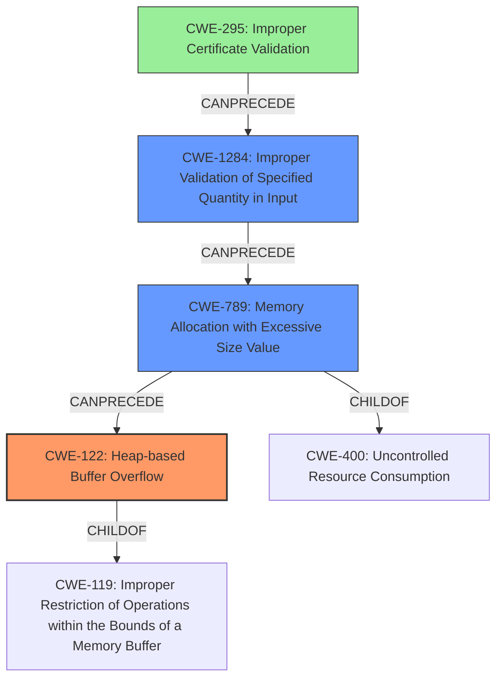

# Final Resolution for CVE-2021-20109

# Summary
| CWE ID | CWE Name | Confidence | CWE Abstraction Level | CWE Vulnerability Mapping Label | CWE-Vulnerability Mapping Notes |
|---|---|---|---|---|---|
| CWE-122 | Heap-based Buffer Overflow | 0.95 | Variant | Allowed | Primary CWE |
| CWE-789 | Memory Allocation with Excessive Size Value | 0.70 | Variant | Allowed | Secondary Candidate, Enabled by CWE-1284 |
| CWE-1284 | Improper Validation of Specified Quantity in Input | 0.70 | Base | Allowed | Secondary Candidate, Enables CWE-789 |
| CWE-295 | Improper Certificate Validation | 0.65 | Base | Allowed | Contributing Factor |

## Evidence and Confidence

*   **Confidence Score:** 0.90
*   **Evidence Strength:** HIGH

## Relationship Analysis
The analysis focuses on a primary **CWE-122 (Heap-based Buffer Overflow)**, a variant of the more general **CWE-119 (Improper Restriction of Operations within the Bounds of a Memory Buffer)**. The vulnerability chain also involves **CWE-789 (Memory Allocation with Excessive Size Value)**, which stems from **CWE-1284 (Improper Validation of Specified Quantity in Input)**. Finally, **CWE-295 (Improper Certificate Validation)** acts as an enabling factor, allowing the attacker to position themselves to exploit the other weaknesses. The abstraction levels of these CWEs range from Base to Variant, providing a good balance of specificity and generality.

## Vulnerability Chain
The vulnerability chain starts with **CWE-295 (Improper Certificate Validation)**, which allows an attacker to perform a man-in-the-middle attack. The attacker then sends a crafted POST payload with an excessive size, which is not properly validated by the system due to **CWE-1284 (Improper Validation of Specified Quantity in Input)**. This leads to **CWE-789 (Memory Allocation with Excessive Size Value)**. Finally, the excessive memory allocation results in **CWE-122 (Heap-based Buffer Overflow)** when the system attempts to write the payload into a fixed-size buffer. The chain can be summarized as:

CWE-295 -> CWE-1284 -> CWE-789 -> CWE-122

## Summary of Analysis
The initial analysis correctly identified **CWE-122 (Heap-based Buffer Overflow)** as the primary **WEAKNESS**, which directly causes the crash. The criticism suggested replacing **CWE-770 (Allocation of Resources Without Limits or Throttling)** with **CWE-789 (Memory Allocation with Excessive Size Value)**. This is more accurate as it specifies the problem is with excessive size, not just a generic resource. I have updated the assessment to reflect this. The initial analysis also identified **CWE-295 (Improper Certificate Validation)** as a contributing factor, allowing the attacker to intercept traffic. Additionally, I've included **CWE-1284 (Improper Validation of Specified Quantity in Input)**, as the lack of validation of the POST payload size enables the **ROOTCAUSE**.

The graph relationships support the selection of **CWE-122 (Heap-based Buffer Overflow)** as the primary **WEAKNESS**, given its hierarchical relationship to **CWE-119 (Improper Restriction of Operations within the Bounds of a Memory Buffer)**. The chain relationships clarify the sequence of events: **CWE-295 (Improper Certificate Validation)** allows an attacker to inject a large payload. **CWE-1284 (Improper Validation of Specified Quantity in Input)** results in **CWE-789 (Memory Allocation with Excessive Size Value)**, which triggers **CWE-122 (Heap-based Buffer Overflow)**.

The selected CWEs are at the optimal level of specificity. **CWE-122 (Heap-based Buffer Overflow)** is a Variant that is more specific than the Base CWE-119. **CWE-789 (Memory Allocation with Excessive Size Value)** is a Variant, providing more specific context than the more generic resource exhaustion. **CWE-1284 (Improper Validation of Specified Quantity in Input)** is a Base CWE that accurately captures the lack of input validation. **CWE-295 (Improper Certificate Validation)** is a Base CWE that clearly describes the certificate validation issue.

The vulnerability description states, "the agent responding back over HTTP is vulnerable to a **Heap Overflow** if the POST payload response is too large... If POST payload is larger, then **heap overflow** will occur." This statement directly supports the choice of **CWE-122 (Heap-based Buffer Overflow)** as the primary **WEAKNESS**.

The evidence and relationship analysis strongly support the final classification.