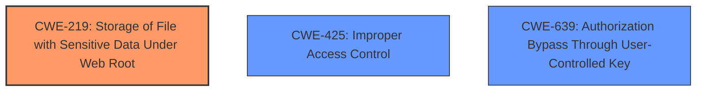

# Final Resolution for CVE-2021-20148

# Summary
| CWE ID | CWE Name | Confidence | CWE Abstraction Level | CWE Vulnerability Mapping Label | CWE-Vulnerability Mapping Notes |
|---|---|---|---|---|---|
| CWE-219 | Storage of File with Sensitive Data Under Web Root | 0.90 | Variant | Allowed | Primary CWE |
| CWE-425 | Improper Access Control | 0.70 | Base | Allowed | Secondary Candidate |
| CWE-639 | Authorization Bypass Through User-Controlled Key | 0.60 | Base | Allowed | Secondary Candidate |

## Evidence and Confidence

*   **Confidence Score:** 0.85
*   **Evidence Strength:** HIGH

## Relationship Analysis
The primary relationship influencing the decision is the specificity of CWE-219 as a Variant, making it a more precise match than broader Class or Base CWEs. CWE-425 and CWE-639 are considered as contributing factors related to authorization, but they are less direct than the core issue of storing sensitive files under the web root. The abstraction levels guided the selection towards the most detailed and applicable CWE.

## Vulnerability Chain
The vulnerability chain starts with the **ROOTCAUSE** being the insecure storage of sensitive password policy files under the web root (CWE-219). This leads to an increased risk of unauthorized access because these files are directly accessible. A user from one domain can then directly request these files (CWE-425), potentially bypassing intended authorization controls. By manipulating the request (e.g., changing the domain name), a user can further bypass authorization and access another domain's password policy files (CWE-639). This results in **Information Disclosure**.

## Summary of Analysis
The initial analysis and criticism were well-reasoned and largely accurate. The decision to classify the primary **weakness** as CWE-219 (Storage of File with Sensitive Data Under Web Root) is strongly supported by the vulnerability description: "ManageEngine ADSelfService Plus below build 6116 stores the password policy file for each domain under the html/ web root with a predictable filename based on the domain name." This is a direct quote from the vulnerability description, which clearly indicates the insecure storage of sensitive data under the web root.

The graph relationships reinforced this decision, as CWE-219 is a Variant-level CWE, making it more specific and relevant than a broader Class or Base CWE. While CWE-425 and CWE-639 are valid secondary candidates, they are consequences of the primary **weakness** (CWE-219).

The selected CWEs are at the optimal level of specificity because they directly address the root cause of the vulnerability (CWE-219) and its contributing factors (CWE-425 and CWE-639).