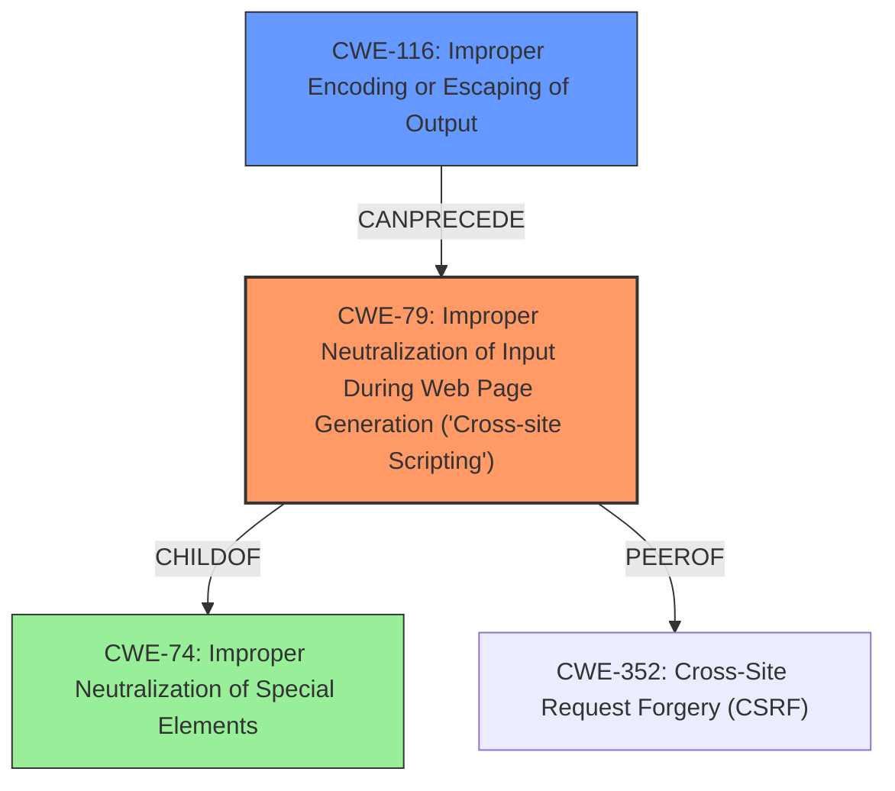

# Final Resolution for CVE-2021-20195

# Summary
| CWE ID | CWE Name | Confidence | CWE Abstraction Level | CWE Vulnerability Mapping Label | CWE-Vulnerability Mapping Notes |
|---|---|---|---|---|---|
| CWE-79 | Improper Neutralization of Input During Web Page Generation ('Cross-site Scripting') | 1.0 | Base | Allowed | Primary CWE |
| CWE-116 | Improper Encoding or Escaping of Output | 0.8 | Class | Allowed-with-Review | Secondary Candidate |

## Evidence and Confidence

*   **Confidence Score:** 0.95
*   **Evidence Strength:** HIGH

## Relationship Analysis
The primary relationship impacting the decision is the hierarchical relationship between CWE-74 (Improper Neutralization of Special Elements) and its child, CWE-79 (**Improper Neutralization of Input During Web Page Generation ('Cross-site Scripting')**). While CWE-74 is a parent, CWE-79 is more specific and directly applicable to the **XSS** vulnerability described. CWE-116 (**Improper Encoding or Escaping of Output**) is a Class-level CWE, and the relationship with CWE-79 indicates that the lack of proper encoding directly leads to the **XSS** vulnerability. Also, the PEEROF relationship between CWE-79 and CWE-352 (**Cross-Site Request Forgery (CSRF)**) was considered, but CSRF is not explicitly mentioned in the vulnerability description, though the risk of CSRF with XSS should be acknowledged.

## Vulnerability Chain
The vulnerability chain starts with the **ROOTCAUSE** of **Improper Encoding or Escaping of Output (CWE-116)**. This leads to the **WEAKNESS** of **Improper Neutralization of Input During Web Page Generation ('Cross-site Scripting') (CWE-79)**. The **IMPACT** is a Self Stored **XSS** attack, potentially escalating to a complete account takeover. A missing link could be the specific type of encoding that was missing, but the chain is otherwise complete.

## Summary of Analysis
The initial analysis correctly identified CWE-79 as the primary **WEAKNESS**, given the vulnerability description: *"A Self Stored **XSS** attack vector escalating to a complete account takeover is possible due to **user-supplied data fields not being properly encoded** and Javascript code being used to process the data."* The description explicitly states that the lack of proper encoding of user-supplied data leads to **XSS**, making CWE-79 the most direct and appropriate classification.

The inclusion of CWE-116 as a contributing factor is also well-justified, as the **ROOTCAUSE** of the **XSS** is indeed the lack of proper encoding. The graph relationships confirm that CWE-79 is a more specific child of CWE-74, and CWE-116 can precede CWE-79 in a vulnerability chain. The assessment is primarily based on the provided evidence and vulnerability description, as well as the MITRE mapping guidance for CWEs.

The selected CWEs are at the optimal level of specificity. CWE-79 is a Base-level CWE that directly addresses the **XSS** vulnerability, while CWE-116 is a Class-level CWE that highlights the underlying encoding issue. Using both CWEs provides a comprehensive understanding of the **WEAKNESS**.

The suggestion to strengthen the relationship analysis for CWE-79 by acknowledging the risk of CSRF is a valid point. While CSRF is not explicitly mentioned, the impersonation aspect and the PEEROF relationship between CWE-79 and CWE-352 warrant a brief mention of the potential for CSRF in conjunction with **XSS**. Furthermore, the suggestion to be more explicit about the specific encoding that is missing for CWE-116 (HTML entity encoding) and to make specific recommendations about context-aware encoding would improve the analysis. I am increasing the confidence in CWE-116 to reflect the explicit connection to the encoding.