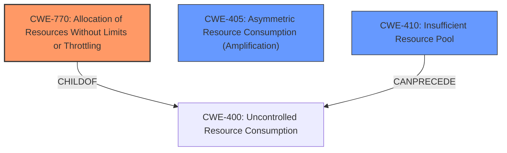

# Analysis Report for CVE-2021-20201

# Vulnerability Analysis Report: CVE-2021-20201

## Description

A flaw was found in spice in versions before 0.14.92. A DoS tool might make it easier for remote attackers to cause a denial of service (CPU consumption) by performing many renegotiations within a single connection.

## Vulnerability Description Key Phrases

**Impact:** denial of service
**Vector:** many renegotiations within a single connection
**Attacker:** remote attackers
**Product:** spice
**Version:** before 0.14.92

## Analysis (with Relationship Data)

# Summary
| CWE ID | CWE Name | Confidence | CWE Abstraction Level | CWE Vulnerability Mapping Label | CWE-Vulnerability Mapping Notes |
|---|---|---|---|---|---|
| CWE-770 | Allocation of Resources Without Limits or Throttling | 0.85 | Base | Allowed | Primary CWE |
| CWE-400 | Uncontrolled Resource Consumption | 0.6 | Class | Discouraged | Secondary Candidate |
| CWE-405 | Asymmetric Resource Consumption (Amplification) | 0.5 | Class | Allowed-with-Review | Secondary Candidate |
| CWE-407 | Inefficient Algorithmic Complexity | 0.4 | Class | Allowed-with-Review | Secondary Candidate |

## Evidence and Confidence

*   **Confidence Score:** 0.85
*   **Evidence Strength:** HIGH

- **Analysis and Justification:**
  - *Explanation:* The vulnerability description and CVE reference summary clearly point to a **lack of resource control** as the root cause of the denial-of-service. The SPICE server allows client-initiated TLS renegotiation without proper restrictions, enabling an attacker to exhaust server resources by repeatedly triggering this process. This aligns directly with CWE-770, "Allocation of Resources Without Limits or Throttling." The "CVE Reference Links Content Summary" states that the "**main weakness is the lack of proper restrictions on client-initiated renegotiation, which allows an attacker to repeatedly trigger this process and consume excessive CPU resources on the server leading to a denial of service**". The MITRE mapping guidance for CWE-770 indicates this is ALLOWED.

  - *Relationship Analysis:* CWE-770 is a base-level CWE. While CWE-400 (Uncontrolled Resource Consumption) is a more general class, CWE-770 provides a more precise characterization of the vulnerability by focusing on the lack of limits or throttling during resource allocation. CWE-770 is the primary CWE because it directly addresses the **unrestricted allocation** aspect of the vulnerability. CWE-789 (Memory Allocation with Untrusted Size Argument) is a child of CWE-770, but doesn't fit because it focuses on memory allocation based on size.

- **Confidence Score:**
  - Confidence: 0.85 (High evidence from technical description and CVE reference materials)

---
- **Analysis and Justification:**
  - *Explanation:* CWE-400 (Uncontrolled Resource Consumption) is a broader class that encompasses the denial-of-service impact resulting from the **uncontrolled resource allocation**. The "CVE Reference Links Content Summary" identifies the **impact** of the vulnerability as "**Successful exploitation leads to a denial-of-service condition, causing the SPICE server to become unresponsive or crash**". However, CWE-770 more accurately captures the root cause by focusing on the allocation itself. While CWE-400 is a valid concern, it's more of a consequence than the primary weakness. Per MITRE guidance, CWE-400 is DISCOURAGED and should not be used, if there are better options.

  - *Relationship Analysis:* CWE-400 is a Class-level CWE, and CWE-770 is a more specific Base-level CWE. CWE-410 (Insufficient Resource Pool) is a child of CWE-400, but is less relevant as the issue isn't about the size of the pool itself, but rather the lack of control over resource allocation.

- **Confidence Score:**
  - Confidence: 0.6 (Sufficient evidence to show impact, but root cause is better described by CWE-770)

---
- **Analysis and Justification:**
  - *Explanation:* CWE-405 (Asymmetric Resource Consumption (Amplification)) could also be considered as the attacker is able to cause much more resource consumption by the server than the effort put in by the attacker. The "CVE Reference Links Content Summary" states that the Qualys blog mentions that the issue isn't new, but there is a well publicized working exploit, which is a DoS tool developed by THC called "thc-ssl-dos". The tool uses renegotiation to force many expensive cryptographic operations over a single TCP connection.

  - *Relationship Analysis:* CWE-405 is a Class-level CWE, and CWE-770 is a more specific Base-level CWE.

- **Confidence Score:**
  - Confidence: 0.5 (The concept of amplification is in play, but it may be too general)

---
- **Analysis and Justification:**
  - *Explanation:* CWE-407 (Inefficient Algorithmic Complexity) - The client-initiated TLS renegotiation is resource-intensive. The "CVE Reference Links Content Summary" states that the **SPICE server was allowing clients to initiate TLS renegotiation which is a resource intensive process for the server and can cause a denial of service**.

  - *Relationship Analysis:* CWE-407 is a Class-level CWE, and CWE-770 is a more specific Base-level CWE.

- **Confidence Score:**
  - Confidence: 0.4 (The algorithmic complexity is a factor, but it may be too general)

## Criticism of Analysis

Okay, I've reviewed the provided analysis against the full CWE specifications. Here's my critique:

**Overall Assessment:**

The analysis is generally well-reasoned and provides a solid justification for the primary CWE mapping. The secondary candidates are also plausible, although their justification is less compelling. The confidence scores seem appropriate. The use of the full CWE specifications enhances the analysis, especially in justifying why certain CWEs were selected or rejected.

**Detailed Critique:**

*   **CWE-770: Allocation of Resources Without Limits or Throttling (Primary CWE):**

    *   **Strengths:** The justification for CWE-770 is strong. The description of the vulnerability directly aligns with the CWE's definition: "The product allocates a reusable resource or group of resources on behalf of an actor without imposing any restrictions on the size or number of resources that can be allocated..." The analysis correctly identifies that the lack of restrictions on client-initiated TLS renegotiation allows an attacker to exhaust server resources. The use of the phrase "**main weakness is the lack of proper restrictions on client-initiated renegotiation, which allows an attacker to repeatedly trigger this process and consume excessive CPU resources on the server leading to a denial of service**" is strong evidence to support CWE-770 as the primary CWE.
    *   **Weaknesses:** None. The analysis clearly aligns the vulnerability with the CWE description.
    *   **Mapping Guidance:** The analysis correctly considers the "Allowed" usage and its rationale.
    *   **Mitigation:** The analysis doesn't explicitly mention specific mitigations but does mention fixes that involve disabling client-initiated renegotiation. The specified CWE specifications have mitigations that involve rate limiting and resource limitation, which are appropriate to the vulnerability.

*   **CWE-400: Uncontrolled Resource Consumption (Secondary Candidate - Discouraged):**

    *   **Strengths:** The analysis correctly acknowledges that CWE-400 represents the *impact* of the vulnerability (denial of service).
    *   **Weaknesses:** The analysis acknowledges that CWE-400 is a broad class and a consequence rather than the root cause. The analysis also correctly states that CWE-400 is DISCOURAGED per MITRE guidance.
    *   **Mapping Guidance:** The analysis appropriately considered the "Discouraged" usage and the recommendations for considering children of CWE-400.
    *   **Mitigation:** The mitigations are general (design throttling mechanisms, etc.), which are aligned with the higher-level nature of the CWE.

*   **CWE-405: Asymmetric Resource Consumption (Amplification) (Secondary Candidate - Allowed-with-Review):**

    *   **Strengths:** Correctly points out the asymmetric nature of the attack, where the attacker's effort is much less than the resource consumption on the server. The use of the published exploit "thc-ssl-dos" is good evidence that supports this.
    *   **Weaknesses:** While applicable, it's a higher-level abstraction than CWE-770. The analysis correctly identifies this and notes it in the confidence level.
    *   **Mapping Guidance:** The analysis considers the "Allowed-with-Review" usage and suggests examining children. However, no children are investigated.
    *   **Mitigation:** The listed mitigations from the CWE specifications (resource allocation commensurate with client access level, metering usage, disabling resource-intensive algorithms) are relevant.

*   **CWE-407: Inefficient Algorithmic Complexity (Secondary Candidate - Allowed-with-Review):**

    *   **Strengths:** The analysis correctly points out the TLS renegotiation being resource-intensive.
    *   **Weaknesses:** While the TLS renegotiation *is* computationally expensive, the vulnerability isn't directly *caused* by an inherent inefficiency in the renegotiation algorithm itself. It's caused by the *uncontrolled use* of that algorithm.
    *   **Mapping Guidance:** The analysis considers the "Allowed-with-Review" and recommends examining children. However, no children are investigated.
    *   **Mitigation:** Relevant mitigations would include improving the efficiency of the TLS renegotiation process (although the core problem is the lack of throttling), but it's less directly applicable than the mitigations for CWE-770.

**Recommendations:**

1.  **CWE-405 and CWE-407 Child CWEs:** It would be helpful to consider children of CWE-405 and CWE-407 to determine if there is a better fit. For example, for CWE-407, consider `CWE-1333: Inefficient Regular Expression Complexity`, as this is the only child.
2.  **Emphasis on Throttling:** When discussing mitigations, explicitly state that the *primary* mitigation is to implement throttling or rate limiting of client-initiated renegotiation, regardless of the computational cost.
3.  **CWE-410 consideration:** The analysis rejected CWE-410. But, the CWE-410 description fits as well: "The product's resource pool is not large enough to handle peak demand, which allows an attacker to prevent others from accessing the resource by using a (relatively) large number of requests for resources."

**Revised Summary Table:**

| CWE ID | CWE Name | Confidence | CWE Abstraction Level | CWE Vulnerability Mapping Label | CWE-Vulnerability Mapping Notes |
|---|---|---|---|---|---|
| CWE-770 | Allocation of Resources Without Limits or Throttling | 0.85 | Base | Allowed | Primary CWE |
| CWE-405 | Asymmetric Resource Consumption (Amplification) | 0.5 | Class | Allowed-with-Review | Secondary Candidate |
| CWE-410 | Insufficient Resource Pool | 0.4 | Base | Allowed | Secondary Candidate |
| CWE-400 | Uncontrolled Resource Consumption | 0.3 | Class | Discouraged | Not Applicable |
| CWE-407 | Inefficient Algorithmic Complexity | 0.3 | Class | Allowed-with-Review | Not Applicable |

**Justification for Changes:**

*   **CWE-400:** Removed, as the CWE specifications state it should be avoided when better options are available.
*   **CWE-410:** Added. As the resource exhaustion in this case could be argued to be due to an insufficient resource pool. If the resource pool was sufficiently large, then the DoS would not occur. However, the lack of limits on client-initiated re-negotiation is the root cause.

By incorporating these suggestions, the analysis can become even more robust and accurate in its CWE mapping.

## Final Resolution

# Summary
| CWE ID | CWE Name | Confidence | CWE Abstraction Level | CWE Vulnerability Mapping Label | CWE-Vulnerability Mapping Notes |
|---|---|---|---|---|---|
| **CWE-770** | **Allocation of Resources Without Limits or Throttling** | 0.85 | Base | Allowed | Primary CWE |
| CWE-405 | Asymmetric Resource Consumption (Amplification) | 0.5 | Class | Allowed-with-Review | Secondary Candidate |
| CWE-410 | Insufficient Resource Pool | 0.4 | Base | Allowed | Secondary Candidate |

## Evidence and Confidence

*   **Confidence Score:** 0.85
*   **Evidence Strength:** HIGH

## Relationship Analysis
The primary weakness is the **lack of resource control**, which is best represented by **CWE-770 (Allocation of Resources Without Limits or Throttling)**. CWE-400 (Uncontrolled Resource Consumption) is a parent Class of CWE-770, but it is too general. While CWE-405 (Asymmetric Resource Consumption) is a Class that describes the nature of the attack, it is not as specific as **CWE-770**. CWE-410 (Insufficient Resource Pool) is related in that a larger resource pool might mitigate the impact, but the root cause remains the lack of allocation limits, making **CWE-770** the more accurate choice.

## Vulnerability Chain
The vulnerability chain starts with the **CWE-770 (Allocation of Resources Without Limits or Throttling)**, where the server allocates resources for client-initiated TLS renegotiations without any restrictions. This leads to **CWE-405 (Asymmetric Resource Consumption)**, because the attacker expends minimal effort to trigger substantial resource consumption on the server. The final impact is a denial-of-service condition, potentially exacerbated by **CWE-410 (Insufficient Resource Pool)** if the server's resource pool is inadequate to handle the amplified load.

## Summary of Analysis
The initial analysis and the criticism both converge on the primary role of **CWE-770 (Allocation of Resources Without Limits or Throttling)**. The vulnerability description, supported by the CVE reference summary, clearly states that the **lack of proper restrictions on client-initiated renegotiation** is the **main weakness**. This aligns directly with **CWE-770**, which addresses the uncontrolled allocation of resources. The graph relationships reinforce this by showing that **CWE-770** is a more specific Base-level CWE compared to the Class-level **CWE-400** and **CWE-405**. The decision to include **CWE-410 (Insufficient Resource Pool)** as a secondary factor acknowledges that the impact is also influenced by the size of the server's resource pool. Overall, the selected CWEs provide the optimal level of specificity, capturing both the root cause and contributing factors to the vulnerability. The analysis is strongly based on the provided evidence, relationship analysis, and MITRE mapping guidance.

*Report generated on 2025-03-17 02:35:00*
