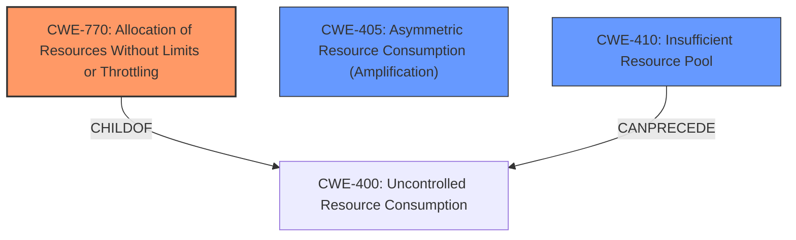

# Final Resolution for CVE-2021-20201

# Summary
| CWE ID | CWE Name | Confidence | CWE Abstraction Level | CWE Vulnerability Mapping Label | CWE-Vulnerability Mapping Notes |
|---|---|---|---|---|---|
| **CWE-770** | **Allocation of Resources Without Limits or Throttling** | 0.85 | Base | Allowed | Primary CWE |
| CWE-405 | Asymmetric Resource Consumption (Amplification) | 0.5 | Class | Allowed-with-Review | Secondary Candidate |
| CWE-410 | Insufficient Resource Pool | 0.4 | Base | Allowed | Secondary Candidate |

## Evidence and Confidence

*   **Confidence Score:** 0.85
*   **Evidence Strength:** HIGH

## Relationship Analysis
The primary weakness is the **lack of resource control**, which is best represented by **CWE-770 (Allocation of Resources Without Limits or Throttling)**. CWE-400 (Uncontrolled Resource Consumption) is a parent Class of CWE-770, but it is too general. While CWE-405 (Asymmetric Resource Consumption) is a Class that describes the nature of the attack, it is not as specific as **CWE-770**. CWE-410 (Insufficient Resource Pool) is related in that a larger resource pool might mitigate the impact, but the root cause remains the lack of allocation limits, making **CWE-770** the more accurate choice.

## Vulnerability Chain
The vulnerability chain starts with the **CWE-770 (Allocation of Resources Without Limits or Throttling)**, where the server allocates resources for client-initiated TLS renegotiations without any restrictions. This leads to **CWE-405 (Asymmetric Resource Consumption)**, because the attacker expends minimal effort to trigger substantial resource consumption on the server. The final impact is a denial-of-service condition, potentially exacerbated by **CWE-410 (Insufficient Resource Pool)** if the server's resource pool is inadequate to handle the amplified load.

## Summary of Analysis
The initial analysis and the criticism both converge on the primary role of **CWE-770 (Allocation of Resources Without Limits or Throttling)**. The vulnerability description, supported by the CVE reference summary, clearly states that the **lack of proper restrictions on client-initiated renegotiation** is the **main weakness**. This aligns directly with **CWE-770**, which addresses the uncontrolled allocation of resources. The graph relationships reinforce this by showing that **CWE-770** is a more specific Base-level CWE compared to the Class-level **CWE-400** and **CWE-405**. The decision to include **CWE-410 (Insufficient Resource Pool)** as a secondary factor acknowledges that the impact is also influenced by the size of the server's resource pool. Overall, the selected CWEs provide the optimal level of specificity, capturing both the root cause and contributing factors to the vulnerability. The analysis is strongly based on the provided evidence, relationship analysis, and MITRE mapping guidance.