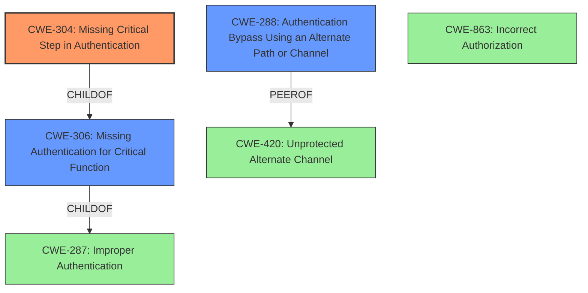

# Final Resolution for CVE-2021-20278

# Summary
| CWE ID | CWE Name | Confidence | CWE Abstraction Level | CWE Vulnerability Mapping Label | CWE-Vulnerability Mapping Notes |
|---|---|---|---|---|---|
| CWE-304 | Missing Critical Step in Authentication | 0.90 | Base | Allowed | Primary CWE |
| CWE-288 | Authentication Bypass Using an Alternate Path or Channel | 0.75 | Base | Allowed | Secondary Candidate |
| CWE-306 | Missing Authentication for Critical Function | 0.70 | Base | Allowed | Secondary Candidate |
| CWE-863 | Incorrect Authorization | 0.40 | Class | Allowed-with-Review | Tertiary Candidate |

## Evidence and Confidence

*   **Confidence Score:** 0.85
*   **Evidence Strength:** HIGH

## Relationship Analysis
The primary relationship impacting the decision is the hierarchical relationship between CWE-287 (Improper Authentication), CWE-306 (Missing Authentication for Critical Function), and CWE-304 (Missing Critical Step in Authentication). CWE-304 is more specific than CWE-306, which in turn is more specific than CWE-287. CWE-288 (Authentication Bypass Using an Alternate Path or Channel) is a peer of CWE-420 (Unprotected Alternate Channel). This peer relationship highlights the alternate path aspect of the vulnerability. The abstraction levels guided the selection towards the most specific Base level CWE where possible.

## Vulnerability Chain
The vulnerability chain starts with the **ROOTCAUSE** being the **CWE-304 (Missing Critical Step in Authentication)**, specifically the skipped token validation when using OpenID implicit flow with RBAC turned off. This leads to **CWE-288 (Authentication Bypass Using an Alternate Path or Channel)** as an attacker can bypass the intended authentication. The consequence is unauthorized access to Kiali, which could lead to further exploitation.

## Summary of Analysis
The initial analysis and criticism both agree that CWE-304 is the most appropriate primary CWE. The evidence provided in the vulnerability description clearly states that Kiali skips token validation, a critical step in the authentication process. This aligns perfectly with CWE-304's description: "The product implements an authentication technique, but it skips a step that weakens the technique."

The graph relationships influenced the decision by reinforcing the hierarchical relationship between different authentication-related CWEs. This helped to select the most specific and relevant CWE (CWE-304) as the primary weakness.

The selected CWEs are at the optimal level of specificity because CWE-304 directly addresses the missing token validation step. While CWE-288 and CWE-306 are relevant, they are broader categories that don't capture the specific nuance of the missing step. The addition of CWE-863 was considered, but it does not adequately describe the flaw, as the authentication mechanism itself is flawed.