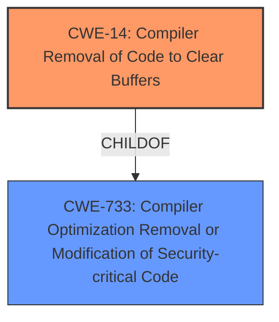

# Analysis Report for CVE-2021-20313

# Vulnerability Analysis Report: CVE-2021-20313

## Description

A flaw was found in ImageMagick in versions before 7.0.11. A potential cipher leak when the calculate signatures in TransformSignature is possible. The highest threat from this vulnerability is to data confidentiality.

## Vulnerability Description Key Phrases

**Weakness:** cipher leak
**Product:** ImageMagick
**Version:** before 7.0.11
**Component:** calculate signatures in TransformSignature

## Analysis (with Relationship Data)

# Summary
| CWE ID | CWE Name | Confidence | CWE Abstraction Level | CWE Vulnerability Mapping Label | CWE-Vulnerability Mapping Notes |
|---|---|---|---|---|---|
| CWE-14 | Compiler Removal of Code to Clear Buffers | 0.9 | Variant | Allowed | Primary CWE |

## Evidence and Confidence

*   **Confidence Score:** 0.9
*   **Evidence Strength:** HIGH

- **Analysis and Justification:**  
  - *Explanation:* The vulnerability description indicates a potential **cipher leak** due to the compiler potentially optimizing away the `memset` call used to clear the `W` array. The CVE Reference Links Content Summary confirms this, stating that the issue was addressed by replacing `memset` with `ResetMagickMemory` and defining `ResetMagickMemory` using a volatile pointer to prevent compiler optimizations. This directly aligns with CWE-14 (Compiler Removal of Code to Clear Buffers), which describes the scenario where sensitive memory is cleared in the source code, but compiler optimizations remove the clearing operation. The core issue is not simply an out-of-bounds read or write, or a general cryptographic issue, but specifically the compiler's optimization interfering with security-sensitive memory clearing. The "Usage: Allowed" mapping guidance for CWE-14 supports this choice.

  - *Relationship Analysis:* While other CWEs like CWE-125 (Out-of-bounds Read), CWE-787 (Out-of-bounds Write) and CWE-327 (Use of a Broken or Risky Cryptographic Algorithm) were suggested by the retriever, they do not precisely capture the **root cause** of the vulnerability, which is the compiler's optimization removing the memory clearing operation. Therefore, CWE-14 is the most accurate and specific classification.

- **Confidence Score:**  
  - Confidence: 0.9 (High confidence based on the vulnerability description, CVE reference summary, and alignment with CWE-14's definition.)

## Criticism of Analysis

Okay, here's a detailed review of the provided analysis, considering the full CWE specifications you've included.

**Overall Assessment:**

The analysis is generally well-reasoned and arrives at a plausible primary CWE (CWE-14). The justification is clear and provides specific evidence from the vulnerability description and CVE details. However, there are a couple of points that could be strengthened or explored further, particularly related to alternative CWEs and potential chains.

**Detailed Critique:**

1.  **Primary CWE: CWE-14 (Compiler Removal of Code to Clear Buffers)**

    *   **Confidence:** The confidence score of 0.9 is justified.  The direct link between the `memset` removal and the cipher leak is well established.
    *   **Justification:** The analysis correctly identifies that the *root cause* is the compiler optimization, not a more general memory safety issue or a flawed cryptographic algorithm.  The fact that the fix specifically addresses the compiler optimization reinforces this.
    *   **Mitigations:** The analysis doesn't explicitly mention mitigations, but it's worth noting that CWE-14's mitigations include using volatile memory locations or configuring the compiler to avoid dead store removal, both of which align with the actual fix implemented in ImageMagick.
    *   **CWE Specification Alignment:** The analysis aligns perfectly with the description and extended description of CWE-14. The scenario described in the CVE exactly matches the scenario described in CWE-14.

2.  **Alternative CWEs Considered (and Rejected):**

    *   **CWE-125 (Out-of-bounds Read) & CWE-787 (Out-of-bounds Write):** The analysis correctly dismisses these. While a successful exploitation *might* lead to an out-of-bounds read or write as a *consequence*, the root cause isn't a buffer overflow itself. It's the failure to properly clear sensitive data due to compiler optimization.  The analysis is right to focus on the root cause.
    *   **CWE-327 (Use of a Broken or Risky Cryptographic Algorithm):** The analysis also reasonably dismisses this. The core cryptographic algorithm itself isn't inherently broken or weak. The vulnerability arises from the *implementation* and its interaction with compiler optimizations, rather than a flaw in the algorithm's design.  This is a key distinction.  However, it's worth considering a *potential* (though less direct) chain involving this.
    *   **CWE-1240 (Use of a Cryptographic Primitive with a Risky Implementation):**  This CWE is more relevant than CWE-327, as it acknowledges the algorithm could be secure on its own, but the implementation has weaknesses.  The analysis could improve by specifically addressing why it is not using CWE-1240. The key is that the risky implementation is not with the cryptographic primitive *itself* but the memory clearing around it.

3.  **Potential Chains and Composite Weaknesses:**

    *   **CWE-733 (Compiler Optimization Removal or Modification of Security-critical Code) -> CWE-14:** This is implied by the analysis, but it could be made more explicit. CWE-733 is a higher-level Base that describes the general problem of compilers interfering with security code.  CWE-14 is a Variant that is more specific to buffer clearing.  Since CWE-14 is selected as the primary, it is implied that CWE-733 has occurred as well.
    *   **CWE-327 (Use of a Broken or Risky Cryptographic Algorithm) -> CWE-208 (Observable Timing Discrepancy):** While the primary issue is the compiler optimization, a successful cipher leak *could* enable timing attacks if the attacker gains enough information to distinguish different cipher states. This is a *potential* secondary effect, and it's reasonable to not include it as a primary factor if the primary concern is the data leak itself.

4.  **Retriever Results:**

    *   The retriever results are mixed.  CWE-1240, CWE-327, and CWE-14 are all relevant. The analysis handles them well. The other results are less relevant and the analysis correctly ignores them.

5.  **Mapping Guidance Adherence:**

    *   The analysis adheres to the CWE's mapping guidance by choosing a Variant-level CWE (CWE-14), which is preferred over Class-level CWEs when an appropriate Variant exists.

**Suggested Improvements:**

*   **Explicitly Address CWE-1240:**  Add a short sentence or two explaining why, although a cipher leak is involved, CWE-1240 is not the best fit because the *cryptographic primitive itself is not the cause of the weakness.* The weakness is the surrounding code.
*   **Consider the Chain with CWE-733:** Briefly mention the relationship to CWE-733 as a more general category, with CWE-14 being a specific instance. This adds nuance to the analysis.
*   **Briefly Acknowledge Mitigation Alignment:** Add a sentence indicating how the chosen CWE's mitigations align with the actual fix implemented. This strengthens the justification.
*   **Potential Side-Channel (Timing Attack) Mention (Optional):** Acknowledge the possibility of a CWE-327 -> CWE-208 chain as a *potential* consequence of the cipher leak, but explain why it's not the primary concern.  This demonstrates a comprehensive understanding of the vulnerability's implications.

By incorporating these suggestions, the analysis will be even more robust and demonstrate a deeper understanding of the CWE specifications and their application.

## Final Resolution

# Summary
| CWE ID | CWE Name | Confidence | CWE Abstraction Level | CWE Vulnerability Mapping Label | CWE-Vulnerability Mapping Notes |
|---|---|---|---|---|---|
| CWE-14 | Compiler Removal of Code to Clear Buffers | 0.95 | Variant | Allowed | Primary CWE |
| CWE-733 | Compiler Optimization Removal or Modification of Security-critical Code | 0.7 | Base | Allowed | Secondary Candidate |

## Evidence and Confidence

*   **Confidence Score:** 0.9
*   **Evidence Strength:** HIGH

## Relationship Analysis
The primary relationship influencing the decision is the hierarchical connection between CWE-733 (Compiler Optimization Removal or Modification of Security-critical Code) and CWE-14 (Compiler Removal of Code to Clear Buffers). CWE-14 is a specific instance (Variant) of the more general class of compiler optimization issues described by CWE-733 (Base). Although the description focuses on CWE-14 because of its specificity, it's important to acknowledge CWE-733 as context.

## Vulnerability Chain
The vulnerability chain involves the compiler removing the `memset` call, resulting in sensitive cipher data remaining in memory. This can then lead to a **cipher leak**, potentially enabling further attacks.
  - **ROOTCAUSE**: Compiler optimization removes security-critical code (CWE-733)
  - **WEAKNESS**: Sensitive memory is not cleared (CWE-14)
  - **IMPACT**: Cipher leak, potential for further exploitation.

## Summary of Analysis
The initial analysis correctly identified CWE-14 (Compiler Removal of Code to Clear Buffers) as the primary **WEAKNESS**. The criticism raised valid points about considering the broader context of CWE-733 (Compiler Optimization Removal or Modification of Security-critical Code) and explicitly addressing why CWE-1240 (Use of a Cryptographic Primitive with a Risky Implementation) is not the best fit.

The vulnerability description states: "A flaw was found in ImageMagick in versions before 7.0.11. A potential **cipher leak** when the calculate signatures in TransformSignature is possible." The CVE Reference Links Content Summary confirms this, stating that the issue was addressed by replacing `memset` with `ResetMagickMemory` and defining `ResetMagickMemory` using a volatile pointer to prevent compiler optimizations. This evidence supports the selection of CWE-14, as it directly relates to the compiler's optimization interfering with security-sensitive memory clearing.

While CWE-1240 involves risky cryptographic implementations, the vulnerability here does not stem from an inherently flawed cryptographic primitive. Instead, the issue arises from the compiler's removal of the memory-clearing operation surrounding the cryptographic function. Therefore, CWE-14 more accurately represents the **ROOTCAUSE**.

CWE-733 is added as a secondary candidate to represent that the compiler optimization is the broader context of the **WEAKNESS**.

The final decision is based on a combination of direct evidence from the vulnerability description, relationship analysis (specifically the child-of relationship between CWE-14 and CWE-733), and adherence to CWE mapping guidance. The selected CWEs provide the optimal level of specificity, with CWE-14 representing the direct cause and CWE-733 providing context.

*Report generated on 2025-03-17 00:08:32*
