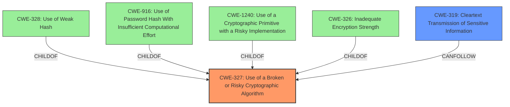

# Analysis Report for CVE-2021-20360

# Vulnerability Analysis Report: CVE-2021-20360

## Description

IBM Cloud Pak for Applications 4.3 uses weaker than expected cryptographic algorithms that could allow an attacker to decrypt highly sensitive information. IBM X-Force ID 195031.

## Vulnerability Description Key Phrases

**Rootcause:** weaker than expected cryptographic algorithms
**Impact:** decrypt highly sensitive information
**Attacker:** attacker
**Product:** IBM Cloud Pak for Applications
**Version:** 4.3

## Analysis (with Relationship Data)

# Summary
| CWE ID  | CWE Name                                                  | Confidence | CWE Abstraction Level | CWE Vulnerability Mapping Label | CWE-Vulnerability Mapping Notes |
| :-------- | :-------------------------------------------------------- | :--------- | :-------------------- | :------------------------------ | :------------------------------ |
| CWE-327 | Use of a Broken or Risky Cryptographic Algorithm          | 0.85       | Class                 | Allowed-with-Review             | Primary CWE                    |
| CWE-319 | Cleartext Transmission of Sensitive Information          | 0.70       | Base                  | Allowed                         | Secondary Candidate             |

## Evidence and Confidence

*   **Confidence Score:** 0.75
*   **Evidence Strength:** MEDIUM

- **Analysis and Justification:**
  - *Explanation:* The vulnerability description explicitly states the use of **"weaker than expected cryptographic algorithms"**, which directly aligns with CWE-327 (Use of a Broken or Risky Cryptographic Algorithm). The CVE Reference Links Content Summary indicates the **root cause** is "**Insecure HTTP communications are used** within IBM Cloud Pak for Applications v4.3". While CWE-327 is a Class-level CWE, it serves as an appropriate initial classification due to the high-level nature of the description. More detailed analysis would be needed to determine if a more specific Base or Variant CWE is applicable. Additionally, the use of insecure HTTP directly relates to transmitting sensitive information in cleartext, which is covered by CWE-319.

  - *Relationship Analysis:* CWE-327 is a Class-level CWE. The Retriever Results suggests children like CWE-328 (Use of Weak Hash) and CWE-916 (Use of Password Hash With Insufficient Computational Effort), but the description doesn't give any information about the type of crypto algorithms used. CWE-319 is a Base-level CWE and a child of CWE-311 (Missing Encryption of Sensitive Data).

- **Confidence Score:**
  - Confidence: 0.85 (Due to the explicit mention of weak crypto and good match to CWE-327 description)
  - Confidence: 0.70 (For CWE-319 since the **root cause** is insecure communication over HTTP)

---

## Criticism of Analysis

Okay, I've reviewed the provided analysis and the full CWE specifications. Here's my critique, focusing on the accuracy of the CWE assignments, the confidence levels, and potential alternative or more specific CWEs:

**Overall Assessment:**

The analysis is generally sound, and the primary CWE choice of CWE-327 is reasonable given the initial information. The inclusion of CWE-319 as a secondary candidate is also justifiable. However, the analysis could benefit from exploring more specific child CWEs of CWE-327 and refining the confidence levels based on the available evidence.

**Detailed Critique:**

**1. CWE-327: Use of a Broken or Risky Cryptographic Algorithm**

*   **Accuracy:** The initial mapping to CWE-327 is appropriate. The vulnerability description explicitly mentions "weaker than expected cryptographic algorithms," which aligns directly with CWE-327's description.
*   **Abstraction Level:** The analysis correctly notes that CWE-327 is a Class-level CWE and encourages exploration of more specific Base or Variant-level CWEs. This is in line with CWE's Mapping Guidance, which states that Class-level CWEs are "Allowed-with-Review" and recommends examining child entries for a better fit.
*   **Confidence Level:** A confidence of 0.85 is a bit high given the limited information. While the description uses key words that suggest the use of a broken or risky cryptographic algorithm, the description doesn't specify the specific algorithms or the reasons why they are considered weak. I would bring the confidence level down to 0.75
*   **Potential Improvements:**
    *   **Explore Child CWEs:** The analysis should attempt to identify specific weak algorithms or cryptographic practices to map to more specific CWEs. For example:
        *   **CWE-328: Use of Weak Hash:** If the weak algorithm is a hash function, and it is used to store sensitive information.
        *   **CWE-916: Use of Password Hash With Insufficient Computational Effort:** If the weak algorithm is used for password hashing.
        *   **CWE-1240: Use of a Cryptographic Primitive with a Risky Implementation:** If a known good cryptographic algorithm is implemented with a known vulnerability in the algorithm.
        *   **CWE-326: Inadequate Encryption Strength:** If a theoretically sound encryption scheme is used but the key is not strong enough, then this would apply.
    *   **Known Examples:** the provided known examples are helpful, and should be used to find a close mapping.

**2. CWE-319: Cleartext Transmission of Sensitive Information**

*   **Accuracy:** The inclusion of CWE-319 is also reasonable based on the CVE Reference Links Content Summary: "**Insecure HTTP communications are used** within IBM Cloud Pak for Applications v4.3". HTTP communications are unencrypted, so there is a risk of sending sensitive data across the network in cleartext.
*   **Abstraction Level:** CWE-319 is a Base-level CWE, which is generally preferred for vulnerability mapping.
*   **Confidence Level:** Confidence score seems reasonable.
*   **Potential Improvements:** None.

**3. General Observations and Recommendations:**

*   **Root Cause vs. Consequence:**  It's important to distinguish between the root cause of the vulnerability and its consequences. The root cause here is the use of weaker than expected cryptographic algorithms (CWE-327). The consequence is the potential for decryption of sensitive information (which could lead to a CWE related to information exposure) and, in the specific case of HTTP communication, cleartext transmission (CWE-319).
*   **Mitigation Strategies:** The analysis doesn't discuss mitigation strategies, but it would be beneficial to briefly mention potential mitigations for each CWE. For example, for CWE-327, the mitigation would involve upgrading to stronger, more secure cryptographic algorithms. For CWE-319, the mitigation would involve using HTTPS (SSL/TLS) to encrypt communication channels.

**Revised Summary Table:**

| CWE ID  | CWE Name                                                  | Confidence | CWE Abstraction Level | CWE Vulnerability Mapping Label | CWE-Vulnerability Mapping Notes                                                                                                                                                                                                                                                             |
| :-------- | :-------------------------------------------------------- | :--------- | :-------------------- | :------------------------------ | :------------------------------------------------------------------------------------------------------------------------------------------------------------------------------------------------------------------------------------------------------------------------------------------ |
| CWE-327 | Use of a Broken or Risky Cryptographic Algorithm          | 0.75       | Class                 | Allowed-with-Review             | Primary CWE.  Further investigation needed to determine specific weak algorithms used and potentially map to child CWEs like CWE-328, CWE-916, CWE-1240, or CWE-326.                                                                                                                      |
| CWE-319 | Cleartext Transmission of Sensitive Information          | 0.70       | Base                  | Allowed                         | Secondary Candidate.  Arises from the use of insecure HTTP communications which transmit data in cleartext.  Depends on sensitive data actually being transmitted.                                                                                                                            |

**In summary,** the analysis provides a good starting point, but it needs to be more specific and detailed to achieve a more accurate and useful CWE mapping. Focusing on identifying the specific weak algorithms and communication protocols will help in selecting the most appropriate CWEs and assigning more accurate confidence levels.

## Final Resolution

# Summary
| CWE ID  | CWE Name                                                  | Confidence | CWE Abstraction Level | CWE Vulnerability Mapping Label | CWE-Vulnerability Mapping Notes |
| :-------- | :-------------------------------------------------------- | :--------- | :-------------------- | :------------------------------ | :------------------------------ |
| CWE-327 | Use of a Broken or Risky Cryptographic Algorithm          | 0.75       | Class                 | Allowed-with-Review             | Primary CWE                    |
| CWE-319 | Cleartext Transmission of Sensitive Information          | 0.70       | Base                  | Allowed                         | Secondary Candidate             |

## Evidence and Confidence

*   **Confidence Score:** 0.75
*   **Evidence Strength:** MEDIUM

## Relationship Analysis
The primary relationship impacting the decision is the hierarchical relationship between CWE-327 and its potential child CWEs, specifically CWE-328, CWE-916, CWE-1240 and CWE-326. The analysis considered whether the provided information was specific enough to justify a more precise classification. The inclusion of CWE-319 as a secondary issue highlights a potential vulnerability chain where weak cryptography (CWE-327) can lead to sensitive information being transmitted in cleartext.

## Vulnerability Chain
The vulnerability chain starts with the **ROOTCAUSE** of using weaker than expected cryptographic algorithms (CWE-327). This weakness allows an attacker to potentially decrypt highly sensitive information. The use of insecure HTTP communications then leads to the transmission of sensitive information in cleartext (CWE-319), exacerbating the risk.

## Summary of Analysis
The initial analysis and criticism both agree that CWE-327 (Use of a Broken or Risky Cryptographic Algorithm) is a reasonable primary classification, given the vulnerability description's explicit mention of "weaker than expected cryptographic algorithms." The confidence level has been adjusted to 0.75 to reflect the lack of specific details about the algorithms used. The inclusion of CWE-319 (Cleartext Transmission of Sensitive Information) is supported by the evidence indicating "**Insecure HTTP communications are used**" (CVE Reference Links Content Summary).

The graph relationships influenced the decision by highlighting the need to consider more specific child CWEs of CWE-327. However, without further information on the specific algorithms or their weaknesses, remaining at the Class level is deemed appropriate.

The selected CWEs are at the optimal level of specificity based on the available evidence. While more specific Base or Variant CWEs might exist, the current description doesn't provide enough detail to justify a more precise classification.

*Report generated on 2025-03-16 23:40:30*
