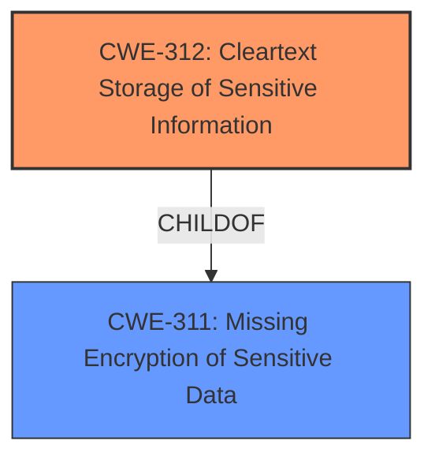

# Final Resolution for CVE-2021-20567

# Summary
| CWE ID | CWE Name | Confidence | CWE Abstraction Level | CWE Vulnerability Mapping Label | CWE-Vulnerability Mapping Notes |
|---|---|---|---|---|---|
| CWE-312 | Cleartext Storage of Sensitive Information | 0.9 | Base | Primary | Allowed |
| CWE-311 | Missing Encryption of Sensitive Data | 0.6 | Class | Secondary | Discouraged |

## Evidence and Confidence

*   **Confidence Score:** 0.9
*   **Evidence Strength:** HIGH

## Relationship Analysis
The primary relationship that impacted the decision was the parent-child relationship between CWE-311 (**Missing Encryption of Sensitive Data**) and CWE-312 (**Cleartext Storage of Sensitive Information**). CWE-311 is a Class-level CWE, while CWE-312 is a Base-level CWE. The analysis and criticism both agree that the vulnerability involves storing secrets in cleartext. Because the vulnerability involves storage, CWE-312 is a more specific and appropriate classification than its parent, CWE-311.

## Vulnerability Chain
The vulnerability chain starts with the **ROOTCAUSE**:

1.  **ROOTCAUSE**: Failure to encrypt sensitive data before storage (**CWE-311**).
2.  **WEAKNESS**: Sensitive information is stored in cleartext (**CWE-312**).
3.  **IMPACT**: A local privileged attacker can obtain sensitive information.

## Summary of Analysis
The initial analysis correctly identified the general issue of missing encryption but incorrectly chose CWE-311 (**Missing Encryption of Sensitive Data**) as the primary CWE. The criticism correctly pointed out that, due to the storage of the secrets, CWE-312 (**Cleartext Storage of Sensitive Information**) is a more specific and appropriate choice.

The vulnerability description explicitly states that the issue is related to "improper or nonexisting encryption" which points to a lack of encryption for sensitive data. The CVE Reference Links Content Summary confirms this by stating that secrets within the Resilient App Host are "not encrypted by default". The secrets are viewable in cleartext by the "root" user, indicating storage.

The MITRE mapping guidance discourages the use of CWE-311 in favor of more precise children. Since the secrets are stored without encryption, CWE-312 is a more specific and better option.

The final decision is based on both the evidence provided and the relationship between CWE-311 and CWE-312. By promoting CWE-312 to the primary CWE, the analysis is more accurate and aligned with best practices. This selection is made at the optimal level of specificity, as the current evidence does not point to more specific variants of CWE-312 (such as storing the secrets in a file or environment variable.)