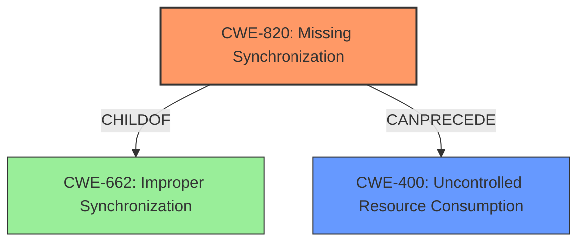

# Final Resolution for CVE-2021-20592

# Summary
| CWE ID | CWE Name | Confidence | CWE Abstraction Level | CWE Vulnerability Mapping Label | CWE-Vulnerability Mapping Notes |
|---|---|---|---|---|---|
| CWE-820 | Missing Synchronization | 1.0 | Base | Allowed | Primary CWE |
| CWE-400 | Uncontrolled Resource Consumption | 0.6 | Class | Discouraged | Secondary Candidate |

## Evidence and Confidence

*   **Confidence Score:** 0.9
*   **Evidence Strength:** HIGH

## Relationship Analysis
The primary CWE is CWE-820 (**Missing Synchronization**), a Base level CWE, which is a child of CWE-662 (**Improper Synchronization**). The vulnerability description explicitly mentions "missing synchronization," justifying this selection. The criticism suggests adding CWE-400 (**Uncontrolled Resource Consumption**) as a secondary CWE because the rapid connecting and disconnecting to the MODBUS/TCP communication port leads to a DoS condition by exhausting resources. While CWE-400 is a Class level CWE and is generally discouraged as a primary mapping, it serves well as a secondary CWE to describe the impact of the **missing synchronization**.

## Vulnerability Chain
The vulnerability chain starts with CWE-820 (**Missing Synchronization**), which allows an attacker to rapidly connect and disconnect to the MODBUS/TCP communication port. This leads to CWE-400 (**Uncontrolled Resource Consumption**) as the system does not properly manage these connections, exhausting resources and resulting in a Denial of Service (DoS).

## Summary of Analysis
The initial analysis correctly identified CWE-820 (**Missing Synchronization**) as the primary weakness, supported by the explicit mention of "missing synchronization" in the vulnerability description. The criticism suggests adding CWE-400 (**Uncontrolled Resource Consumption**) as a secondary CWE, and I concur because the rapid connections and disconnections lead to resource exhaustion and a DoS condition.

*Evidence:*
The vulnerability description states: "Missing synchronization vulnerability...allows a remote unauthenticated attacker to cause DoS condition...by rapidly and repeatedly connecting and disconnecting..."
The CVE Reference Links Content Summary confirms "a lack of proper synchronization when accessing shared resources within the MODBUS/TCP slave communication function"

The relationship analysis highlights that CWE-820 is a child of CWE-662 and can precede CWE-400. This chain accurately reflects the progression of the vulnerability.

The selected CWEs are at the optimal level of specificity. CWE-820 is a Base level CWE and directly addresses the **root cause**, while CWE-400, although a Class level CWE, accurately describes the resulting impact of the **missing synchronization**.