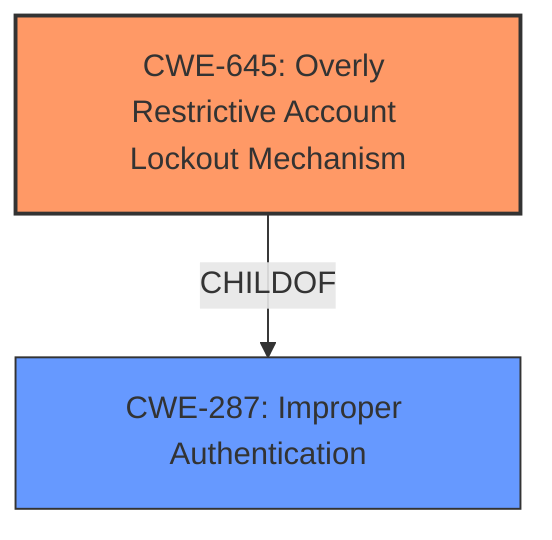

# Final Resolution for CVE-2021-20598

# Summary
| CWE ID | CWE Name | Confidence | CWE Abstraction Level | CWE Vulnerability Mapping Label | CWE-Vulnerability Mapping Notes |
|---|---|---|---|---|---|
| CWE-645 | Overly Restrictive Account Lockout Mechanism | 1.0 | Base | Primary | Allowed |

## Evidence and Confidence

*   **Confidence Score:** 1.0
*   **Evidence Strength:** HIGH

## Relationship Analysis
The primary CWE, CWE-645 (**Overly Restrictive Account Lockout Mechanism**), is a Base level CWE, which is the preferred level of abstraction for mapping. CWE-645 is a child of CWE-287 (**Improper Authentication**), which is a Class-level CWE. Selecting the Base level CWE provides more specificity.

## Vulnerability Chain
The vulnerability chain starts with the **Overly Restrictive Account Lockout Mechanism** (CWE-645). An unauthenticated attacker can exploit this by continuously attempting logins with incorrect passwords. This leads to legitimate users being locked out of their accounts, resulting in a denial-of-service.

## Summary of Analysis
The initial analysis correctly identified CWE-645 (**Overly Restrictive Account Lockout Mechanism**) as the primary **WEAKNESS**. The vulnerability description explicitly states that there is an "**Overly Restrictive Account Lockout Mechanism**," and the CVE Reference Links Content Summary reinforces this by identifying the **ROOTCAUSE** as "**Overly Restrictive Account Lockout Mechanism (CWE-645)**".

The relationship analysis confirms that selecting the Base level CWE provides more specificity than using the Class level CWE-287 (**Improper Authentication**).

The high confidence level of 1.0 is justified based on the direct evidence from the vulnerability description and the CVE summary.