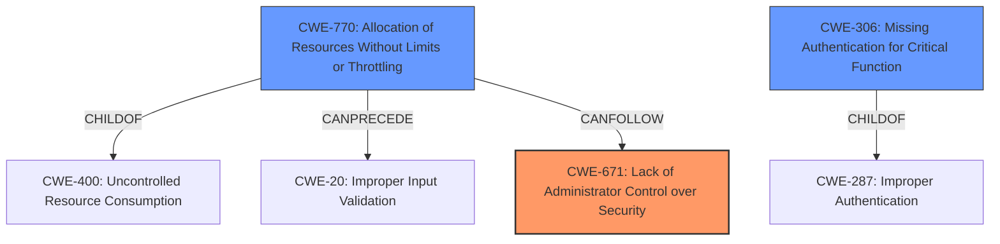

# Final Resolution for CVE-2021-20612

# Summary
| CWE ID | CWE Name | Confidence | CWE Abstraction Level | CWE Vulnerability Mapping Label | CWE-Vulnerability Mapping Notes |
|---|---|---|---|---|---|
| CWE-671 | Lack of Administrator Control over Security | 0.9 | Class | Allowed-with-Review | Primary CWE |
| CWE-770 | Allocation of Resources Without Limits or Throttling | 0.7 | Base | Allowed | Secondary Candidate |
| CWE-306 | Missing Authentication for Critical Function | 0.4 | Base | Allowed | Secondary Candidate |

## Evidence and Confidence

*   **Confidence Score:** 0.8
*   **Evidence Strength:** HIGH

## Relationship Analysis
The primary CWE is CWE-671 (Lack of Administrator Control over Security), which is a Class-level CWE. It is a child of CWE-670 (Always-Incorrect Configuration). CWE-770 (Allocation of Resources Without Limits or Throttling) is a Base-level CWE and a child of CWE-400 (Uncontrolled Resource Consumption). CWE-770 can precede CWE-20 (Improper Input Validation). CWE-306 (Missing Authentication for Critical Function) has no direct relationships in the provided data, but is a child of CWE-287 (Improper Authentication). The abstraction levels influenced the selection, prioritizing Base-level CWEs when available and appropriate.

## Vulnerability Chain
The vulnerability chain starts with the **lack of administrator control over security (CWE-671)**, which allows for an unnecessary TCP port to be open, potentially due to **missing authentication for critical functions (CWE-306)**. This open port is then vulnerable to specially crafted packets that exploit the **allocation of resources without limits or throttling (CWE-770)**, leading to a denial-of-service condition.

## Summary of Analysis
The initial analysis correctly identified **CWE-671 (Lack of Administrator Control over Security)** as the primary **ROOTCAUSE**, based on the vulnerability description explicitly stating a "**Lack of administrator control over security**" and the CVE Reference Links Content Summary explicitly mentioning "**Weaknesses/vulnerabilities present**: Lack of Administrator Control Over Security (CWE-671)". The selection of **CWE-770 (Allocation of Resources Without Limits or Throttling)** as a secondary candidate is also well-justified, as the denial-of-service condition is a direct result of resource exhaustion. The addition of **CWE-306 (Missing Authentication for Critical Function)** is a plausible secondary cause, as it could contribute to the **lack of administrator control**. The graph relationships influenced the final selection by highlighting the potential vulnerability chain from the root cause to the impact. The selected CWEs are at the optimal level of specificity, with **CWE-671** being the most precise classification given the available information, and **CWE-770** providing a more specific explanation of the resource allocation issue. **CWE-400** was deemed less appropriate due to its discouraged usage and being more of an impact than a root cause.