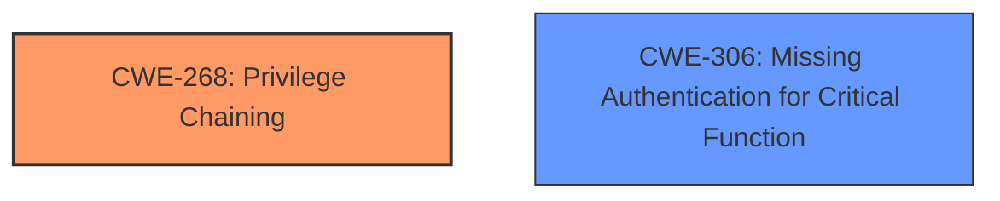

# Analysis Report for CVE-2021-20618

# Vulnerability Analysis Report: CVE-2021-20618

## Description

Privilege chaining vulnerability in acmailer ver. 4.0.2 and earlier, and acmailer DB ver. 1.1.4 and earlier allows remote attackers to bypass authentication and to gain an administrative privilege which may result in obtaining the sensitive information on the server via unspecified vectors.

## Vulnerability Description Key Phrases

**Rootcause:** Privilege chaining vulnerability
**Impact:** ['bypass authentication', 'gain administrative privilege']
**Vector:** unspecified vectors
**Attacker:** remote attackers
**Product:** ['acmailer', 'acmailer DB']
**Version:** ['ver. 4.0.2 and earlier', 'ver. 1.1.4 and earlier']

## Analysis (with Relationship Data)

# Summary
| CWE ID  | CWE Name                       | Confidence | CWE Abstraction Level | CWE Vulnerability Mapping Label | CWE-Vulnerability Mapping Notes |
|---------|--------------------------------|------------|-----------------------|---------------------------------|-------------------------------|
| CWE-268 | Privilege Chaining              | 0.95       | Base                  | Allowed                         | Primary CWE                    |
| CWE-284 | Improper Access Control        | 0.60       | Pillar                  | Discouraged                     | Secondary Candidate            |
| CWE-306 | Missing Authentication for Critical Function | 0.70       | Base                  | Allowed                         | Secondary Candidate            |

## Evidence and Confidence

*   **Confidence Score:** 0.90
*   **Evidence Strength:** HIGH

- **Analysis and Justification:**
  - *Explanation:* The vulnerability description explicitly mentions a **privilege chaining vulnerability**, which directly maps to CWE-268 (Privilege Chaining). The description states that this vulnerability allows remote attackers to bypass authentication and gain administrative privileges, leading to the exposure of sensitive information. The CVE Reference Links Content Summary confirms the **root cause** as a "Privilege Chaining" issue. The affected `enq_*.cgi` files within the survey/questionnaire functionality of acmailer and acmailer DB indicate a chain of actions or requests that can be exploited to gain elevated privileges. This aligns perfectly with the definition of CWE-268. The MITRE mapping guidance for CWE-268 indicates that it is ALLOWED at the Base level of abstraction.
  - *Relationship Analysis:* CWE-268 is a Base-level CWE, which is suitable for mapping the **root cause** of this vulnerability. While other CWEs like CWE-269 (Improper Privilege Management) are related, CWE-268 more specifically describes the chaining aspect that leads to the privilege escalation. The description and the CVE details explicitly point to a chain of actions leading to the privilege gain, making CWE-268 the most appropriate primary CWE.

- **Confidence Score:**
  - Confidence: 0.95 (High confidence due to direct mention of "Privilege Chaining" and detailed CVE reference materials.)

---

- **Analysis and Justification:**
  - *Explanation:* CWE-284 (Improper Access Control) is a high-level Pillar that broadly describes the vulnerability's impact. While the vulnerability ultimately results in improper access control, the **root cause** is more precisely described by the Privilege Chaining (CWE-268). CWE-284 is listed as DISCOURAGED by MITRE due to its high-level nature and potential for misuse.
  - *Relationship Analysis:* CWE-284 is a Pillar-level CWE and doesn't provide the specificity needed to describe the **root cause**. Lower-level CWEs like CWE-268 are more appropriate.

- **Confidence Score:**
  - Confidence: 0.60 (Lower confidence due to the high-level nature of the CWE and the existence of a more specific CWE.)

---

- **Analysis and Justification:**
  - *Explanation:* The vulnerability allows bypassing authentication, which could potentially be categorized as CWE-306 (Missing Authentication for Critical Function). However, the privilege chaining aspect is the primary driver of the vulnerability. The attacker is not simply bypassing authentication due to a missing check, but rather exploiting a chain of privileges to gain administrative access. The CVE summary explicitly states that no authentication is required to exploit the vulnerability. Thus, the vulnerability can also be viewed as a missing authentication check.
  - *Relationship Analysis:* CWE-306 is a Base-level CWE and is related to authentication issues. While it's a contributing factor, the core issue is the privilege chaining.

- **Confidence Score:**
  - Confidence: 0.70 (Moderate confidence as authentication bypass is a consequence of privilege chaining, but not the primary weakness.)

## Criticism of Analysis

Okay, here's a detailed review of the provided CWE analysis, incorporating the full CWE specifications:

**Overall Assessment:**

The analysis is well-structured and generally accurate. The primary CWE mapping to CWE-268 (Privilege Chaining) is strongly justified and well-supported by the evidence. The secondary candidates are also reasonable considerations, although their justification could be further refined. The confidence scoring is appropriate.

**Detailed Review:**

**1. CWE-268: Privilege Chaining (Primary CWE)**

*   **Confidence Score:** 0.95
*   **Abstraction Level:** Base
*   **CWE Vulnerability Mapping Label:** Allowed
*   **Assessment:** The analysis correctly identifies this as the primary CWE.
*   **Justification Strength:**  The justification is strong. The direct mention of "privilege chaining" in the vulnerability description, combined with the CVE details describing a sequence of actions leading to privilege escalation, directly aligns with the CWE-268 description. The identification of vulnerable `enq_*.cgi` files further supports this, as CGI scripts often handle chained requests.
*   **Mapping Guidance Compliance:** The analysis accurately notes that CWE-268 is at the Base level of abstraction, which is preferred. The analysis appropriately states that the mapping fits according to the documentation, which states "Carefully read both the name and description to ensure that this mapping is an appropriate fit. Do not try to 'force' a mapping to a lower-level Base/Variant simply to comply with this preferred level of abstraction."
*   **Potential Mitigations Considered:** The analysis implicitly covers the potential mitigations listed in the CWE definition:
    *   **Separation of Privilege:** The description and remediation steps (deleting files) imply that the original design did *not* properly separate privileges.
    *   **Careful Management of Privileges:** The vulnerability indicates a failure to properly manage and handle privileges in the application.
    *   **Environment Hardening:** Although not explicit, this could involve running the application with the least necessary privileges.
*   **Areas for Improvement:** None. This is a strong mapping.

**2. CWE-284: Improper Access Control (Secondary Candidate)**

*   **Confidence Score:** 0.60
*   **Abstraction Level:** Pillar
*   **CWE Vulnerability Mapping Label:** Discouraged
*   **Assessment:** The analysis acknowledges the relevance of CWE-284 but correctly identifies its limitations.
*   **Justification Strength:** The justification is accurate in stating that CWE-284 is a high-level Pillar that describes the *impact* of the vulnerability, but not the root cause.
*   **Mapping Guidance Compliance:** The analysis correctly states the mapping is DISCOURAGED and describes the MITRE recommendation for selecting descendant alternatives.
*   **Potential Mitigations Considered:** The mitigations for CWE-284 in the specification, such as "Very carefully manage the setting, management, and handling of privileges," are relevant, but too broad to be truly helpful in addressing the *root cause* of this specific vulnerability.
*   **Areas for Improvement:** None, the analysis correctly identifies this as an improper CWE to use.

**3. CWE-306: Missing Authentication for Critical Function (Secondary Candidate)**

*   **Confidence Score:** 0.70
*   **Abstraction Level:** Base
*   **CWE Vulnerability Mapping Label:** Allowed
*   **Assessment:** This is a reasonable secondary candidate, but the justification needs further refinement.
*   **Justification Strength:** The analysis correctly identifies the lack of authentication as a contributing factor to the exploitability of the vulnerability, and the attacker does not need any prior authentication.
*   **Mapping Guidance Compliance:** The analysis accurately notes that CWE-306 is at the Base level of abstraction, which is preferred.
*   **Potential Mitigations Considered:** The analysis implicitly points towards the lack of authentication mechanisms as a contributing factor, thus is related to adding authentication checks to critical function.
*   **Areas for Improvement:** Expand on *how* authentication is bypassed. The strength of Privilege Chaining means that even if authentication *existed* for some functions, the chain allows an attacker to bypass it for *critical* administrative functions. Because of this interdependency, the focus remains on CWE-268. Thus it is important to acknowledge that the 'missing authentication' aspect is largely a consequence of the chaining issue.

**General Comments & Suggestions:**

*   **Retriever Results:** Consider referencing the Retriever Results more explicitly. The table shows that CWE-268 consistently scores highly across different retrievers, reinforcing its appropriateness as the primary CWE. Also, the next highest scoring CWE is CWE-288. It may be useful to describe why this is not appropriate: CWE-288 specifically involves an *alternate* path or channel. While this *could* be argued for this vulnerability, the main issue isn't an intentionally provided alternate route but rather the *unintentional* chaining of privileges to achieve admin access.

*   **Impact Details:** The analysis mentions sensitive information exposure, CGI file manipulation, and full administrative access as impacts. Consider explicitly relating those impacts to the specific `enq_*.cgi` files. For example, how might these CGI files be manipulated to expose sensitive information?

*   **Mitigation Specificity:** While the remediation steps are clear (delete specific files or upgrade), the analysis could connect those steps more directly to the CWE-268 root cause. How does deleting these files break the chain of privileges?

**Revised Summary Table:**

| CWE ID  | CWE Name                       | Confidence | CWE Abstraction Level | CWE Vulnerability Mapping Label | CWE-Vulnerability Mapping Notes |
|---------|--------------------------------|------------|-----------------------|---------------------------------|-------------------------------|
| CWE-268 | Privilege Chaining              | 0.95       | Base                  | Allowed                         | Primary CWE                    |
| CWE-284 | Improper Access Control        | 0.60       | Pillar                  | Discouraged                     | Impact of the vulnerability.  Not the root cause. |
| CWE-306 | Missing Authentication for Critical Function | 0.70       | Base                  | Allowed                         | Consequence of privilege chaining, not the root cause.    |

By incorporating these suggestions, the analysis would be even more robust and provide a clearer understanding of the underlying vulnerability.

## Final Resolution

# Summary
| CWE ID  | CWE Name                       | Confidence | CWE Abstraction Level | CWE Vulnerability Mapping Label | CWE-Vulnerability Mapping Notes |
|---------|--------------------------------|------------|-----------------------|---------------------------------|-------------------------------|
| CWE-268 | Privilege Chaining              | 0.95       | Base                  | Allowed                         | Primary CWE                    |
| CWE-306 | Missing Authentication for Critical Function | 0.70       | Base                  | Allowed                         | Secondary Candidate            |

## Evidence and Confidence

*   **Confidence Score:** 0.95
*   **Evidence Strength:** HIGH

## Relationship Analysis
The primary relationship that impacted the decision was the lack of parent-child relationships for CWE-268. While CWE-268 could be seen as a child of CWE-269 (Improper Privilege Management), the description of CWE-268 specifically highlights the chaining aspect, which is the core of this vulnerability. CWE-306 (Missing Authentication for Critical Function) is related but represents a consequence rather than the **root cause**. The base level of abstraction for both CWE-268 and CWE-306 is appropriate for describing the **root cause**.

## Vulnerability Chain
The vulnerability chain starts with the **root cause**, **CWE-268 (Privilege Chaining)**, which allows an attacker to perform actions with elevated privileges by exploiting a sequence of improperly managed privileges. This leads to **CWE-306 (Missing Authentication for Critical Function)**, where critical administrative functions lack proper authentication checks, which enables the attacker to bypass authentication and gain administrative access. The final impact is the exposure of sensitive information on the server.

## Summary of Analysis
The initial analysis and criticism were both accurate. The evidence provided strongly supports the selection of **CWE-268 (Privilege Chaining)** as the primary CWE. The vulnerability description explicitly mentions "privilege chaining," and the CVE details describe a sequence of actions leading to privilege escalation. The affected `enq_*.cgi` files indicate a chain of requests that can be exploited to gain elevated privileges.

The graph relationships influenced the decision by highlighting the lack of direct parent-child relationships for CWE-268, reinforcing its suitability as a primary CWE.

The selected CWEs are at the optimal level of specificity because they directly address the **root cause** and contributing factors. **CWE-268 (Privilege Chaining)** is a Base-level CWE that specifically describes the chaining aspect of the vulnerability, while **CWE-306 (Missing Authentication for Critical Function)** describes the consequence of the chaining, not the **root cause**.

*Report generated on 2025-03-17 00:18:06*
