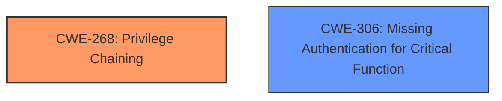

# Final Resolution for CVE-2021-20618

# Summary
| CWE ID  | CWE Name                       | Confidence | CWE Abstraction Level | CWE Vulnerability Mapping Label | CWE-Vulnerability Mapping Notes |
|---------|--------------------------------|------------|-----------------------|---------------------------------|-------------------------------|
| CWE-268 | Privilege Chaining              | 0.95       | Base                  | Allowed                         | Primary CWE                    |
| CWE-306 | Missing Authentication for Critical Function | 0.70       | Base                  | Allowed                         | Secondary Candidate            |

## Evidence and Confidence

*   **Confidence Score:** 0.95
*   **Evidence Strength:** HIGH

## Relationship Analysis
The primary relationship that impacted the decision was the lack of parent-child relationships for CWE-268. While CWE-268 could be seen as a child of CWE-269 (Improper Privilege Management), the description of CWE-268 specifically highlights the chaining aspect, which is the core of this vulnerability. CWE-306 (Missing Authentication for Critical Function) is related but represents a consequence rather than the **root cause**. The base level of abstraction for both CWE-268 and CWE-306 is appropriate for describing the **root cause**.

## Vulnerability Chain
The vulnerability chain starts with the **root cause**, **CWE-268 (Privilege Chaining)**, which allows an attacker to perform actions with elevated privileges by exploiting a sequence of improperly managed privileges. This leads to **CWE-306 (Missing Authentication for Critical Function)**, where critical administrative functions lack proper authentication checks, which enables the attacker to bypass authentication and gain administrative access. The final impact is the exposure of sensitive information on the server.

## Summary of Analysis
The initial analysis and criticism were both accurate. The evidence provided strongly supports the selection of **CWE-268 (Privilege Chaining)** as the primary CWE. The vulnerability description explicitly mentions "privilege chaining," and the CVE details describe a sequence of actions leading to privilege escalation. The affected `enq_*.cgi` files indicate a chain of requests that can be exploited to gain elevated privileges.

The graph relationships influenced the decision by highlighting the lack of direct parent-child relationships for CWE-268, reinforcing its suitability as a primary CWE.

The selected CWEs are at the optimal level of specificity because they directly address the **root cause** and contributing factors. **CWE-268 (Privilege Chaining)** is a Base-level CWE that specifically describes the chaining aspect of the vulnerability, while **CWE-306 (Missing Authentication for Critical Function)** describes the consequence of the chaining, not the **root cause**.