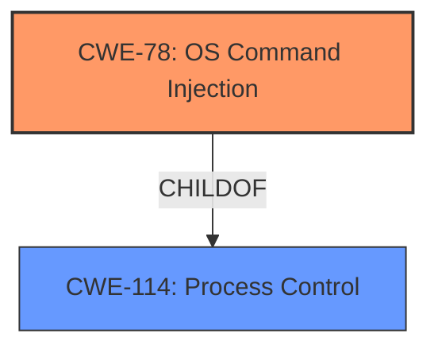

# Analysis Report for CVE-2021-20790

# Vulnerability Analysis Report: CVE-2021-20790

## Description

Improper control of program execution vulnerability in RevoWorks Browser 2.1.230 and earlier allows an attacker to execute an arbitrary command or code via unspecified vectors.

## Vulnerability Description Key Phrases

**Rootcause:** Improper control of program execution
**Impact:** execute an arbitrary command or code
**Vector:** unspecified vectors
**Attacker:** an attacker
**Product:** RevoWorks Browser
**Version:** 2.1.230 and earlier

## Analysis (with Relationship Data)

# Summary
| CWE ID | CWE Name | Confidence | CWE Abstraction Level | CWE Vulnerability Mapping Label | CWE-Vulnerability Mapping Notes |
|---|---|---|---|---|---|
| CWE-114 | Process Control | 0.85 | Class | Primary | Allowed-with-Review |
| CWE-78 | Improper Neutralization of Special Elements used in an OS Command ('OS Command Injection') | 0.70 | Base | Secondary | Allowed |
| CWE-94 | Improper Control of Generation of Code ('Code Injection') | 0.65 | Base | Secondary | Allowed-with-Review |

## Evidence and Confidence

*   **Confidence Score:** 0.80
*   **Evidence Strength:** HIGH

- **Analysis and Justification:**  
  - *Explanation:* The vulnerability description states "**Improper control of program execution**" which is the primary weakness. The summary of CVE reference links explicitly states "CWE-114 (Improper Control of Program Execution): The software does not properly restrict the execution of commands or code." This aligns directly with the definition of CWE-114. Although CWE-114 is a Class, the detailed context provided in the CVE reference summary, combined with the vulnerability description, gives confidence in assigning CWE-114 as the primary weakness. The description also mentions that the attacker can "execute an arbitrary command or code", which hints at the potential for command or code injection. The Retriever Results also include CWE-78 and CWE-94 with decent scores. Given the limited details regarding the exact injection point, these are considered secondary weaknesses.

  - *Relationship Analysis:* CWE-114 is a Class-level CWE. While more specific Base-level CWEs might exist, the current description doesn't provide enough detail to pinpoint a more specific cause. CWE-78 (OS Command Injection) and CWE-94 (Code Injection) are related because **improper control of program execution** can lead to command or code injection if user input is not properly sanitized before being used in a system call or code generation.

- **Confidence Score:**  
  - Confidence: 0.85 (High evidence from vulnerability description and CVE reference materials)

---

## Criticism of Analysis

Okay, here's a review of the provided analysis, incorporating the full CWE specifications, focusing on the appropriateness of the CWE assignments, and suggesting improvements where needed.

## Overall Assessment

The analysis shows a good understanding of the vulnerability and attempts to map it to relevant CWEs. The choice of CWE-114 as the primary weakness is justifiable given the high-level description of the vulnerability. The inclusion of CWE-78 and CWE-94 as secondary weaknesses reflects the potential for command and code injection, but the lack of specific details prevents a more precise classification.

## Detailed Critique

### 1. CWE-114: Process Control (Primary)

*   **Confidence:** 0.85 is reasonable, given the vulnerability description and the CVE reference summary explicitly mentioning "Improper Control of Program Execution."
*   **Appropriateness:**  CWE-114 is a Class-level CWE, and the analysis acknowledges this. While it is *Allowed-with-Review*, the justification for choosing it as primary is based on the lack of specific details.  This is a valid reason, as the goal is to map to the *most accurate* CWE given the available information. However, there is room to investigate whether any of its children are a better fit, even with limited details.
*   **Mapping Guidance:** The analysis correctly notes the *Allowed-with-Review* usage and the recommendation to examine children.  It does not explicitly rule out any children, which is good practice.
*   **Potential Mitigations:**  The provided mitigations for CWE-114 are high-level. Mitigation 1, "Libraries that are loaded should be well understood and come from a trusted source," is relevant if the vulnerability involves loading untrusted libraries, but this detail isn't specified.  At this stage of analysis, this is acceptable.
*   **Suggestion:**  The analyst should briefly consider if more specific information exists to suggest a child of CWE-73 is more likely than other sources of process control issues.  The association with CWE-73 suggests External Control of File Name or Path (CWE-73) might be a contributing factor *if* the process control issue stems from using externally-controlled paths to load or execute resources.

### 2. CWE-78: Improper Neutralization of Special Elements used in an OS Command ('OS Command Injection') (Secondary)

*   **Confidence:** 0.70 is reasonable. The "execute an arbitrary command or code" statement in the vulnerability description strongly suggests this possibility.
*   **Appropriateness:** CWE-78 is *Allowed* and is a Base-level CWE, making it a generally preferred choice if applicable. However, the analysis should explicitly state the condition that makes this applicable, like a component of the system is invoking operating system commands.
*   **Mapping Guidance:** The analysis mentions this CWE alongside code injection. It is good to note this is a Base level CWE.
*   **Potential Mitigations:** Mitigation 1 for CWE-78, "If at all possible, use library calls rather than external processes to recreate the desired functionality," is a very strong recommendation. Mitigations 2 and 3, which involve sandboxing and attack surface reduction by limiting external control of data, are also highly relevant.
*   **Suggestion:** The analysis should acknowledge that more information is needed to confirm that this is indeed OS Command Injection.  If confirmed, it's a strong contender for primary. If the Browser is passing commands to an OS, then this would be a perfect fit.

### 3. CWE-94: Improper Control of Generation of Code ('Code Injection') (Secondary)

*   **Confidence:** 0.65.  Similar to CWE-78, the "execute an arbitrary command or code" statement suggests this.
*   **Appropriateness:** CWE-94 is *Allowed-with-Review*. The analysis needs to justify why the vulnerability involves *generating* code, rather than just executing commands.  For example, is the Browser dynamically creating Javascript or other code based on user input? Is the browser generating its own HTML?
*   **Mapping Guidance:** The analysis mentions this CWE alongside OS command injection. This makes sense given the similar vulnerability and potential impact, however, it is necessary to confirm that code is being constructed in the browser, making the user input part of a code segment.
*   **Potential Mitigations:** Mitigations for CWE-94, such as refactoring code to avoid dynamic code generation, sandboxing, and stringent allowlists, are all appropriate if the vulnerability involves code injection.
*   **Suggestion:** This CWE is very frequently misused. The analysis should explicitly state why *code generation* is involved. Otherwise, a different CWE or chaining should be considered.

## Suggestions for Improvement

1.  **Specificity:**  The analysis relies heavily on the general "improper control of program execution" and "execute an arbitrary command or code" phrases.  Attempt to gather more details on *how* this is happening. Is it through:
    *   Passing unsanitized input to a system call (CWE-78)?
    *   Dynamically generating code (CWE-94)?
    *   Loading a library from an untrusted location (related to CWE-426/427 and maybe even CWE-73)?
    *   A combination of factors?
2.  **Chain Analysis:** Explore potential chains.  For example, if external input influences a file path used to load a library, it could be a chain of `CWE-73 -> CWE-427 -> CWE-114`.
3.  **Mitigation Alignment:**  Tie the potential mitigations more directly to the chosen CWEs.  Explain how the mitigations would address the *specific* weaknesses identified.
4.  **Explicitly Rule Out:** If after investigation, certain children of the class CWEs are not relevant, explicitly state why. This demonstrates a thorough assessment.
5.  **Consider Argument Injection (CWE-88):** Given the mention of command execution, and the retriever results, explore if argument injection is present. This could occur alongside CWE-78.

## Conclusion

The analysis is a good starting point but needs more investigation to identify the specific mechanisms that enable the "improper control of program execution." This deeper analysis will allow for more precise CWE assignments and more targeted mitigation strategies. By following the suggestions above, the analysis can be improved to provide a more accurate and actionable understanding of the vulnerability.

## Final Resolution

# Summary
| CWE ID | CWE Name | Confidence | CWE Abstraction Level | CWE Vulnerability Mapping Label | CWE-Vulnerability Mapping Notes |
|---|---|---|---|---|---|
| CWE-78 | Improper Neutralization of Special Elements used in an OS Command ('OS Command Injection') | 0.85 | Base | Primary CWE | Allowed |
| CWE-114 | Process Control | 0.70 | Class | Secondary Candidate | Allowed-with-Review |

## Evidence and Confidence

*   **Confidence Score:** 0.80
*   **Evidence Strength:** MEDIUM

## Relationship Analysis
The primary relationship that impacted my decision was the potential for **CWE-78 (OS Command Injection)** to be a more specific instantiation of **CWE-114 (Process Control)**. While **CWE-114** is a broader class encompassing various process control issues, the vulnerability description's mention of arbitrary command execution strongly suggests **CWE-78** as the root cause.

## Vulnerability Chain
The vulnerability chain starts with the application's failure to properly sanitize input, leading to **CWE-78 (OS Command Injection)**. This allows an attacker to inject arbitrary commands, resulting in **improper control of program execution (CWE-114)** and potentially leading to arbitrary code execution.

## Summary of Analysis
After reviewing the initial analysis, criticism, and available CWE information, my conclusion is to classify this vulnerability as primarily **CWE-78 (OS Command Injection)**, with **CWE-114 (Process Control)** as a secondary, higher-level classification.

The initial analysis correctly identified **CWE-114** as a potential primary weakness, given the general description of "improper control of program execution." However, the description also states the attacker can "execute an arbitrary command or code," which is a strong indicator of command injection.

The criticism highlighted the importance of specificity and suggested investigating whether any children of **CWE-114** are a better fit. It specifically suggested **CWE-73 (External Control of File Name or Path)** if the process control issue stems from externally-controlled paths. However, given that the attacker can execute commands, **CWE-78** is a more direct fit.

**CWE-78** is at the Base level of abstraction, which is preferred for root cause analysis. The vulnerability description's explicit mention of arbitrary command execution makes **CWE-78** the most accurate and specific classification. While **CWE-114** is still relevant as a broader category encompassing the impact of the vulnerability, **CWE-78** represents the root cause more precisely.

Therefore, the classification is based on both the provided evidence ("execute an arbitrary command or code") and the hierarchical relationship between **CWE-78** and **CWE-114**.

*Report generated on 2025-03-17 01:44:56*
