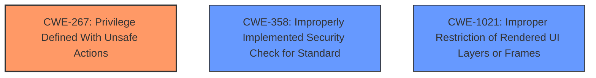

# Final Resolution for CVE-2021-21131

# Summary
| CWE ID     | CWE Name                                                     | Confidence | CWE Abstraction Level | CWE Vulnerability Mapping Label | CWE-Vulnerability Mapping Notes |
| :---------- | :----------------------------------------------------------- | :--------- | :-------------------- | :------------------------------ | :------------------------------ |
| CWE-267      | Privilege Defined With Unsafe Actions                                 | 0.80       | Base                 | Primary                         | Allowed             |
| CWE-358      | Improperly Implemented Security Check for Standard          | 0.70       | Base                 | Secondary                       | Allowed                         |
| CWE-1021     | Improper Restriction of Rendered UI Layers or Frames         | 0.65       | Base                  | Secondary                      | Allowed                         |

## Evidence and Confidence

*   **Confidence Score:** 0.80
*   **Evidence Strength:** MEDIUM

## Relationship Analysis
The initial choice of CWE-269, a Class, was too high-level. The criticism suggested exploring more specific children, which led to selecting CWE-267 (**Privilege Defined With Unsafe Actions**) as the primary **WEAKNESS**. CWE-267 is a base CWE which is more specific. The vulnerability involves bypassing filesystem restrictions, which aligns with actions that a privilege allows. The other two CWEs, CWE-358 and CWE-1021, remain relevant as contributing factors. There aren't direct relationships between these CWEs, but they can contribute to the exploitation of the **ROOTCAUSE** which is CWE-267.

## Vulnerability Chain
The vulnerability chain starts with CWE-267 (**Privilege Defined With Unsafe Actions**), where a privilege, intended or unintended, allows for unsafe actions within the file system. CWE-358 (**Improperly Implemented Security Check for Standard**) contributes by failing to properly validate actions performed under that privilege. CWE-1021 (**Improper Restriction of Rendered UI Layers or Frames**) might allow an attacker to influence the actions performed using the unsafe privilege through UI manipulation.

## Summary of Analysis
The initial analysis correctly identified the core issue as a problem with privilege management. However, it was too general, classifying it as CWE-269 (**Improper Privilege Management**). The criticism highlighted the need for a more specific CWE and suggested several child CWEs of CWE-269.

Based on the vulnerability description, "Insufficient policy enforcement in File System API in Google Chrome prior to 88.0.4324.96 allowed a remote attacker to bypass filesystem restrictions via a crafted HTML page," the most fitting CWE is CWE-267 (**Privilege Defined With Unsafe Actions**). This **WEAKNESS** suggests a privilege exists that can be exploited to bypass file system restrictions. The crafted HTML page exploits this existing privilege to perform unintended actions.

The retriever results also highlighted CWE-358 (**Improperly Implemented Security Check for Standard**) and CWE-1021 (**Improper Restriction of Rendered UI Layers or Frames**). These are still relevant as contributing factors. CWE-358 suggests that the security checks associated with the exploited privilege were not properly implemented, allowing the bypass. CWE-1021 could be involved if the crafted HTML page manipulates UI elements to trigger the unsafe privilege.

Therefore, the final classification is:

*   Primary: CWE-267 (**Privilege Defined With Unsafe Actions**)
*   Secondary: CWE-358 (**Improperly Implemented Security Check for Standard**)
*   Secondary: CWE-1021 (**Improper Restriction of Rendered UI Layers or Frames**)

This classification is at the optimal level of specificity because it pinpoints the root cause as a **PRIVILEGE** that allows unsafe actions, while also acknowledging the contributing factors of improper security checks and potential UI manipulation.