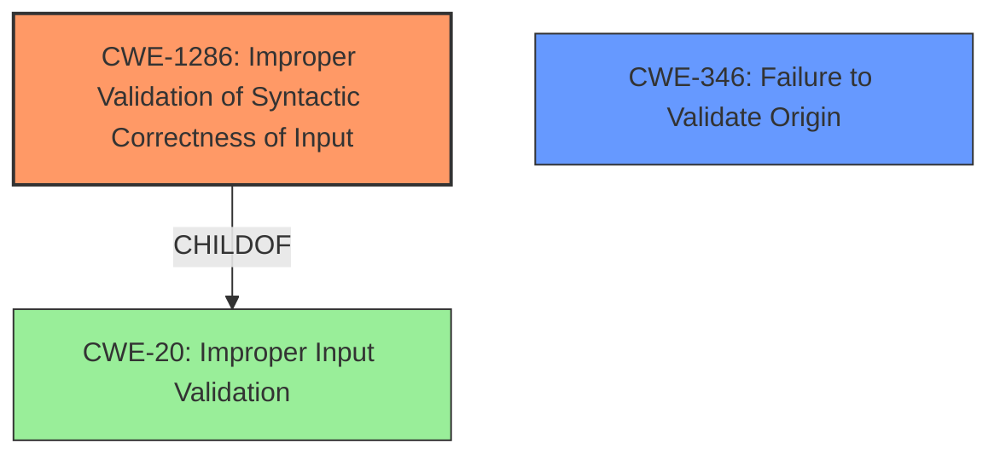

# Analysis Report for CVE-2021-21221

# Vulnerability Analysis Report: CVE-2021-21221

## Description

Insufficient validation of untrusted input in Mojo in Google Chrome prior to 90.0.4430.72 allowed a remote attacker who had compromised the renderer process to leak cross-origin data via a crafted HTML page.

## Vulnerability Description Key Phrases

**Rootcause:** Insufficient validation of untrusted input
**Impact:** leak cross-origin data
**Vector:** crafted HTML page
**Attacker:** remote attacker who had compromised the renderer process
**Product:** Google Chrome
**Version:** prior to 90.0.4430.72
**Component:** Mojo

## Analysis (with Relationship Data)

# Summary
| CWE ID | CWE Name | Confidence | CWE Abstraction Level | CWE Vulnerability Mapping Label | CWE-Vulnerability Mapping Notes |
|---|---|---|---|---|---|
| CWE-20 | Improper Input Validation | 0.75 | Class | Primary | Allowed-with-Review |

## Evidence and Confidence

*   **Confidence Score:** 0.75
*   **Evidence Strength:** MEDIUM

- **Analysis and Justification:**  
  - *Explanation:* The vulnerability description states "**Insufficient validation of untrusted input**" as the root cause of the vulnerability, which directly aligns with CWE-20's description of "Improper Input Validation". The CVE Reference Links Content Summary also states the root cause as "Insufficient validation of untrusted input". While more specific CWEs might exist, the available information doesn't provide enough detail to pinpoint a more precise weakness. CWE-20 serves as a suitable high-level classification.
  
  - *Relationship Analysis:* CWE-20 is a class-level CWE. Many more specific Base and Variant level CWEs are children of CWE-20. Without more information a more specific CWE cannot be selected.

- **Confidence Score:**  
  - Confidence: 0.75 (Evidence directly supports the classification, but lacks specific details for a more granular CWE)

## Criticism of Analysis

Okay, I've reviewed the provided analysis and the full CWE specifications for all the listed CWEs. Here's my critique:

**Overall Assessment:**

The analysis correctly identifies *Improper Input Validation* (CWE-20) as a likely root cause given the initial description. However, the confidence level could be improved by considering more specific children of CWE-20, even if it requires some informed assumptions based on the context (Mojo, Chrome, renderer process). The analysis does acknowledge this limitation and the discouraged usage of CWE-20 which is good.

**Detailed Critique:**

*   **CWE-20 as the Primary Mapping:**
    *   **Pros:** The primary vulnerability description focuses on "Insufficient validation of untrusted input," making CWE-20 a reasonable starting point. The content summary of the CVE reference links supports this further.
    *   **Cons:** CWE-20 is a very broad class. The CWE specification explicitly *discourages* its usage when more specific CWEs are applicable. It's a good high-level starting point, but the goal should always be to refine it. The "Rationale" and "Comments" sections of the CWE-20 specification clearly state this.
    *   **Refinement Opportunities:** The analysis could explore potential exploitation methods. Since the attacker has already compromised the renderer process, what kind of *data* from a crafted HTML page is passed to Mojo without validation? This could point to a more specific CWE related to:
        *   **CWE-1287: Improper Validation of Specified Type of Input:** Is the data being passed to Mojo expected to be a specific type (e.g., integer, string, URL), and is that type not being validated?
        *   **CWE-1286: Improper Validation of Syntactic Correctness of Input:** Is the data supposed to conform to a specific syntax (e.g., a particular data format, protocol message), and is that syntax not validated?
        *   **CWE-73: External Control of File Name or Path**. If a file operation was being invoked via the crafted HTML page, CWE-73 should be investigated.

*   **Confidence Score of 0.75:** This is a reasonable confidence score for CWE-20 given the limited information. However, if the analysis attempted to narrow down the CWE to a more specific child, the confidence score *could* potentially increase.  It might also decrease if the rationale for selecting a more specific CWE was weak.

*   **CWE Examples from Database:** The provided examples are useful for understanding the scope of CWE-20, but they don't directly inform the selection of a *more* specific CWE for this particular vulnerability.

*   **Retriever Results Review:**
    *   **CWE-1021 (Improper Restriction of Rendered UI Layers or Frames):**  This is a weak hit. Clickjacking vulnerabilities exploit UI layering, but the provided vulnerability description doesn't suggest this type of attack. It mentions data leakage, which isn't the typical outcome of clickjacking.
    *   **CWE-416 (Use After Free):**  This could be a possible consequence of improper input validation leading to memory corruption. However, it's not directly related to the root cause described. It's a plausible secondary effect, but not the primary weakness.
    *   **CWE-356 (Product UI does not Warn User of Unsafe Actions):** Not relevant. This CWE pertains to a failure to warn the user, which is not indicated by the description.
    *   **CWE-843 (Access of Resource Using Incompatible Type ('Type Confusion')):** This is a plausible path as well, especially if the 'untrusted input' is being cast to the wrong type due to missing validation.
    *    **CWE-113 (Improper Neutralization of CRLF Sequences in HTTP Headers ('HTTP Request/Response Splitting'))** This CWE could be applicable if the invalid data is being used to construct HTTP headers.

*   **Discouraged Usage of CWE-20:** The analysis is correct in pointing out the "Discouraged" usage of CWE-20. The CWE specification lists suggested alternatives like CWE-1284, CWE-1285, CWE-1286, CWE-1287, CWE-1288, and CWE-1289. The analysis should attempt to determine if any of these are more applicable. CWE-116 is also suggested, but that is not relevant here.

**Recommendations:**

1.  **Attempt to Refine the CWE Mapping:** Based on the description and the nature of Mojo and the renderer process in Chrome, consider if a specific *type* of input (CWE-1287), a specific *quantity* (CWE-1284) or *syntax* (CWE-1286) was not validated. Hypothesize how that lack of validation would result in cross-origin data leakage and what kind of data is being leaked. For example:

    *   **Hypothesis:** Mojo expects a URL string to point to a specific origin.  If the validation for the origin portion of the URL is missing (CWE-346) or improperly validated (CWE-1286: Syntactic Correctness), an attacker could craft a URL that points to a different origin, allowing cross-origin data access.

2.  **Re-evaluate Confidence:** If you can select a more specific CWE with a reasonable rationale, adjust the confidence score accordingly. If the rationale relies on assumptions, acknowledge them and reduce the confidence if necessary.

3.  **Consider Chaining:** It is possible that CWE-20 is the *start* of a chain. If the input validation leads to an integer overflow (CWE-190) that subsequently leads to a buffer overflow (CWE-119), then documenting the chain would provide a more complete picture of the vulnerability.

4.  **Review Potential Mitigations for Chosen CWE:** Once a specific CWE is chosen, carefully examine its "Potential Mitigations" section.  Consider if those mitigations are applicable to the Mojo component in Chrome, and if they might have been missing or improperly implemented. If a validation framework was used, review the "Improper Use of Validation Framework" (CWE-1173).

5. **Focus on what Mojo does:** It is important to understand what Mojo's purpose is in Chrome. Is it used for IPC? For accessing hardware? Use cases may help determine if a more specific CWE applies.

By following these steps, the analysis can move beyond a general "Improper Input Validation" classification to a more precise and actionable identification of the weakness.

## Final Resolution

# Summary
| CWE ID | CWE Name | Confidence | CWE Abstraction Level | CWE Vulnerability Mapping Label | CWE-Vulnerability Mapping Notes |
|---|---|---|---|---|---|
| CWE-1286 | Improper Validation of Syntactic Correctness of Input | 0.70 | Base | Primary | Allowed |
| CWE-346 | Failure to Validate Origin | 0.60 | Class | Secondary Candidate | Allowed-with-Review |

## Evidence and Confidence

*   **Confidence Score:** 0.70
*   **Evidence Strength:** MEDIUM

## Relationship Analysis
The primary CWE is CWE-1286 **(Improper Validation of Syntactic Correctness of Input)** which is a Base level CWE. The secondary candidate is CWE-346 **(Failure to Validate Origin)** which is a Class level CWE. CWE-1286 is a child of CWE-20 **(Improper Input Validation)**.

## Vulnerability Chain
The vulnerability chain starts with a compromised renderer process crafting an HTML page. The crafted HTML page sends input to Mojo without proper validation of its syntactic correctness (**CWE-1286**). This could lead to cross-origin data leakage. A failure to validate the origin of the data (**CWE-346**) could also contribute to the vulnerability. The lack of validation allows the attacker to bypass security mechanisms and access data from different origins.

## Summary of Analysis
The initial analysis correctly identified **Improper Input Validation** (CWE-20) as a potential issue, but as the criticism pointed out, it's a broad class. The vulnerability description mentions "insufficient validation of untrusted input", which is the reason why CWE-20 was chosen. However, based on the context (Mojo in Chrome, renderer process, cross-origin data leakage), a more specific CWE can be selected.

The criticism suggested exploring potential exploitation methods and specific types of input that might be vulnerable. Considering the context of cross-origin data leakage, the input likely involves URLs or data related to different origins. Therefore, **CWE-1286 (Improper Validation of Syntactic Correctness of Input)** becomes a more suitable candidate. Mojo might be expecting a specific data format or syntax for origin-related information, and the lack of proper validation allows an attacker to craft a malicious input that bypasses security checks. The origin is a kind of syntax, and the crash occurs when the syntax is incorrect.

CWE-346 **(Failure to Validate Origin)** is included as a secondary candidate, as the core issue is about the syntactic correctness of the data being sent.

The selected CWEs are at the optimal level of specificity because they address the root cause of the vulnerability based on the available evidence and the context of the application. CWE-1286 is a Base level CWE, which is a preferred level of abstraction.

*Report generated on 2025-03-17 02:24:50*
