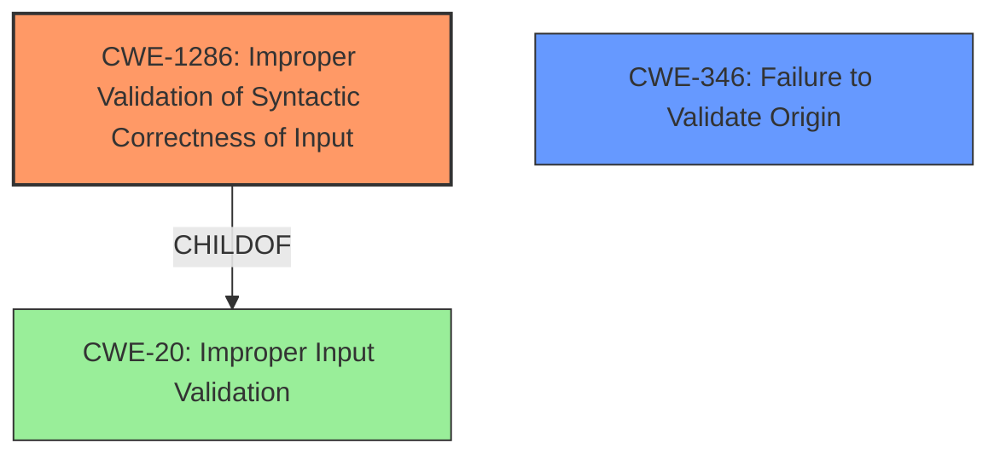

# Final Resolution for CVE-2021-21221

# Summary
| CWE ID | CWE Name | Confidence | CWE Abstraction Level | CWE Vulnerability Mapping Label | CWE-Vulnerability Mapping Notes |
|---|---|---|---|---|---|
| CWE-1286 | Improper Validation of Syntactic Correctness of Input | 0.70 | Base | Primary | Allowed |
| CWE-346 | Failure to Validate Origin | 0.60 | Class | Secondary Candidate | Allowed-with-Review |

## Evidence and Confidence

*   **Confidence Score:** 0.70
*   **Evidence Strength:** MEDIUM

## Relationship Analysis
The primary CWE is CWE-1286 **(Improper Validation of Syntactic Correctness of Input)** which is a Base level CWE. The secondary candidate is CWE-346 **(Failure to Validate Origin)** which is a Class level CWE. CWE-1286 is a child of CWE-20 **(Improper Input Validation)**.

## Vulnerability Chain
The vulnerability chain starts with a compromised renderer process crafting an HTML page. The crafted HTML page sends input to Mojo without proper validation of its syntactic correctness (**CWE-1286**). This could lead to cross-origin data leakage. A failure to validate the origin of the data (**CWE-346**) could also contribute to the vulnerability. The lack of validation allows the attacker to bypass security mechanisms and access data from different origins.

## Summary of Analysis
The initial analysis correctly identified **Improper Input Validation** (CWE-20) as a potential issue, but as the criticism pointed out, it's a broad class. The vulnerability description mentions "insufficient validation of untrusted input", which is the reason why CWE-20 was chosen. However, based on the context (Mojo in Chrome, renderer process, cross-origin data leakage), a more specific CWE can be selected.

The criticism suggested exploring potential exploitation methods and specific types of input that might be vulnerable. Considering the context of cross-origin data leakage, the input likely involves URLs or data related to different origins. Therefore, **CWE-1286 (Improper Validation of Syntactic Correctness of Input)** becomes a more suitable candidate. Mojo might be expecting a specific data format or syntax for origin-related information, and the lack of proper validation allows an attacker to craft a malicious input that bypasses security checks. The origin is a kind of syntax, and the crash occurs when the syntax is incorrect.

CWE-346 **(Failure to Validate Origin)** is included as a secondary candidate, as the core issue is about the syntactic correctness of the data being sent.

The selected CWEs are at the optimal level of specificity because they address the root cause of the vulnerability based on the available evidence and the context of the application. CWE-1286 is a Base level CWE, which is a preferred level of abstraction.