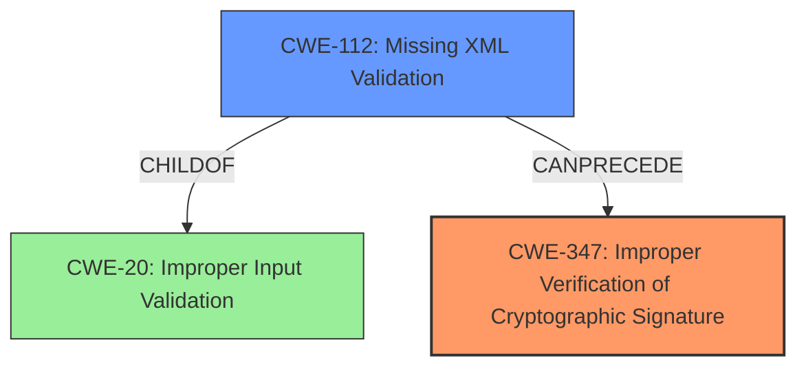

# Analysis Report for CVE-2021-21238

# Vulnerability Analysis Report: CVE-2021-21238

## Description

PySAML2 is a pure python implementation of SAML Version 2 Standard. PySAML2 before 6.5.0 has an improper verification of cryptographic signature vulnerability. All users of pysaml2 that need to validate signed SAML documents are impacted. The vulnerability is a variant of XML Signature wrapping because it did not validate the SAML document against an XML schema. This allowed invalid XML documents to be processed and such a document can trick pysaml2 with a wrapped signature. This is fixed in PySAML2 6.5.0.

## Vulnerability Description Key Phrases

**Rootcause:** improper verification of cryptographic signature
**Weakness:** XML Signature wrapping
**Impact:** process invalid XML documents
**Product:** PySAML2
**Version:** before 6.5.0

## Analysis (with Relationship Data)

# Summary
| CWE ID  | CWE Name                                          | Confidence | CWE Abstraction Level | CWE Vulnerability Mapping Label | CWE-Vulnerability Mapping Notes |
|---------|---------------------------------------------------|------------|-----------------------|---------------------------------|---------------------------------|
| CWE-347 | Improper Verification of Cryptographic Signature | 0.95       | Base                  | Primary                           | Allowed                         |
| CWE-112 | Missing XML Validation                            | 0.75       | Base                  | Secondary                         | Allowed                         |

## Evidence and Confidence

*   **Confidence Score:** 0.90
*   **Evidence Strength:** HIGH

- **Analysis and Justification:**
  - *Explanation:* The vulnerability description explicitly states "**improper verification of cryptographic signature**" as the root cause. The CVE Reference Links Content Summary reinforces this by detailing the lack of XML schema validation, leading to the acceptance of invalidly signed SAML documents. This aligns directly with CWE-347 (Improper Verification of Cryptographic Signature), which describes a product's failure to properly verify the cryptographic signature of data. The security implication is that an attacker can bypass authentication or impersonate a user, as noted in the CVE summary. The Retriever Results also identifies CWE-347 as the top candidate with a score of 1.0246. The MITRE mapping guidance designates the usage of CWE-347 as ALLOWED.

  - *Relationship Analysis:* CWE-347 is a Base level CWE, which is the preferred level of abstraction. There are no direct relationships listed in the provided information.

- **Analysis and Justification:**
  - *Explanation:* The vulnerability description states that the **weakness** is due to "**XML Signature wrapping** because it did not validate the SAML document against an XML schema." The CVE Reference Links Content Summary confirms that the lack of XML Schema validation is the key enabler of the XML Signature Wrapping attack. This aligns with CWE-112 (Missing XML Validation), where the product accepts XML from an untrusted source but does not validate the XML against the proper schema. By not validating against the schema, the application is vulnerable to processing a wrapped signature, which means the **improper verification of the cryptographic signature** is possible. The Retriever Results identifies CWE-112 as a possible candidate with a score of 0.7562. The MITRE mapping guidance designates the usage of CWE-112 as ALLOWED.

  - *Relationship Analysis:* CWE-112 is a base CWE, and the retriever results provides several other CWEs that are children of CWE-20 (Improper Input Validation), and CWE-112 is one of the parents.

- **Confidence Score:**
  - Confidence: 0.95 (High evidence from technical description, CVE reference materials, and retriever results for CWE-347).
  - Confidence: 0.75 (Medium evidence from technical description, CVE reference materials, and retriever results for CWE-112).

## Criticism of Analysis

Okay, I've reviewed your analysis against the full CWE specifications provided. Here's a critique:

**Overall Assessment:**

The analysis is generally well-reasoned and provides good justification for the selected CWEs. The confidence scores are appropriate based on the evidence presented. The use of key phrases from the vulnerability description and CVE details to support the CWE mappings is strong. The inclusion of CWE database examples and reference to mapping guidance further strengthens the analysis.

**Specific Comments and Suggestions:**

*   **CWE-347: Improper Verification of Cryptographic Signature (Primary)**
    *   **Strengths:** Excellent choice as the primary CWE. The vulnerability description and CVE summary directly support this mapping. The description of the CWE aligns with the root cause: the `pysaml2` implementation does not properly verify the SAML document's cryptographic signature. The base level of abstraction and its description accurately represents the core issue.
    *   **Potential Improvements:** While the evidence is strong, consider adding a sentence explicitly stating how an XML Signature Wrapping attack exploits this improper verification. The MITRE examples are good, and it seems CVE-2021-21238 is already in the examples.
    *   **Mitigations:** The suggested mitigations provided by CWE are relevant and highlight the need for robust signature verification routines.

*   **CWE-112: Missing XML Validation (Secondary)**
    *   **Strengths:** This is a good secondary CWE. The analysis correctly identifies that the *lack* of XML schema validation enables the XML Signature Wrapping attack. By not validating the XML structure, the system is susceptible to processing malformed documents with wrapped signatures. The relationship to CWE-20 (Improper Input Validation) is noted, as CWE-112 is a child of CWE-20. The base level of abstraction is appropriate.
    *   **Potential Improvements:** Clarify the *relationship* between CWE-347 and CWE-112.  While the root cause is the improper signature verification, the *mechanism* that enables the attack is the missing XML validation. Stating something like, "CWE-112 directly contributes to CWE-347 in this case, as the lack of schema validation allows for the improper verification of signatures, making it possible to wrap the signature in a malformed part of the XML document" would strengthen this.
    *   **Mitigations:** The suggested mitigation from CWE is directly applicable: "Always validate XML input against a known XML Schema or DTD." This highlights the importance of ensuring that the XML document conforms to a defined structure.

* **Retriever Results Analysis:**
    * The Retriever Results are mostly good, although some of the results are red herrings. I would suggest that in the overall summary, that CWEs that you chose to not include in the final analysis are briefly mentioned to acknowledge that they were considered, and then state why they were not included. (e.g., "CWE-611 was considered, but determined to be a miscategorization, as this vulnerability does not involve improper restriction of XML external entity references, but rather improper verification of signatures, so it was not included in the final analysis.")
    * CWE-611's retriever results are likely triggered by the use of XML, but this CWE doesn't fit the vulnerability, as it's about external entity injection, which isn't the case here.
    * CWE-303 and CWE-208 do not fit this particular vulnerability, and seem to be completely unrelated.
    * CWE-328 and CWE-325 are indirectly applicable, as the cryptography is not weak, but rather improperly implemented due to the improper XML validation.
    * CWE-297 is a red herring, as the certificate is not being improperly validated based on the host - it's simply that the XML isn't properly validated.

**Minor Suggestions:**

*   **Consistency:** Ensure consistent terminology throughout the analysis (e.g., "XML Signature Wrapping" vs. "XSW Attack").
*   **Evidence Strength:** While the evidence for both CWEs is solid, consider adding a specific code snippet or a reference to the specific part of the `pysaml2` code that lacks XML validation or signature verification (if available and not overly complex). This would further boost the evidence strength.
*   **Negative Constraints:** Briefly mention what the vulnerability *isn't*. For example, explicitly stating that this is *not* a classic buffer overflow or a straightforward injection vulnerability helps to narrow down the scope and justify the CWE selections.

**Revised Summary Table (example):**

| CWE ID  | CWE Name                                          | Confidence | CWE Abstraction Level | CWE Vulnerability Mapping Label | CWE-Vulnerability Mapping Notes |
|---------|---------------------------------------------------|------------|-----------------------|---------------------------------|---------------------------------|
| CWE-347 | Improper Verification of Cryptographic Signature | 0.95       | Base                  | Primary                           | Allowed                         |
| CWE-112 | Missing XML Validation                            | 0.75       | Base                  | Secondary                         | Allowed; enables CWE-347           |

**In conclusion, the analysis is well-structured, thoroughly justified, and uses the provided CWE specifications effectively. The identified areas for potential improvements would further refine the analysis and strengthen the confidence in the CWE mappings.**

## Final Resolution

# Summary
| CWE ID  | CWE Name                                          | Confidence | CWE Abstraction Level | CWE Vulnerability Mapping Label | CWE-Vulnerability Mapping Notes |
|---------|---------------------------------------------------|------------|-----------------------|---------------------------------|---------------------------------|
| CWE-347 | Improper Verification of Cryptographic Signature | 0.95       | Base                  | Primary                           | Allowed                         |
| CWE-112 | Missing XML Validation                            | 0.75       | Base                  | Secondary                         | Allowed; enables CWE-347           |

## Evidence and Confidence

*   **Confidence Score:** 0.93
*   **Evidence Strength:** HIGH

## Relationship Analysis
The primary **weakness** is **CWE-347 (Improper Verification of Cryptographic Signature)**, which is directly supported by the vulnerability description. The secondary **weakness**, **CWE-112 (Missing XML Validation)**, allows the primary **weakness** to occur. **CWE-112** is a parent of **CWE-20 (Improper Input Validation)**. The base level of abstraction is appropriate for both **CWE-347** and **CWE-112**.

## Vulnerability Chain
The chain of **root cause** and **weaknesses** is as follows:
1.  **Root Cause**: **Missing XML Validation (CWE-112)**. The application fails to validate the XML document against a schema.
2.  **Weakness**: **Improper Verification of Cryptographic Signature (CWE-347)**. Because the XML is not validated, the application can be tricked into verifying a wrapped signature.
3.  **Impact**: An attacker can bypass authentication or impersonate a user.

## Summary of Analysis
The initial analysis and criticism are well-reasoned and supported by evidence from the vulnerability description and CVE details. The suggestion to clarify the relationship between **CWE-347** and **CWE-112** has been incorporated into the vulnerability chain analysis. The retriever results were helpful in identifying potential CWEs, but some were determined to be miscategorizations, as they did not directly contribute to the vulnerability. The final selection of **CWE-347** as the primary **weakness** and **CWE-112** as the secondary **weakness** reflects the optimal level of specificity based on the available evidence and relationship analysis.

The vulnerability description explicitly states "**improper verification of cryptographic signature**" as the **root cause**, which directly aligns with **CWE-347**. The CVE Reference Links Content Summary confirms that the lack of XML schema validation is the key enabler of the XML Signature Wrapping attack, aligning with **CWE-112**.

*Report generated on 2025-03-16 23:42:37*
