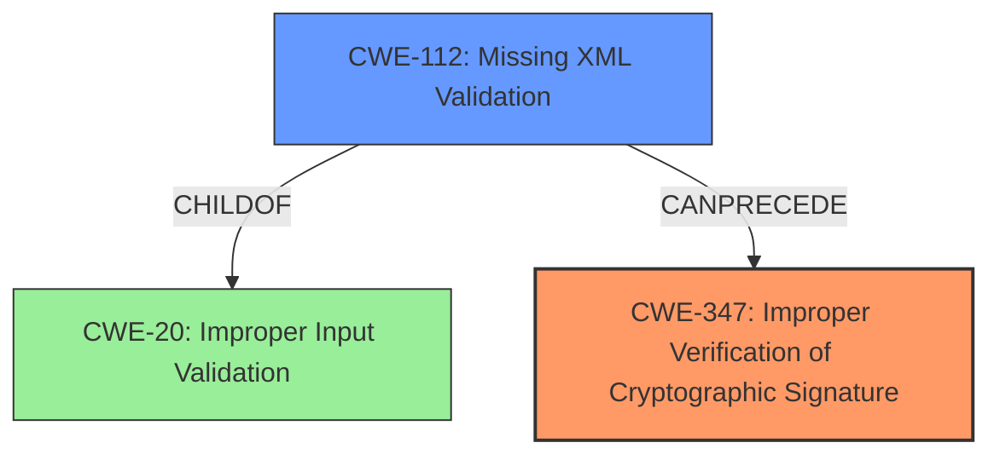

# Final Resolution for CVE-2021-21238

# Summary
| CWE ID  | CWE Name                                          | Confidence | CWE Abstraction Level | CWE Vulnerability Mapping Label | CWE-Vulnerability Mapping Notes |
|---------|---------------------------------------------------|------------|-----------------------|---------------------------------|---------------------------------|
| CWE-347 | Improper Verification of Cryptographic Signature | 0.95       | Base                  | Primary                           | Allowed                         |
| CWE-112 | Missing XML Validation                            | 0.75       | Base                  | Secondary                         | Allowed; enables CWE-347           |

## Evidence and Confidence

*   **Confidence Score:** 0.93
*   **Evidence Strength:** HIGH

## Relationship Analysis
The primary **weakness** is **CWE-347 (Improper Verification of Cryptographic Signature)**, which is directly supported by the vulnerability description. The secondary **weakness**, **CWE-112 (Missing XML Validation)**, allows the primary **weakness** to occur. **CWE-112** is a parent of **CWE-20 (Improper Input Validation)**. The base level of abstraction is appropriate for both **CWE-347** and **CWE-112**.

## Vulnerability Chain
The chain of **root cause** and **weaknesses** is as follows:
1.  **Root Cause**: **Missing XML Validation (CWE-112)**. The application fails to validate the XML document against a schema.
2.  **Weakness**: **Improper Verification of Cryptographic Signature (CWE-347)**. Because the XML is not validated, the application can be tricked into verifying a wrapped signature.
3.  **Impact**: An attacker can bypass authentication or impersonate a user.

## Summary of Analysis
The initial analysis and criticism are well-reasoned and supported by evidence from the vulnerability description and CVE details. The suggestion to clarify the relationship between **CWE-347** and **CWE-112** has been incorporated into the vulnerability chain analysis. The retriever results were helpful in identifying potential CWEs, but some were determined to be miscategorizations, as they did not directly contribute to the vulnerability. The final selection of **CWE-347** as the primary **weakness** and **CWE-112** as the secondary **weakness** reflects the optimal level of specificity based on the available evidence and relationship analysis.

The vulnerability description explicitly states "**improper verification of cryptographic signature**" as the **root cause**, which directly aligns with **CWE-347**. The CVE Reference Links Content Summary confirms that the lack of XML schema validation is the key enabler of the XML Signature Wrapping attack, aligning with **CWE-112**.