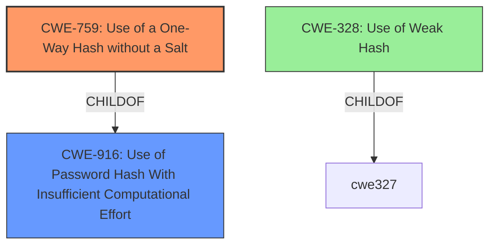

# Analysis Report for CVE-2021-21253

# Vulnerability Analysis Report: CVE-2021-21253

## Description

OnlineVotingSystem is an open source project hosted on GitHub. OnlineVotingSystem before version 1.1.2 hashes user passwords without a salt, which is vulnerable to dictionary attacks. Therefore there is a threat of security breach in the voting system. Without a salt, it is much easier for attackers to pre-compute the hash value using dictionary attack techniques such as rainbow tables to crack passwords. This problem is fixed and published in version 1.1.2. A long randomly generated salt is added to the password hash function to better protect passwords stored in the voting system.

## Vulnerability Description Key Phrases

**Weakness:** hashes user passwords without a salt
**Impact:** crack passwords
**Vector:** dictionary attacks
**Attacker:** attackers
**Product:** OnlineVotingSystem
**Version:** before version 1.1.2

## Analysis (with Relationship Data)

# Summary
| CWE ID | CWE Name | Confidence | CWE Abstraction Level | CWE Vulnerability Mapping Label | CWE-Vulnerability Mapping Notes |
|---|---|---|---|---|---|
| CWE-759 | Use of a One-Way Hash without a Salt | 1.0 | Variant | Allowed | Primary CWE: The application **hashes user passwords without a salt**, making it vulnerable to dictionary attacks. |
| CWE-916 | Use of Password Hash With Insufficient Computational Effort | 0.7 | Base | Allowed | Secondary CWE: Using a one-way hash without a salt indicates insufficient computational effort to protect passwords. |

## Evidence and Confidence

*   **Confidence Score:** 0.9
*   **Evidence Strength:** HIGH

- **Analysis and Justification:**  
  - *Explanation:* The vulnerability description clearly states that the OnlineVotingSystem **hashes user passwords without a salt**. This directly aligns with the description of CWE-759, "Use of a One-Way Hash without a Salt," which is a Variant level weakness and is ALLOWED according to MITRE mapping guidance. The CVE Reference Links Content Summary explicitly identifies this as the root cause and refers to CWE-759. The absence of a salt makes the system vulnerable to dictionary attacks, increasing the risk of password compromise. While other CWEs like CWE-916 (Use of Password Hash With Insufficient Computational Effort) are relevant, CWE-759 is more specific to the described **weakness**.

  - *Relationship Analysis:* CWE-759 is a child of CWE-916. CWE-916 is a more general case of using weak password hashing, while CWE-759 specifies the use of one-way hashing without a salt. Mapping to CWE-759 is more specific and appropriate given the description.

- **Confidence Score:**  
  - Confidence: 1.0 (High confidence due to direct evidence from the vulnerability description and CVE reference materials, as well as the Retriever Results)

---
- **Analysis and Justification:**  
  - *Explanation:* CWE-916 (Use of Password Hash With Insufficient Computational Effort) is a candidate because the use of a one-way hash function without a salt indicates insufficient computational effort to protect passwords. The product generates a hash for a password, but it uses a scheme that does not provide a sufficient level of computational effort that would make password cracking attacks infeasible or expensive. It's a Base level CWE and is ALLOWED. While not as specific as CWE-759, it is still relevant as a broader characterization of the **weakness**.

  - *Relationship Analysis:* CWE-916 is a parent of CWE-759, meaning that CWE-759 is a more specific type of insufficient computational effort.

- **Confidence Score:**  
  - Confidence: 0.7 (Medium confidence because, although relevant, it's less specific than CWE-759)

## Criticism of Analysis

Okay, let's review the CWE analysis provided, keeping in mind the full CWE specifications.

**Overall Assessment:**

The analysis is generally good and identifies the primary weakness correctly. The choice of CWE-759 as the primary CWE is appropriate and well-justified. The inclusion of CWE-916 as a secondary CWE provides additional context, although it's less specific. The confidence scores are reasonable.

**Detailed Critique:**

**1. CWE-759: Use of a One-Way Hash without a Salt**

*   **CWE Name:** Use of a One-Way Hash without a Salt
*   **Confidence:** 1.0
*   **Abstraction Level:** Variant
*   **Vulnerability Mapping Label:** Allowed
*   **CWE-Vulnerability Mapping Notes:** Primary CWE: The application hashes user passwords without a salt, making it vulnerable to dictionary attacks.

*   **Review:**

    *   **Correctness:** The mapping to CWE-759 is accurate. The description aligns perfectly with the CWE definition. The absence of a salt directly leads to the vulnerability described in the CVE.
    *   **Justification:** The explanation provided is clear and convincing. The analysis correctly points out that CWE-759 is a Variant level weakness, which is the preferred level of abstraction for mapping to root causes. The reference to the CVE Reference Links Content Summary further strengthens the justification.
    *   **Confidence:** The high confidence score (1.0) is justified due to the direct evidence and clear alignment with the CWE definition.  The Retriever Results also highly favor this CWE.
    *   **Mapping Guidance Compliance:** The analysis adheres to the "Allowed" usage guidance, acknowledging that it's a Variant level of abstraction.
    *   **Mitigations:**  The analysis doesn't explicitly mention mitigations, which would strengthen the analysis.  Based on the CWE specifications, the following mitigations would be appropriate to mention:
        *   **Mitigation 1 (Architecture and Design - High Effectiveness):**  Using an adaptive hash function (bcrypt, scrypt, PBKDF2) that can be configured to change the amount of computational effort needed to compute the hash.  This is the preferred mitigation.
        *   **Mitigation 2 (Architecture and Design - Limited Effectiveness):**  Generating a new random salt for each password using a strong random number generator and storing it with the hash.

**2. CWE-916: Use of Password Hash With Insufficient Computational Effort**

*   **CWE Name:** Use of Password Hash With Insufficient Computational Effort
*   **Confidence:** 0.7
*   **Abstraction Level:** Base
*   **Vulnerability Mapping Label:** Allowed
*   **CWE-Vulnerability Mapping Notes:** Secondary CWE: Using a one-way hash without a salt indicates insufficient computational effort to protect passwords.

*   **Review:**

    *   **Correctness:** The mapping to CWE-916 is also correct, but less specific than CWE-759. It's a broader categorization.
    *   **Justification:** The justification is reasonable, stating that the absence of a salt indicates insufficient computational effort. However, it's important to emphasize that CWE-759 is a specific instance of CWE-916.
    *   **Confidence:** The medium confidence score (0.7) is appropriate.
    *   **Mapping Guidance Compliance:** Complies with the "Allowed" usage guidance, noting that it's a Base level CWE. The analysis also acknowledges that CWE-759 is a more specific type of insufficient computational effort.
    *   **Mitigations:** Again, the analysis doesn't explicitly mention mitigations, and adding them would be beneficial. The most relevant mitigation (and the same as for CWE-759) is:
        *   **Mitigation 1 (Architecture and Design - High Effectiveness):**  Using an adaptive hash function (bcrypt, scrypt, PBKDF2) that can be configured to change the amount of computational effort needed to compute the hash.

**Suggestions for Improvement:**

1.  **Explicitly mention mitigations:** For both CWEs, adding a sentence or two about the recommended mitigations from the CWE specifications would make the analysis more comprehensive and actionable. This would highlight the importance of not just identifying the weakness but also knowing how to fix it.  Specifically, mentioning the use of adaptive hash functions like bcrypt, scrypt, or PBKDF2.

2.  **Relationship Emphasis:** Reinforce the parent-child relationship between CWE-916 and CWE-759.  The analysis already does this well, but it could be strengthened by explicitly stating that fixing CWE-759 *automatically* addresses the broader concern of CWE-916 in this specific case.

3. **Consider CWE-328: Use of Weak Hash:** Although CWE-759 and CWE-916 are highly relevant, consider adding a brief discussion of CWE-328 (Use of Weak Hash).  While the primary issue is the lack of a salt, the fact that a simple (and therefore potentially weak) one-way hash was used at all contributes to the weakness.  The extended description of CWE-328 explicitly mentions the lack of salt as a way a hash can be made weak. Justify why it is not selected as a primary or secondary weakness.

4. **Acknowledge Limitations:** It might be worthwhile to acknowledge the limitations of the analysis, such as not having access to the source code to confirm the exact hashing algorithm used.

**Revised Summary Table (Example):**

| CWE ID    | CWE Name                                                | Confidence | CWE Abstraction Level | CWE Vulnerability Mapping Label | CWE-Vulnerability Mapping Notes                                                                                                                                                                                                                                                                                                                                                                    |
| --------- | ------------------------------------------------------- | ---------- | ----------------------- | --------------------------------- | ------------------------------------------------------------------------------------------------------------------------------------------------------------------------------------------------------------------------------------------------------------------------------------------------------------------------------------------------------------------------------------------------- |
| CWE-759   | Use of a One-Way Hash without a Salt                   | 1.0        | Variant                 | Allowed                           | Primary CWE: The application hashes user passwords without a salt, making it vulnerable to dictionary attacks.  **Mitigation:** Use an adaptive hash function like bcrypt, scrypt, or PBKDF2.                                                                                                                                                                                                             |
| CWE-916   | Use of Password Hash With Insufficient Computational Effort | 0.7        | Base                    | Allowed                           | Secondary CWE: Using a one-way hash without a salt indicates insufficient computational effort to protect passwords. CWE-759 is a specific instance of this. Addressing CWE-759 addresses this concern. **Mitigation:** Use an adaptive hash function like bcrypt, scrypt, or PBKDF2.                                                                                                       |
| CWE-328   | Use of Weak Hash                                                | 0.3        | Base                    | Allowed                           | Considered, but not selected as primary/secondary: The simple one-way hash function used (implied from the lack of salt) may be considered a weak hash overall. Mitigations for CWE-759 and CWE-916 address this concern.                                                                                                                                      |

By incorporating these suggestions, the analysis will be even more robust and informative.

## Final Resolution

# Summary
| CWE ID | CWE Name | Confidence | CWE Abstraction Level | CWE Vulnerability Mapping Label | CWE-Vulnerability Mapping Notes |
|---|---|---|---|---|---|
| CWE-759 | Use of a One-Way Hash without a Salt | 1.0 | Variant | Allowed | Primary CWE: The application **hashes user passwords without a salt**, making it vulnerable to dictionary attacks. Mitigation: Use an adaptive hash function like bcrypt, scrypt, or PBKDF2. |
| CWE-916 | Use of Password Hash With Insufficient Computational Effort | 0.7 | Base | Allowed | Secondary CWE: Using a one-way hash without a salt indicates insufficient computational effort to protect passwords. CWE-759 is a specific instance of this. Addressing CWE-759 addresses this concern. Mitigation: Use an adaptive hash function like bcrypt, scrypt, or PBKDF2. |

## Evidence and Confidence

*   **Confidence Score:** 0.9
*   **Evidence Strength:** HIGH

## Relationship Analysis
The primary relationship influencing the decision is the parent-child relationship between CWE-916 (Base) and CWE-759 (Variant). CWE-759 is a more specific case of CWE-916. The analysis also considered CWE-328 but determined that the lack of a salt (CWE-759) was the more direct and impactful weakness. Choosing the Variant level CWE-759 provides a more precise classification.

## Vulnerability Chain
The vulnerability chain starts with the **ROOTCAUSE** of using a one-way hash function without a salt (**CWE-759**). This leads to the **WEAKNESS** of insufficient computational effort (**CWE-916**). The final impact is the vulnerability to dictionary attacks, increasing the risk of password compromise.

## Summary of Analysis
The initial analysis and criticism both converge on the appropriateness of CWE-759 as the primary CWE due to the explicit mention of **hashing user passwords without a salt** in the vulnerability description. This direct evidence, combined with the Variant level of abstraction of CWE-759, makes it the most suitable classification. The inclusion of CWE-916 as a secondary CWE provides broader context but is less specific. The relationship analysis confirms that CWE-759 is a specific instance of CWE-916, justifying the selection of the more precise Variant. The decision is also supported by the retriever scores, which highly favored CWE-759.

The mitigations suggested, such as using adaptive hash functions like bcrypt, scrypt, or PBKDF2, directly address the **ROOTCAUSE** and **WEAKNESS**, further validating the chosen classifications.

The analysis considered CWE-328 but determined that the core issue was the absence of a salt, making CWE-759 a more accurate representation of the vulnerability. While a simple one-way hash is potentially weak, the lack of salt is the immediate problem.

*Report generated on 2025-03-16 23:43:12*
