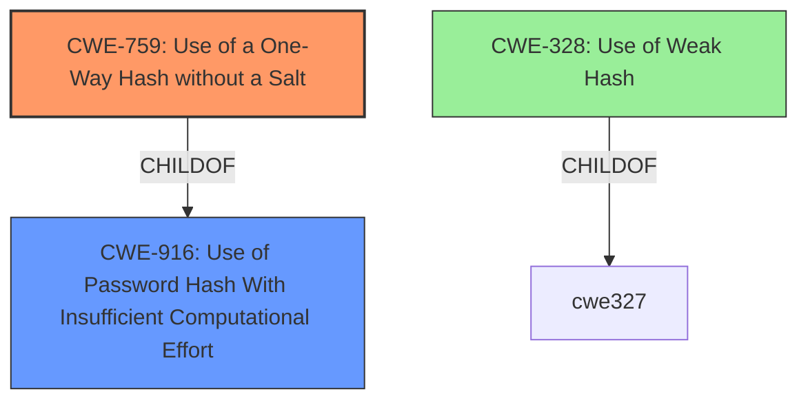

# Final Resolution for CVE-2021-21253

# Summary
| CWE ID | CWE Name | Confidence | CWE Abstraction Level | CWE Vulnerability Mapping Label | CWE-Vulnerability Mapping Notes |
|---|---|---|---|---|---|
| CWE-759 | Use of a One-Way Hash without a Salt | 1.0 | Variant | Allowed | Primary CWE: The application **hashes user passwords without a salt**, making it vulnerable to dictionary attacks. Mitigation: Use an adaptive hash function like bcrypt, scrypt, or PBKDF2. |
| CWE-916 | Use of Password Hash With Insufficient Computational Effort | 0.7 | Base | Allowed | Secondary CWE: Using a one-way hash without a salt indicates insufficient computational effort to protect passwords. CWE-759 is a specific instance of this. Addressing CWE-759 addresses this concern. Mitigation: Use an adaptive hash function like bcrypt, scrypt, or PBKDF2. |

## Evidence and Confidence

*   **Confidence Score:** 0.9
*   **Evidence Strength:** HIGH

## Relationship Analysis
The primary relationship influencing the decision is the parent-child relationship between CWE-916 (Base) and CWE-759 (Variant). CWE-759 is a more specific case of CWE-916. The analysis also considered CWE-328 but determined that the lack of a salt (CWE-759) was the more direct and impactful weakness. Choosing the Variant level CWE-759 provides a more precise classification.

## Vulnerability Chain
The vulnerability chain starts with the **ROOTCAUSE** of using a one-way hash function without a salt (**CWE-759**). This leads to the **WEAKNESS** of insufficient computational effort (**CWE-916**). The final impact is the vulnerability to dictionary attacks, increasing the risk of password compromise.

## Summary of Analysis
The initial analysis and criticism both converge on the appropriateness of CWE-759 as the primary CWE due to the explicit mention of **hashing user passwords without a salt** in the vulnerability description. This direct evidence, combined with the Variant level of abstraction of CWE-759, makes it the most suitable classification. The inclusion of CWE-916 as a secondary CWE provides broader context but is less specific. The relationship analysis confirms that CWE-759 is a specific instance of CWE-916, justifying the selection of the more precise Variant. The decision is also supported by the retriever scores, which highly favored CWE-759.

The mitigations suggested, such as using adaptive hash functions like bcrypt, scrypt, or PBKDF2, directly address the **ROOTCAUSE** and **WEAKNESS**, further validating the chosen classifications.

The analysis considered CWE-328 but determined that the core issue was the absence of a salt, making CWE-759 a more accurate representation of the vulnerability. While a simple one-way hash is potentially weak, the lack of salt is the immediate problem.