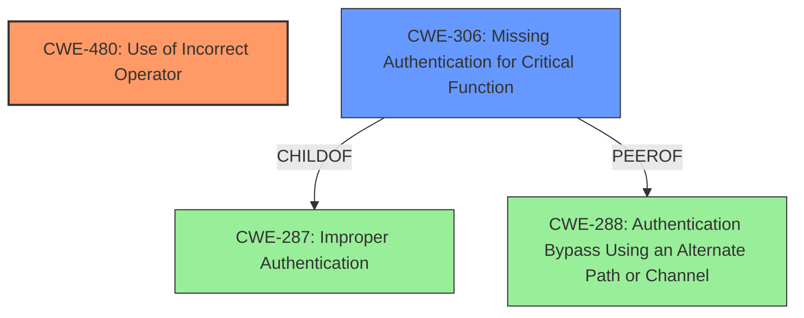

# Analysis Report for CVE-2021-21276

# Vulnerability Analysis Report: CVE-2021-21276

## Description

Polr is an open source URL shortener. in Polr before version 2.3.0, a vulnerability in the setup process allows attackers to gain admin access to site instances, even if they do not possess an existing account. This vulnerability exists regardless of users settings. If an attacker crafts a request with specific cookie headers to the /setup/finish endpoint, they may be able to obtain admin privileges on the instance. This is caused by a loose comparison (==) in SetupController that is susceptible to attack. The project has been patched to ensure that a strict comparison (===) is used to verify the setup key, and that /setup/finish verifies that no users table exists before performing any migrations or provisioning any new accounts. This is fixed in version 2.3.0. Users can patch this vulnerability without upgrading by adding abort(404) to the very first line of finishSetup in SetupController.php.

## Vulnerability Description Key Phrases

**Rootcause:** loose comparison (==) in SetupController
**Impact:** gain admin access
**Vector:** request with specific cookie headers to /setup/finish endpoint
**Attacker:** attackers
**Product:** Polr
**Version:** before 2.3.0
**Component:** setup process

## Analysis (with Relationship Data)

# Summary
| CWE ID | CWE Name | Confidence | CWE Abstraction Level | CWE Vulnerability Mapping Label | CWE-Vulnerability Mapping Notes |
|---|---|---|---|---|---|
| CWE-480 | Use of Incorrect Operator | 0.95 | Base | Primary | Allowed |
| CWE-306 | Missing Authentication for Critical Function | 0.70 | Base | Secondary | Allowed |

## Evidence and Confidence

*   **Confidence Score:** 0.90
*   **Evidence Strength:** HIGH

- **Analysis and Justification:**  
  - *Explanation:* "The vulnerability is caused by a **loose comparison (==) in SetupController** that is susceptible to attack." This directly indicates the use of an incorrect operator for comparison, which falls under CWE-480 (Use of Incorrect Operator). The impact is that an attacker can gain admin access. The CVE reference details further confirm this by stating that the initial implementation used a loose comparison (`==`) to verify the setup key, allowing attackers to bypass the authorization check. CWE-480 is a Base level CWE, which is appropriate for mapping the root cause.
  
  - *Relationship Analysis:* "CWE-480 doesn't have any direct relationships that would strongly influence the mapping. However, the weakness leads to an authentication bypass which can be related to CWE-306 (Missing Authentication for Critical Function). While CWE-480 is the direct cause, the lack of proper authentication arising from this incorrect operator contributes to the vulnerability."

- **Confidence Score:**  
  - Confidence: 0.95 (High evidence from technical description and CVE reference materials)

---
- **Analysis and Justification:**  
  - *Explanation:* "The vulnerability allows attackers to gain admin access to site instances, even if they do not possess an existing account." This indicates a failure in the authentication mechanism, which aligns with CWE-306 (Missing Authentication for Critical Function). The vulnerability description explains that by crafting a request to the `/setup/finish` endpoint, attackers can obtain admin privileges. The CVE Reference Links Content Summary highlights that the **insecure type comparison** allowed bypassing the authorization check. This shows that a critical function i.e. the setup process which requires authentication is missing it.

  - *Relationship Analysis:* "CWE-306 is related to other authentication-related CWEs, such as CWE-287 (Improper Authentication), but is more specific as it describes the complete absence of authentication for a critical function rather than an improper authentication implementation. It's a base-level CWE, providing a good level of detail."

- **Confidence Score:**  
  - *Example:* Confidence: 0.70 (Supporting evidence, but not as direct as CWE-480)

## Criticism of Analysis

Okay, let's review the CWE analysis provided, keeping in mind the full CWE specifications.

**Overall Assessment:**

The analysis is generally well-reasoned and justified, with a good understanding of the root cause, impact, and attack vector. The confidence scores are appropriate. The choice of Base-level CWEs (CWE-480 and CWE-306) is correct, given the information available. However, there are a few areas where the reasoning could be refined, and some additional CWEs considered.

**Detailed Review:**

**1. CWE-480: Use of Incorrect Operator**

*   **Confidence Score:** 0.95.  This is appropriate.
*   **Justification:**  The explanation is solid. The direct mention of "loose comparison (==)" as the root cause strongly supports this mapping.
*   **CWE Specification Alignment:** The analysis correctly identifies that this is a typo-like error, aligning with the "Extended Description" of CWE-480.
*   **Mapping Guidance:** The analysis correctly follows the "Usage: Allowed" and "Rationale" provided in the CWE specification. It's at the Base level and directly reflects the root cause.
*   **Potential Improvements:** None needed.
*   **Observed Examples:** The included example of `CVE-2021-21276` is directly relevant, as this is the vulnerability we are analyzing.

**2. CWE-306: Missing Authentication for Critical Function**

*   **Confidence Score:** 0.70.  This is a reasonable confidence level.
*   **Justification:** The analysis correctly notes that the missing/weak authentication allows attackers to gain admin access.  However, it would be even stronger if it called out the function that is missing authentication.
*   **CWE Specification Alignment:** This vulnerability does align with CWE-306's definition. The setup process (specifically `finishSetup`) is a critical function, and the loose comparison effectively bypasses authentication.
*   **Mapping Guidance:** Correctly follows "Usage: Allowed" and "Rationale"
*   **Potential Improvements:** This could be strengthened by referencing `CWE-287 Improper Authentication` which is the parent of `CWE-306`, and is the more general term. Also, referencing `CWE-288 Authentication Bypass Using an Alternate Path or Channel` might strengthen this analysis as this vulnerability could be viewed as an alternate path, or more specifically, the lack of a path, since no authentication at all is required.
*   **Observed Examples:** The example of `CVE-2022-31260` is relevant because it has a chain involving CWE-306.

**Additional CWEs to Consider (and why they might *not* be the best fit):**

*   **CWE-639: Authorization Bypass Through User-Controlled Key:** While the `setup_arguments` cookie is user-controlled, the vulnerability stems from the *incorrect comparison* of the key, not simply the ability to control it. The fact that the comparison fails is the crux of the issue. If the comparison had been implemented correctly, user control would not have mattered. Therefore, while relevant, it's not as direct a mapping as CWE-480.
*   **CWE-352: Cross-Site Request Forgery (CSRF):** While the attack *involves* crafting a request, the core issue isn't the lack of CSRF protection. The setup process *shouldn't* be vulnerable even with a valid, intentional request if the setup is complete or the key is invalid. The CSRF concern is secondary to the underlying authentication bypass.
*   **CWE-287: Improper Authentication:** The mapping guidance for this CWE states that it should be *discouraged* because lower-level CWEs are likely to be more applicable. Since CWE-306 and CWE-480 are more specific, this suggestion should be heeded.

**Specific Suggestions:**

*   In the CWE-306 justification, explicitly state *which* critical function is missing authentication. "The `finishSetup` function in `SetupController.php` is a critical function that lacks proper authentication."
*   In the CWE-306 justification, consider the relationship between CWE-306 and its parent, CWE-287 (Improper Authentication). "CWE-306 is a specific type of CWE-287. It describes a situation where a critical function has *no* authentication, rather than *improper* authentication."
*   In the CWE-306 justification, consider the relationship between CWE-306 and CWE-288 (Authentication Bypass Using an Alternate Path or Channel). "CWE-288 is a type of CWE-306. It describes a situation where there is an alternate path that skips authentication."

**Revised Summary Table:**

| CWE ID  | CWE Name                               | Confidence | CWE Abstraction Level | CWE Vulnerability Mapping Label | CWE-Vulnerability Mapping Notes                                                                                                                                                                                                                                                                       |
| :------ | :------------------------------------- | :--------- | :---------------------- | :------------------------------ | :------------------------------------------------------------------------------------------------------------------------------------------------------------------------------------------------------------------------------------------------------------------------------------------------------------ |
| CWE-480 | Use of Incorrect Operator              | 0.95       | Base                    | Primary                       | Allowed                                                                                                                                                                                                                                                                                                     |
| CWE-306 | Missing Authentication for Critical Function | 0.70       | Base                    | Secondary                     | Allowed. See justification for relationship between CWE-306, CWE-287, and CWE-288.                                                                                                                                                                                  |

**Conclusion:**

The provided analysis is fundamentally correct in its identification of CWE-480 and CWE-306. By explicitly relating the two CWE's to their parents, `CWE-287`, and other related CWE's such as `CWE-288`, the analysis can be improved. The confidence levels are appropriate, but the justification for CWE-306 can be strengthened.

## Final Resolution

# Summary

| CWE ID  | CWE Name                               | Confidence | CWE Abstraction Level | CWE Vulnerability Mapping Label | CWE-Vulnerability Mapping Notes                                                                                                                                                                                                                                                                       |
| :------ | :------------------------------------- | :--------- | :---------------------- | :------------------------------ | :------------------------------------------------------------------------------------------------------------------------------------------------------------------------------------------------------------------------------------------------------------------------------------------------------------ |
| CWE-480 | Use of Incorrect Operator              | 0.95       | Base                    | Primary                       | Allowed                                                                                                                                                                                                                                                                                                     |
| CWE-306 | Missing Authentication for Critical Function | 0.70       | Base                    | Secondary                     | Allowed. See justification for relationship between CWE-306, CWE-287, and CWE-288.                                                                                                                                                   |

  - The Primary CWE should be first and noted as the Primary CWEs
  - The secondary candidate CWEs should be next and noted as secondary candidates.
  - The confidence is a confidence score 0 to 1 to rate your confidence in your assessment for that CWE.
  - The CWE Abstraction Level as one of these values: Base, Variant, Pillar, Class, Compound
  - The Mapping Notes Usage as one of these values: Allowed, Allowed-with-Review, Prohibited, Discouraged

## Evidence and Confidence

*   **Confidence Score:** 0.90
*   **Evidence Strength:** HIGH

## Relationship Analysis
The primary relationship that influenced the decision was the hierarchical relationship between CWE-306 and CWE-287 (Improper Authentication), where CWE-306 is a child of CWE-287. Also, the peer relationship with CWE-288 (Authentication Bypass Using an Alternate Path or Channel) influenced the analysis. This helped clarify the specific nature of the authentication failure as a complete absence of authentication for a critical function (setup process), rather than a generic improper implementation. The base level of CWE-480 and CWE-306 provided the appropriate level of specificity.

## Vulnerability Chain
The vulnerability chain starts with the **CWE-480 (Use of Incorrect Operator)** in the `SetupController.php`, which leads to **CWE-306 (Missing Authentication for Critical Function)** because the incorrect comparison allows bypassing the authentication check in the setup process. This allows an attacker to gain admin access.
  - Map the sequence from initial flaw to final impact
  - Identify which CWEs represent root causes vs. impacts
  - Note any missing links in the chain based on relationship data

## Summary of Analysis
The initial analysis correctly identified CWE-480 as the primary **ROOTCAUSE** due to the loose comparison (`==`) in the code. The criticism suggested strengthening the analysis by explicitly stating which critical function lacked authentication, which is the `finishSetup` function in `SetupController.php`. Also, the relationship between CWE-306 and its parent CWE-287 was considered, which shows how the more specific CWE-306 describes a complete absence of authentication rather than just an improper implementation. The peer relationship with CWE-288 was also considered, as the lack of authentication can be seen as an alternate path. The selected CWEs are at the optimal level of specificity, reflecting the direct **ROOTCAUSE** and impact of the vulnerability. The evidence provided in the vulnerability description, which states "This is caused by a **loose comparison (==) in SetupController** that is susceptible to attack" supports the selection of CWE-480 as the primary CWE.

*Report generated on 2025-03-17 01:10:52*
