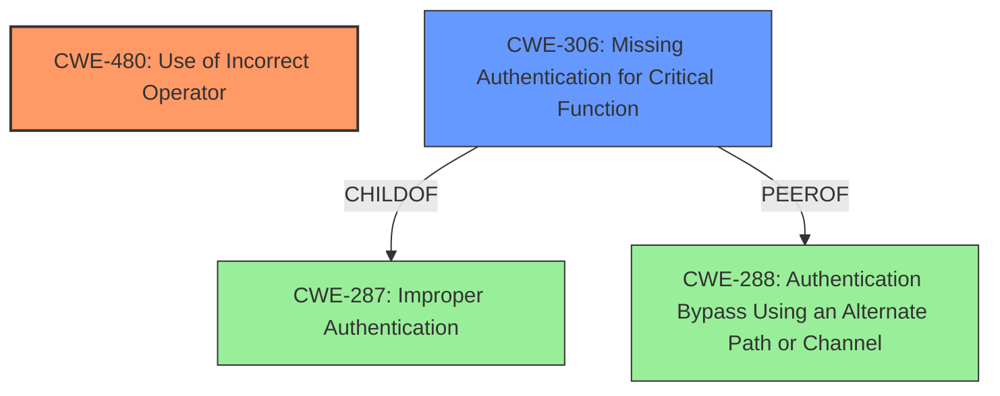

# Final Resolution for CVE-2021-21276

# Summary

| CWE ID  | CWE Name                               | Confidence | CWE Abstraction Level | CWE Vulnerability Mapping Label | CWE-Vulnerability Mapping Notes                                                                                                                                                                                                                                                                       |
| :------ | :------------------------------------- | :--------- | :---------------------- | :------------------------------ | :------------------------------------------------------------------------------------------------------------------------------------------------------------------------------------------------------------------------------------------------------------------------------------------------------------ |
| CWE-480 | Use of Incorrect Operator              | 0.95       | Base                    | Primary                       | Allowed                                                                                                                                                                                                                                                                                                     |
| CWE-306 | Missing Authentication for Critical Function | 0.70       | Base                    | Secondary                     | Allowed. See justification for relationship between CWE-306, CWE-287, and CWE-288.                                                                                                                                                   |

  - The Primary CWE should be first and noted as the Primary CWEs
  - The secondary candidate CWEs should be next and noted as secondary candidates.
  - The confidence is a confidence score 0 to 1 to rate your confidence in your assessment for that CWE.
  - The CWE Abstraction Level as one of these values: Base, Variant, Pillar, Class, Compound
  - The Mapping Notes Usage as one of these values: Allowed, Allowed-with-Review, Prohibited, Discouraged

## Evidence and Confidence

*   **Confidence Score:** 0.90
*   **Evidence Strength:** HIGH

## Relationship Analysis
The primary relationship that influenced the decision was the hierarchical relationship between CWE-306 and CWE-287 (Improper Authentication), where CWE-306 is a child of CWE-287. Also, the peer relationship with CWE-288 (Authentication Bypass Using an Alternate Path or Channel) influenced the analysis. This helped clarify the specific nature of the authentication failure as a complete absence of authentication for a critical function (setup process), rather than a generic improper implementation. The base level of CWE-480 and CWE-306 provided the appropriate level of specificity.

## Vulnerability Chain
The vulnerability chain starts with the **CWE-480 (Use of Incorrect Operator)** in the `SetupController.php`, which leads to **CWE-306 (Missing Authentication for Critical Function)** because the incorrect comparison allows bypassing the authentication check in the setup process. This allows an attacker to gain admin access.
  - Map the sequence from initial flaw to final impact
  - Identify which CWEs represent root causes vs. impacts
  - Note any missing links in the chain based on relationship data

## Summary of Analysis
The initial analysis correctly identified CWE-480 as the primary **ROOTCAUSE** due to the loose comparison (`==`) in the code. The criticism suggested strengthening the analysis by explicitly stating which critical function lacked authentication, which is the `finishSetup` function in `SetupController.php`. Also, the relationship between CWE-306 and its parent CWE-287 was considered, which shows how the more specific CWE-306 describes a complete absence of authentication rather than just an improper implementation. The peer relationship with CWE-288 was also considered, as the lack of authentication can be seen as an alternate path. The selected CWEs are at the optimal level of specificity, reflecting the direct **ROOTCAUSE** and impact of the vulnerability. The evidence provided in the vulnerability description, which states "This is caused by a **loose comparison (==) in SetupController** that is susceptible to attack" supports the selection of CWE-480 as the primary CWE.