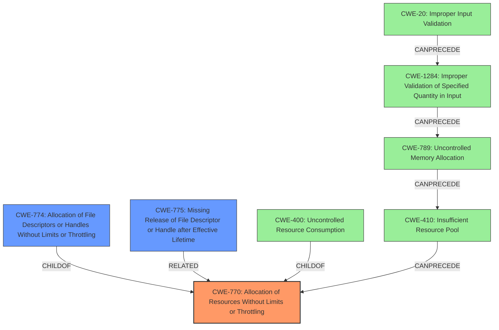

# Final Resolution for CVE-2021-21293

# Summary
| CWE ID  | CWE Name                                                     | Confidence | CWE Abstraction Level | CWE Vulnerability Mapping Label | CWE-Vulnerability Mapping Notes |
| :-------- | :----------------------------------------------------------- | :--------- | :-------------------- | :------------------------------ | :------------------------------ |
| CWE-770 | Allocation of Resources Without Limits or Throttling         | 0.95       | Base                  | Allowed                       | Primary CWE                     |
| CWE-774 | Allocation of File Descriptors or Handles Without Limits or Throttling | 0.85       | Variant               | Allowed                       | Secondary Candidate             |
| CWE-775 | Missing Release of File Descriptor or Handle after Effective Lifetime | 0.60       | Variant               | Allowed                       | Tertiary Candidate            |
| CWE-400 | Uncontrolled Resource Consumption                                          | 0.70       | Class                 | Discouraged                   | Impact/Consequence, not the **rootcause**; consider children like CWE-770 and CWE-774 instead.                                                               |

## Evidence and Confidence

*   **Confidence Score:** 0.93
*   **Evidence Strength:** HIGH

## Relationship Analysis
The primary CWE is CWE-770, which describes the **allocation of resources without limits or throttling**. CWE-774 is a variant that focuses on the specific case of file descriptors. CWE-400 is a more general class describing uncontrolled resource consumption, but it's discouraged because it is too broad and represents the impact rather than the **rootcause**. CWE-775 is also a candidate to consider, which is a missing release of the file descriptor.

## Vulnerability Chain
The vulnerability chain starts with the **unbounded connection acceptance** (**ROOTCAUSE**, CWE-770). This leads to the consumption of OS resources (socket handles), potentially degrading service performance. This is further amplified when services are unable to handle the current request load. Each connection allocates a socket handle, which drains a scarce OS resource. The lack of limits on the number of connections results in resource exhaustion (**WEAKNESS**, CWE-400). If the release of the file descriptors is not properly handled, it contributes to the resource exhaustion (**WEAKNESS**, CWE-775). The **IMPACT** is service degradation or denial of service.

## Summary of Analysis
The initial analysis correctly identified **CWE-770 (Allocation of Resources Without Limits or Throttling)** as the primary **rootcause** of the vulnerability. The vulnerability description clearly states the "**unbounded connection acceptance**" which leads to "**file handle exhaustion**", supporting this classification.

The criticism provided valuable suggestions, including considering CWE-775 and expanding the relationship analysis. The additional CWEs in the chain (CWE-20, CWE-1284, CWE-789, CWE-410) are related to resource allocation, however they are not as relevant as CWE-770. The addition of CWE-775 as a tertiary consideration is valid, as the proper release of resources impacts resource consumption.

The final decision is based on the evidence provided in the vulnerability description, the CWE definitions, and the relationships between CWEs. CWE-770 is the most specific and accurate representation of the **rootcause**.
The selected CWEs are at the optimal level of specificity.