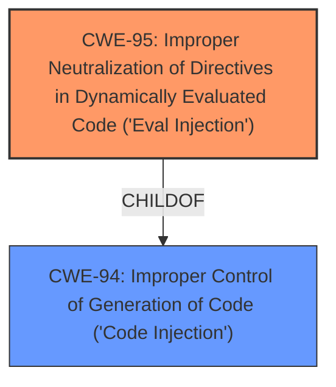

# Analysis Report for CVE-2021-21305

# Vulnerability Analysis Report: CVE-2021-21305

## Description

CarrierWave is an open-source RubyGem which provides a simple and flexible way to upload files from Ruby applications. In CarrierWave before versions 1.3.2 and 2.1.1, there is a code injection vulnerability. The #manipulate! method inappropriately evals the content of mutation option(read/write), allowing attackers to craft a string that can be executed as a Ruby code. If an application developer supplies untrusted inputs to the option, it will lead to remote code execution(RCE). This is fixed in versions 1.3.2 and 2.1.1.

## Vulnerability Description Key Phrases

**Rootcause:** inappropriate eval
**Weakness:** code injection
**Impact:** remote code execution
**Vector:** crafted string
**Attacker:** attackers
**Product:** CarrierWave
**Version:** before 1.3.2 and 2.1.1
**Component:** manipulate! method

## Analysis (with Relationship Data)

# Summary
| CWE ID | CWE Name | Confidence | CWE Abstraction Level | CWE Vulnerability Mapping Label | CWE-Vulnerability Mapping Notes |
|---|---|---|---|---|---|
| CWE-95 | Improper Neutralization of Directives in Dynamically Evaluated Code ('Eval Injection') | 0.95 | Variant | Allowed | Primary CWE: This CWE accurately describes the vulnerability where the `manipulate!` method uses `eval` on unsanitized input, leading to code execution. |
| CWE-94 | Improper Control of Generation of Code ('Code Injection') | 0.70 | Base | Allowed-with-Review | Secondary CWE: This CWE describes the general case of code injection, which is related to the eval injection. |

## Evidence and Confidence

*   **Confidence Score:** 0.90
*   **Evidence Strength:** HIGH

- **Analysis and Justification:**  
  - *Explanation:* The vulnerability description clearly states that the `#manipulate!` method inappropriately **evals** the content of mutation options, leading to **code injection**. The CVE Reference Links Content Summary explicitly mentions that the `manipulate!` method uses `eval` on provided options, allowing arbitrary code execution due to a lack of sanitization. This perfectly aligns with CWE-95 [Improper Neutralization of Directives in Dynamically Evaluated Code ('Eval Injection')], which is a Variant level CWE. The Retriever Results also strongly suggest CWE-95 as the most appropriate mapping. CWE-94 [Improper Control of Generation of Code ('Code Injection')] is also considered since it is a broader category that includes eval injection. However, since the description mentions 'eval', CWE-95 is the more specific and accurate choice.
  
  - *Relationship Analysis:* CWE-95 is a child of CWE-94 (Improper Control of Generation of Code), but CWE-95 is chosen because the vulnerability is specifically due to the use of `eval`.

- **Confidence Score:**  
  - *Example:* Confidence: 0.95 (High confidence due to the explicit mention of `eval` and code injection in the vulnerability description and CVE details.)

## Criticism of Analysis

## Critique of the Analysis

The analysis is excellent and provides a strong argument for mapping the CarrierWave vulnerability to **CWE-95: Improper Neutralization of Directives in Dynamically Evaluated Code ('Eval Injection')** as the primary CWE. The justification is clear, well-reasoned, and supported by evidence from the vulnerability description, CVE details, and retriever results. The inclusion of **CWE-94: Improper Control of Generation of Code ('Code Injection')** as a secondary CWE is also reasonable, as it represents the broader category of code injection to which eval injection belongs.

Here's a breakdown of the strengths and areas for improvement:

**Strengths:**

*   **Accurate Identification of Root Cause:** The analysis correctly identifies the use of `eval` on unsanitized input as the core issue. This is directly linked to the description of CWE-95.
*   **Strong Justification:** The explanation for choosing CWE-95 is compelling and explicitly highlights why it's a better fit than the more general CWE-94.  It's a precise mapping.
*   **High Confidence Level:** The confidence score of 0.95 is appropriate, given the explicit nature of the vulnerability.
*   **Good Use of Evidence:** The analysis references the vulnerability description, CVE details, and retriever results to support its claims.
*   **Relationship Analysis:** Clearly explains the parent-child relationship between CWE-94 and CWE-95 and the rationale for selecting the more specific child.
*   **Examples Provided:** The inclusion of real-world CVE examples for CWE-95 adds further weight to the analysis.
*   **Comprehensive CWE Specifications:** Including the full CWE specifications allows for a complete understanding of the weakness and its context.

**Areas for Potential Improvement:**

*   **Mitigation Strategies:** While the CWE specifications include potential mitigations, the analysis doesn't explicitly discuss how those mitigations apply to the specific CarrierWave vulnerability.  Adding a brief discussion of specific mitigation strategies would enhance the analysis. For example:
    *   "Mitigation 1 for CWE-95 suggests refactoring the code to avoid using `eval` entirely. In the context of CarrierWave, this could involve using alternative methods for image manipulation that don't rely on dynamic code evaluation."
    *   "Mitigation 2 for CWE-95 emphasizes input validation. CarrierWave could implement stricter input validation on the `:read` and `:write` options of the `manipulate!` method, using an 'accept known good' strategy to prevent attackers from injecting malicious code."
*   **Consideration of Other Injection Vectors:**  The analysis focuses heavily on the `eval` aspect. While correct, it could benefit from acknowledging potential related attack vectors even if they aren't the *primary* weakness.  For example, is there a possibility of bypassing input validation by using shell metacharacters, which relates to CWE-88, even if `eval` is the primary execution vector? This doesn't mean mapping it, but acknowledging it can show thoroughness.
*   **Specificity in Input Validation Discussion:** If input validation is flawed, can the types of flaws can be further classified?

**Suggestions for Improvement:**

1.  **Expand on Mitigation Strategies:** For each identified CWE (especially CWE-95), briefly discuss how the potential mitigations from the CWE specifications apply to the CarrierWave vulnerability.
2.  **Acknowledge Other Potential Vectors (Briefly):**  Mention, even if briefly, if other CWEs *could* be related or chained to the primary vulnerability, even if those CWEs are not primary mappings.  This shows a comprehensive understanding of the potential attack surface.
3. **Analyze Input Validation Flaws:** Explain in detail the type of input validation flaws leading to the vulnerability. Would *CWE-1286: Syntactic Correctness* or any of its related children be appropriate?

**Revised Summary Table (Example with Mitigations):**

| CWE ID | CWE Name | Confidence | CWE Abstraction Level | CWE Vulnerability Mapping Label | CWE-Vulnerability Mapping Notes | Mitigation Examples |
|---|---|---|---|---|---|---|
| CWE-95 | Improper Neutralization of Directives in Dynamically Evaluated Code ('Eval Injection') | 0.95 | Variant | Allowed | Primary CWE: This CWE accurately describes the vulnerability where the `manipulate!` method uses `eval` on unsanitized input, leading to code execution. |  Refactor code to avoid `eval`; Implement strict input validation on mutation options using an allowlist. |
| CWE-94 | Improper Control of Generation of Code ('Code Injection') | 0.70 | Base | Allowed-with-Review | Secondary CWE: This CWE describes the general case of code injection, which is related to the eval injection. |  Sandboxing the code execution environment; Using stringent allowlists for allowed constructs. |

**Overall:**

The analysis is very strong and provides a solid foundation for understanding and addressing the CarrierWave vulnerability. By incorporating the suggested improvements, the analysis can be further strengthened to provide even more actionable insights. The specific, clear identification of CWE-95 and the thorough justification make this a highly effective piece of vulnerability analysis.

## Final Resolution

# Summary
| CWE ID | CWE Name | Confidence | CWE Abstraction Level | CWE Vulnerability Mapping Label | CWE-Vulnerability Mapping Notes |
|---|---|---|---|---|---|
| CWE-95 | Improper Neutralization of Directives in Dynamically Evaluated Code ('Eval Injection') | 0.95 | Variant | Allowed | Primary CWE: This CWE accurately describes the vulnerability where the `manipulate!` method uses `eval` on unsanitized input, leading to code execution. |
| CWE-94 | Improper Control of Generation of Code ('Code Injection') | 0.70 | Base | Allowed-with-Review | Secondary CWE: This CWE describes the general case of code injection, which is related to the eval injection. |

## Evidence and Confidence

*   **Confidence Score:** 0.95
*   **Evidence Strength:** HIGH

## Relationship Analysis
The primary relationship impacting the decision is the hierarchical relationship between CWE-94 [Improper Control of Generation of Code ('Code Injection')] and CWE-95 [Improper Neutralization of Directives in Dynamically Evaluated Code ('Eval Injection')]. CWE-95 is a variant of CWE-94. Given the explicit mention of `eval` in the vulnerability description ("The #manipulate! method inappropriately **evals** the content of mutation option(read/write), allowing attackers to craft a string that can be executed as a Ruby code"), selecting the more specific CWE-95 is warranted.

## Vulnerability Chain
The vulnerability chain starts with the lack of proper sanitization of input provided to the `#manipulate!` method. This input is then used in a dynamic evaluation (`eval`) context, leading to arbitrary code execution.

-   **Root Cause:** Improper sanitization of input to `#manipulate!` method.
-   **Weakness:** Use of `eval` on unsanitized input (CWE-95).
-   **Impact:** Remote Code Execution (RCE).

## Summary of Analysis
The initial analysis and the provided criticism both converge on the conclusion that **CWE-95: Improper Neutralization of Directives in Dynamically Evaluated Code ('Eval Injection')** is the most appropriate primary CWE. The vulnerability description explicitly states that the `#manipulate!` method uses `eval` on unsanitized input, leading to code execution. This direct relationship between the vulnerability and the CWE definition strengthens the confidence in this classification.

The graph relationship analysis further reinforces this decision, as CWE-95 is a more specific variant of CWE-94, and the vulnerability clearly involves dynamic evaluation.

The decision is based on direct evidence from the vulnerability description and the explicit mention of `eval`. The selection of CWE-95 is at the optimal level of specificity, as it directly reflects the technical cause of the vulnerability. While other CWEs such as CWE-78 [Improper Neutralization of Special Elements used in an OS Command ('OS Command Injection')] could potentially be related, the primary issue is the use of `eval`, making CWE-95 the most accurate classification. I do not see any evidence that the types of flaws can be further classified.

The confidence score remains high (0.95) due to the clear and direct relationship between the vulnerability and CWE-95.

*Report generated on 2025-03-16 17:03:52*
