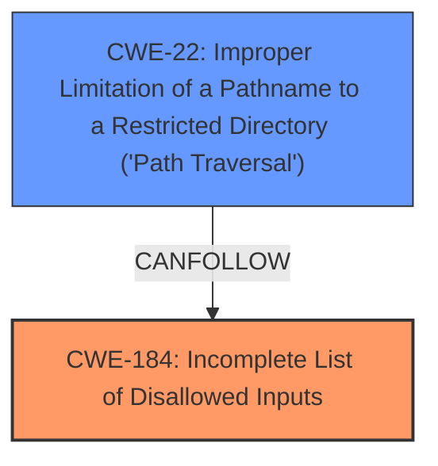

# Final Resolution for CVE-2021-21381

# Summary

| CWE ID  | CWE Name                                                                     | Confidence | CWE Abstraction Level | CWE Vulnerability Mapping Label | CWE-Vulnerability Mapping Notes |
| :-------- | :--------------------------------------------------------------------------- | :--------- | :-------------------- | :-------------------------------- | :------------------------------ |
| **CWE-184** | **Incomplete List of Disallowed Inputs** | 0.80       | Base                  | Allowed                         | Acceptable-Use, Primary **weakness**.       |
| CWE-22  | Improper Limitation of a Pathname to a Restricted Directory ('Path Traversal') | 0.50       | Base                  | Allowed                         | Acceptable-Use, Secondary effect.                    |

## Evidence and Confidence

*   **Confidence Score:** 0.80
*   **Evidence Strength:** HIGH

## Relationship Analysis
The primary relationship that impacted the decision was the differentiation between the **ROOTCAUSE** and the effect. **CWE-184 (Incomplete List of Disallowed Inputs)** is the more direct **ROOTCAUSE**, as the vulnerability stems from the failure to properly validate and restrict inputs in the `Exec` field. **CWE-22 (Improper Limitation of a Pathname to a Restricted Directory ('Path Traversal'))** is a secondary effect, as it represents the consequence of the bypass, where an attacker can access unintended files. The abstraction levels are both Base, which is appropriate.

## Vulnerability Chain
The vulnerability chain starts with the **ROOTCAUSE**, **CWE-184 (Incomplete List of Disallowed Inputs)**, where Flatpak fails to adequately restrict the file paths specified through the `@@` and `@@u` tokens in the `Exec` field of a `.desktop` file. This leads to **CWE-22 (Improper Limitation of a Pathname to a Restricted Directory ('Path Traversal'))** as a consequence, because an attacker can access files outside the intended scope. The final impact is unauthorized file access.

## Summary of Analysis
The analysis correctly identifies **CWE-184 (Incomplete List of Disallowed Inputs)** as the primary **weakness**. The justification is well-supported by the vulnerability description. The vulnerability allows a malicious app publisher to gain access to files that would not ordinarily be allowed. The attack uses special tokens `@@` and `@@u` in the `Exec` field of a Flatpak app's .desktop file to trick Flatpak into behaving as though the user had chosen to open a target file with the app. This represents an incomplete list of disallowed inputs (CWE-184) because Flatpak is not properly validating the arguments within the `Exec` field, allowing arbitrary file paths. Additionally, the ability to access arbitrary files can be considered a form of Path Traversal (CWE-22).

The revised summary table and analysis reflects the emphasis on the **ROOTCAUSE**, **CWE-184 (Incomplete List of Disallowed Inputs)**, and clearly differentiates it from the secondary effect, **CWE-22 (Improper Limitation of a Pathname to a Restricted Directory ('Path Traversal'))**. The mitigation is about restricting the allowed inputs based on the expected behavior of file forwarding. The mitigations for CWE-22 are primarily focused on directory traversal, but the attacker in the described scenario does not need to traverse directories to conduct the attack. Rather, the attacker gains complete access to files by providing the literal file names. This is the primary reason for decreasing the confidence in CWE-22.