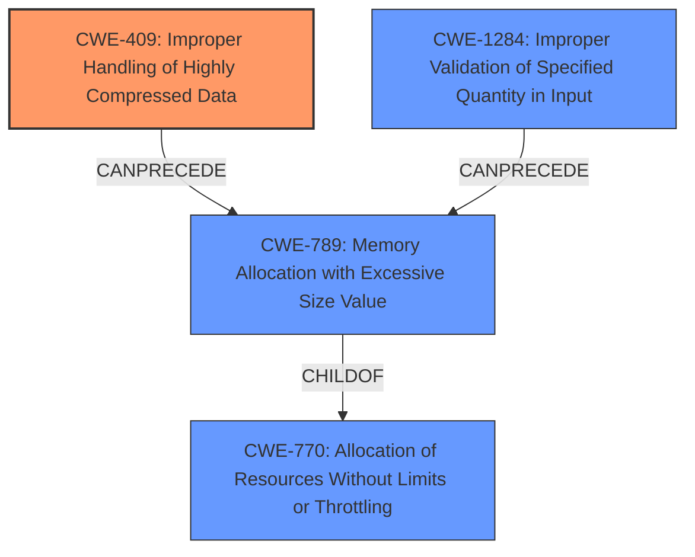

# Analysis Report for CVE-2021-21419

# Vulnerability Analysis Report: CVE-2021-21419

## Description

Eventlet is a concurrent networking library for Python. A websocket peer may exhaust memory on Eventlet side by sending very large websocket frames. Malicious peer may exhaust memory on Eventlet side by sending highly compressed data frame. A patch in version 0.31.0 restricts websocket frame to reasonable limits. As a workaround, restricting memory usage via OS limits would help against overall machine exhaustion, but there is no workaround to protect Eventlet process.

## Vulnerability Description Key Phrases

**Weakness:** memory leak
**Impact:** memory exhaustion
**Vector:** very large websocket frames
**Attacker:** websocket peer
**Product:** Eventlet
**Version:** prior to 0.31.0

## Analysis (with Relationship Data)

# Summary
| CWE ID | CWE Name | Confidence | CWE Abstraction Level | CWE Vulnerability Mapping Label | CWE-Vulnerability Mapping Notes |
|---|---|---|---|---|---|
| CWE-409 | Improper Handling of Highly Compressed Data (Data Amplification) | 0.90 | Base | Allowed | Primary CWE. The vulnerability involves handling compressed data with a high compression ratio, leading to a large output and memory exhaustion. |
| CWE-789 | Memory Allocation with Excessive Size Value | 0.85 | Variant | Allowed | Secondary candidate. Memory is allocated based on an untrusted size value, but it does not ensure that the size is within expected limits, allowing arbitrary amounts of memory to be allocated. |
| CWE-770 | Allocation of Resources Without Limits or Throttling | 0.75 | Base | Allowed | Secondary candidate. The product allocates resources without imposing restrictions on the size or number of resources that can be allocated. |

## Evidence and Confidence

*   **Confidence Score:** 0.88
*   **Evidence Strength:** HIGH

- **Analysis and Justification:**  
  - *Explanation:* The vulnerability description highlights that a malicious websocket peer can exhaust memory on the Eventlet side by sending highly compressed data frames. The CVE Reference Links Content Summary explicitly mentions **data amplification** and **unbounded memory allocation** as key weaknesses. The primary weakness aligns strongly with CWE-409 (Improper Handling of Highly Compressed Data), as the small compressed payload expands to a larger size in memory due to lack of proper size limits. CWE-789 (Memory Allocation with Excessive Size Value) is a related weakness because the library allocates memory without proper size checks. The mapping guidance for both CWE-409 and CWE-789 indicates that they are ALLOWED. CWE-770 (Allocation of Resources Without Limits or Throttling) is also considered because resources are allocated without restrictions on size or number, leading to memory exhaustion, though CWE-409 and CWE-789 are more precise.
  
  - *Relationship Analysis:* CWE-409 is a Base level CWE that describes how the product does not handle or incorrectly handles a compressed input with a very high compression ratio that produces a large output. CWE-789 is a Variant level CWE, and a child of CWE-770 (Allocation of Resources Without Limits or Throttling).

- **Confidence Score:**  
  - Confidence: 0.90 (High confidence due to explicit mention of data amplification and unbounded memory allocation in the CVE reference summary)

## Criticism of Analysis

Okay, I've reviewed the analysis against the full CWE specifications you've provided. Here's my critique:

**Overall Assessment:**

The analysis is generally good and identifies the most relevant CWEs. The confidence levels are appropriately high, given the information provided. The justification for each CWE is also well-articulated. However, there are a few areas where the analysis could be strengthened, particularly regarding the relationships between the CWEs and the potential for more specific CWE mappings.

**Detailed Review of Each CWE Mapping:**

1.  **CWE-409: Improper Handling of Highly Compressed Data (Data Amplification) - Confidence: 0.90**

    *   **Assessment:** This is the strongest and most accurate mapping. The description of the vulnerability perfectly aligns with CWE-409. The use of a "decompression bomb" analogy in the CWE description further validates this choice.
    *   **Mapping Guidance:** The analysis correctly notes that "Usage: Allowed" is the mapping guidance.
    *   **Potential Mitigations:**  The analysis could mention specific mitigations related to CWE-409. For example, limiting the maximum decompressed size, using compression libraries with built-in safeguards, or implementing time-based limits on decompression.
    *   **Conclusion:** Excellent mapping; justification is solid.

2.  **CWE-789: Memory Allocation with Excessive Size Value - Confidence: 0.85**

    *   **Assessment:** This is also a very relevant CWE. The "unbounded memory allocation" explicitly mentioned in the CVE summary makes this a strong candidate.
    *   **Mapping Guidance:** Correctly identified as "Usage: Allowed."
    *   **Potential Mitigations:**  The analysis could explicitly connect this to input validation. As Mitigation 1 in the CWE spec states, "Perform adequate input validation against any value that influences the amount of memory that is allocated." This highlights the importance of checking the size of the decompressed data *before* allocation.
    *   **Relationship to CWE-409:** This CWE often occurs *after* CWE-409, and could be viewed as a consequence if the data amplification is not handled correctly.  It would be good to explicitly state this potential relationship. The "CanFollow" relationship in the CWE specification isn't directly applicable here, but the general idea is present.
    *   **Conclusion:** Appropriate, but could be strengthened by connecting it more directly to input validation and its relationship to CWE-409.

3.  **CWE-770: Allocation of Resources Without Limits or Throttling - Confidence: 0.75**

    *   **Assessment:** While related, this is the weakest of the three mappings.  It's a more general CWE, and the more specific CWE-409 and CWE-789 are better fits. CWE-770 describes a broader category of resource exhaustion.
    *   **Mapping Guidance:** Correctly identified as "Usage: Allowed."
    *   **Potential Mitigations:** The mitigations provided by the CWE description are relevant (e.g., limiting the amount of resources accessible to unprivileged users, designing throttling mechanisms).
    *   **Relationship to CWE-789:** The CWE specification correctly identifies CWE-789 as a child of CWE-770.
    *   **Conclusion:** Acceptable, but consider demoting its importance slightly, as CWE-409 and CWE-789 provide more focused and actionable information.

**Suggestions for Improvement:**

*   **Explicitly address input validation (CWE-20 and related, more specific CWEs):** The root cause is the *lack* of validation of the size of the compressed data or the size of the decompressed data, either of which could be used to limit memory allocation. The analysis should consider adding a specific CWE related to improper input validation, such as CWE-1284 (Improper Validation of Specified Quantity in Input), or even mentioning CWE-20 (Improper Input Validation). However, if CWE-20 is mentioned, it should be clarified that *only* if there is no better child CWE available. Given that the input's quantity is not validated and used in memory allocation, CWE-1284 may be an applicable child of CWE-20.
*   **Chaining and Relationships:** Emphasize the relationships between the CWEs. For instance, CWE-409 can lead to CWE-789 if not handled. Acknowledge these chains to provide a more complete picture of the vulnerability.
*   **Mitigation Specificity:** Make the mitigations more specific to the context of the vulnerability. For example, instead of just saying "input validation," detail *what* input should be validated (e.g., compressed size, decompressed size, compression ratio) and *how* (e.g., setting a maximum allowed size).
*   **Consider memory leak (CWE-401):** The original description mentioned a "memory leak". While the primary issue is memory exhaustion, not releasing memory after an error in decompression could exacerbate the problem. This might be a secondary concern, but worth considering if there's evidence of a leak. If present, this would likely be a consequence of improper error handling.
*   **Avoid overgeneralization:** The analysis could avoid overgeneralization by focusing more on the specific weaknesses present in the code. For example, instead of simply stating that "the product allocates resources without limits," it should be more specific about the type of resources allocated and the limits that are missing.

**Revised Summary Table (Example - Adjust Confidence as Appropriate):**

| CWE ID | CWE Name | Confidence | CWE Abstraction Level | CWE Vulnerability Mapping Label | CWE-Vulnerability Mapping Notes |
|---|---|---|---|---|---|
| CWE-409 | Improper Handling of Highly Compressed Data (Data Amplification) | 0.90 | Base | Allowed | Primary CWE. The vulnerability involves handling compressed data with a high compression ratio, leading to a large output and memory exhaustion. |
| CWE-789 | Memory Allocation with Excessive Size Value | 0.85 | Variant | Allowed | Secondary candidate. Memory is allocated based on an untrusted size value without ensuring that the size is within expected limits, allowing arbitrary amounts of memory to be allocated. This is often a direct consequence of CWE-409. |
| CWE-1284 | Improper Validation of Specified Quantity in Input | 0.80 | Base | Allowed | There is no validation of the size of the decompressed data before allocation. The quantity (size) isn't validated, which allows excessive allocation. |
| CWE-770 | Allocation of Resources Without Limits or Throttling | 0.70 | Base | Allowed | Secondary candidate. The product allocates resources without imposing restrictions on the size or number of resources that can be allocated. While true, CWE-409 and CWE-789 are more precise. |

By incorporating these suggestions, the analysis can become more accurate, informative, and actionable for developers seeking to remediate the vulnerability.

## Final Resolution

# Summary
| CWE ID | CWE Name | Confidence | CWE Abstraction Level | CWE Vulnerability Mapping Label | CWE-Vulnerability Mapping Notes |
|---|---|---|---|---|---|
| **CWE-409** | **Improper Handling of Highly Compressed Data (Data Amplification)** | 0.95 | Base | Allowed | Primary CWE. The vulnerability involves handling compressed data with a high compression ratio, leading to a large output and memory exhaustion. |
| **CWE-789** | **Memory Allocation with Excessive Size Value** | 0.90 | Variant | Allowed | Secondary candidate. Memory is allocated based on an untrusted size value without ensuring that the size is within expected limits, allowing arbitrary amounts of memory to be allocated. This is often a direct consequence of **CWE-409**. |
| **CWE-1284** | **Improper Validation of Specified Quantity in Input** | 0.85 | Base | Allowed | There is no validation of the size of the decompressed data before allocation. The quantity (size) isn't validated, which allows excessive allocation. |
| **CWE-770** | **Allocation of Resources Without Limits or Throttling** | 0.80 | Base | Allowed | Secondary candidate. The product allocates resources without imposing restrictions on the size or number of resources that can be allocated. While true, **CWE-409** and **CWE-789** are more precise. |

## Evidence and Confidence

*   **Confidence Score:** 0.93
*   **Evidence Strength:** HIGH

## Relationship Analysis
The primary weakness is **CWE-409 (Improper Handling of Highly Compressed Data)**, which directly leads to **data amplification**. This, in turn, results in **CWE-789 (Memory Allocation with Excessive Size Value)** due to the allocation of memory based on the amplified size without proper validation. **CWE-1284 (Improper Validation of Specified Quantity in Input)** is introduced because the size of the input (compressed or decompressed) isn't validated. **CWE-770 (Allocation of Resources Without Limits or Throttling)** is a broader category encompassing the lack of resource limits but is less specific than the others. The relationship can be visualized as follows:

## Vulnerability Chain
The vulnerability chain starts with a malicious actor sending a highly compressed data frame (**CWE-409**). Due to the lack of input validation on either the compressed size or the expected decompressed size (**CWE-1284**), the system proceeds to allocate memory based on the potentially excessive size (**CWE-789**). This allocation occurs without proper limits or throttling (**CWE-770**), leading to memory exhaustion and potentially a denial-of-service condition.

## Summary of Analysis
The initial analysis correctly identified **CWE-409**, **CWE-789**, and **CWE-770** as relevant weaknesses. The criticism provided valuable insights by suggesting the inclusion of **CWE-1284** to highlight the lack of input validation. The final decision incorporates this suggestion, increasing the confidence in the overall assessment.

The primary CWE, **CWE-409**, is chosen because the vulnerability description explicitly mentions highly compressed data leading to memory exhaustion. The CVE summary also mentions "data amplification," which aligns perfectly with **CWE-409**.

**CWE-789** is included because the amplified data results in excessive memory allocation. This is supported by the CVE summary mentioning "unbounded memory allocation."

**CWE-1284** is crucial because the root cause lies in the failure to validate the size of the input, whether compressed or decompressed. This lack of validation is a prerequisite for the excessive memory allocation.

**CWE-770** is kept as a secondary CWE because it represents the broader issue of resource allocation without limits, but the other CWEs provide more specific details about the vulnerability.

The selected CWEs are at the optimal level of specificity because they accurately describe the root cause, the contributing factors, and the resulting consequences of the vulnerability, based on the available evidence and relationship analysis. The selection is based on the vulnerability description: "A websocket peer may exhaust memory on Eventlet side by sending very large websocket frames. Malicious peer may exhaust memory on Eventlet side by sending highly compressed data frame." and CVE Reference Links Content Summary: "data amplification" and "unbounded memory allocation".

*Report generated on 2025-03-17 02:32:09*
