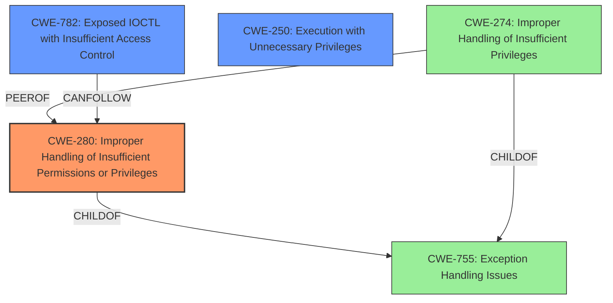

# Final Resolution for CVE-2021-21551

# Summary
| CWE ID | CWE Name | Confidence | CWE Abstraction Level | CWE Vulnerability Mapping Label | CWE-Vulnerability Mapping Notes |
|---|---|---|---|---|---|
| CWE-280 | Improper Handling of Insufficient Permissions or Privileges | 0.90 | Base | Allowed | Primary CWE |
| CWE-782 | Exposed IOCTL with Insufficient Access Control | 0.80 | Variant | Allowed | Secondary Candidate |
| CWE-250 | Execution with Unnecessary Privileges | 0.60 | Base | Allowed | Secondary Candidate |

## Evidence and Confidence

*   **Confidence Score:** 0.85
*   **Evidence Strength:** HIGH

## Relationship Analysis
The analysis considers the parent-child relationship between CWE-280 and more abstract CWEs. It also considers the peer relationship between CWE-280 and CWE-274, noting that CWE-274 is likely to be deprecated due to overlap. The analysis considers that CWE-782 is a variant and therefore is a good option because it is at a lower level of abstraction.

## Vulnerability Chain
The chain of weaknesses starts with **insufficient access control** (CWE-280), potentially leading to privilege escalation, denial of service, or information disclosure. If IOCTLs are involved (CWE-782), this provides a more specific path. CWE-250 is a contributing factor if the driver runs with unnecessary privileges, amplifying the impact of the **insufficient access control**.

## Summary of Analysis
The initial analysis and criticism both correctly identify **insufficient access control** as the **root cause** of the vulnerability. The vulnerability description explicitly mentions "**insufficient access control**" which aligns directly with CWE-280 (Improper Handling of Insufficient Permissions or Privileges). The retriever results also support this by listing similar CWEs such as CWE-269 and CWE-274, although these are less preferred due to being high-level or potentially deprecated.

The graph relationships support the selection of CWE-280 as the primary CWE because it is a base-level weakness that directly addresses the **root cause**. CWE-782 is retained as a secondary candidate, pending further investigation into the use of IOCTLs. CWE-250 is retained as a secondary candidate, but given a slightly lower confidence.

The final selection of CWEs is at the optimal level of specificity, given the available evidence. CWE-280 provides a general description of the **weakness**, while CWE-782 offers a more specific variant if IOCTLs are involved.