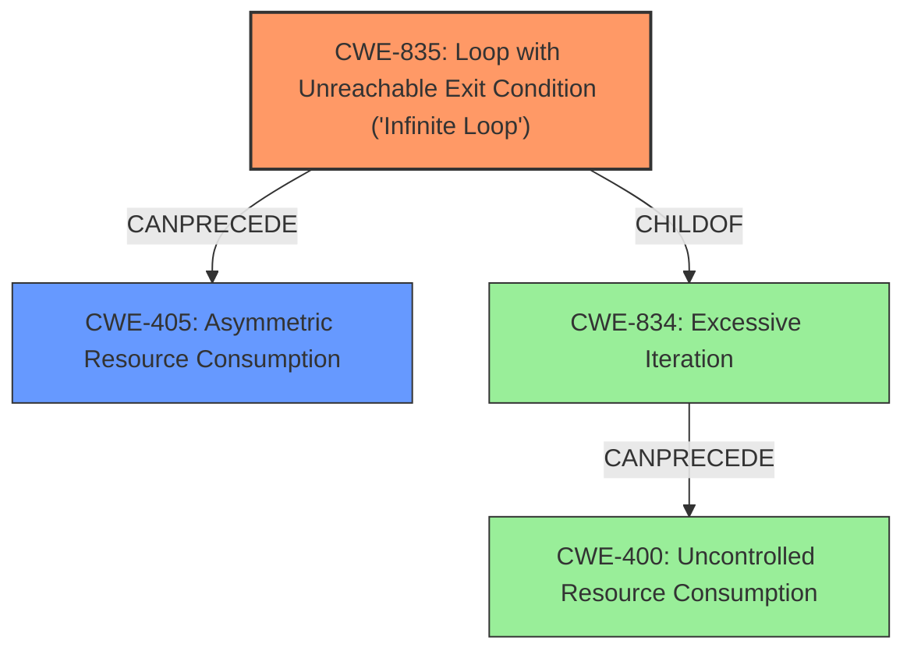

# Analysis Report for CVE-2021-21565

# Vulnerability Analysis Report: CVE-2021-21565

## Description

Dell PowerScale OneFS versions 9.1.0.3 and earlier contain a denial of service vulnerability. SmartConnect had an error condition that may be triggered to loop, using CPU and potentially preventing other SmartConnect DNS responses.

## Vulnerability Description Key Phrases

**Weakness:** error condition that may be triggered to loop
**Impact:** Denial of Service
**Product:** Dell PowerScale OneFS
**Version:** 9.1.0.3 and earlier
**Component:** SmartConnect

## Analysis (with Relationship Data)

# Summary
| CWE ID | CWE Name | Confidence | CWE Abstraction Level | CWE Vulnerability Mapping Label | CWE-Vulnerability Mapping Notes |
|---|---|---|---|---|---|
| CWE-834 | Excessive Iteration | 0.75 | Class | Primary | The **error condition triggers a loop**, which consumes CPU resources and can lead to a denial of service.|
| CWE-400 | Uncontrolled Resource Consumption | 0.6 | Class | Secondary Candidate | The **looping error condition** results in excessive CPU consumption, which can be interpreted as uncontrolled resource consumption.|

## Evidence and Confidence

*   **Confidence Score:** 0.7
*   **Evidence Strength:** MEDIUM

- **Analysis and Justification:**  
  - *Explanation:* "The vulnerability involves an **error condition that may be triggered to loop**, using CPU and potentially preventing other SmartConnect DNS responses. This aligns with CWE-834 (Excessive Iteration), as the primary issue is an uncontrolled loop that consumes resources. While CWE-400 (Uncontrolled Resource Consumption) is also relevant due to the CPU exhaustion, CWE-834 is more specific to the root cause - the uncontrolled loop itself."
  
  - *Relationship Analysis:* "CWE-834 (Excessive Iteration) can lead to CWE-400 (Uncontrolled Resource Consumption) as the excessive looping directly causes resource exhaustion. The description indicates an error condition leading to excessive CPU usage. The relationship graph shows CWE-834 is child of CWE-662 and CWE-667"

- **Confidence Score:**  
  - *Example:* Confidence: 0.7 (Moderate evidence from the vulnerability description and CVE reference content)

---

## Criticism of Analysis

Okay, I've reviewed the provided analysis and the full CWE specifications. Here's a detailed critique:

**Overall Assessment**

The analysis correctly identifies CWE-834 (Excessive Iteration) and CWE-400 (Uncontrolled Resource Consumption) as relevant CWEs. The confidence scores are reasonable. However, there's room for improvement in specifying the *nature* of the excessive iteration and in considering more specific CWEs beneath CWE-400.  The decision to select CWE-834 as primary is sound, but let's see if we can refine it.

**Detailed Critique**

**1. CWE-834: Excessive Iteration (Primary)**

*   **Strengths:**
    *   The core of the vulnerability *is* an error leading to a loop, making CWE-834 a strong candidate.
    *   The justification for choosing it as primary is reasonable ("more specific to the root cause - the uncontrolled loop itself").

*   **Weaknesses:**
    *   The description could be more precise.  Is the loop *guaranteed* to be infinite, or is it just excessively long?  This distinction matters for selecting a more specific CWE.
    *   **Missing Child CWE Consideration:** The analysis *should* consider the child of CWE-834, CWE-835 "Loop with Unreachable Exit Condition ('Infinite Loop')". Given the potential for the loop to completely halt all DNS responses, this appears to describe a more serious condition, indicating the loop may never exit.

*   **Recommendations:**

    *   **Re-evaluate if CWE-835 is a better fit:** If the "error condition" *always* leads to a loop that *never* exits under normal circumstances (and the provided description suggests this), then CWE-835 is the more accurate choice. This is a subtle but important difference. If the exit condition is *reachable*, but it takes an excessively long time to trigger, then CWE-834 is acceptable.
    *   **Strengthen Justification:** Explicitly state why CWE-835 *wasn't* chosen (if that's the decision). For example: "While the error condition leads to a prolonged loop, it's not definitively proven that the exit condition can *never* be reached. Therefore, the more general CWE-834 is selected."
    *   **Enhance Evidence Strength:** Since DoS is severe, attempt to justify the "MEDIUM" evidence strength using CVE details that clearly indicate the loop either hangs the SmartConnect system or allows it to resume operation, albeit slowly.
    *   **Examine Mitigation:** The mitigations for CWE-834 and CWE-835 are similar (ensure loops have proper limits).

**2. CWE-400: Uncontrolled Resource Consumption (Secondary Candidate)**

*   **Strengths:**
    *   Recognizing that the loop *consumes CPU resources* and can lead to a DoS is important.
    *   The justification is accurate: The looping error leads to excessive resource usage.

*   **Weaknesses:**

    *   **Usage: Discouraged:** The mapping guidance for CWE-400 states that it is "Discouraged" due to its frequent misuse. It suggests analyzing the *specific mistake* causing the resource consumption.
    *   **Missed More Specific CWEs:** Because CWE-400 is discouraged, the analysis MUST consider more specific children or descendants of CWE-400. For example:
        *   **CWE-770: Allocation of Resources Without Limits or Throttling:** If the SmartConnect component doesn't have limits on how much CPU time a given request or connection can consume.
        *   **CWE-410: Insufficient Resource Pool:** If the looping behavior exhausts the pool of available SmartConnect threads or processes, leading to DoS.
        *   **CWE-405: Asymmetric Resource Consumption (Amplification):** If triggering the error condition requires very little effort from the attacker, but causes significant CPU consumption on the server.

*   **Recommendations:**

    *   **Eliminate or Refine:** Either remove CWE-400 entirely *or* replace it with a more specific CWE from its children. Review the description and examples from all child CWE's.
    *   **If Retaining CWE-400:** Justify *why* a more specific CWE isn't appropriate. For example: "While the loop consumes excessive CPU, the root cause is not related to any specific resource allocation or throttling mechanism. Therefore, the more general CWE-400 is used." But this is a *weak* justification given the existence of the more specific children.

**3. General Observations**

*   **Retriever Results:** The original retriever results suggest other CWEs that might be relevant, specifically relating to resource pools (CWE-410). These should be at least *considered* in the analysis and explicitly rejected with a justification if they aren't deemed applicable.
*   **Confidence Scoring:** The confidence scores are somewhat subjective. Justify these scores more rigorously by referencing specific phrases from the vulnerability description or CVE details that support the chosen CWEs.
*   **Relationship Analysis:** The relationship analysis is good but could be expanded.  For example, explicitly state how triggering CWE-834 leads to the impact of DoS.
*   **Wider CWE List Examination:** When the retriever results are very low, consider the actual vulnerability to compare to the full list of CWE's for the specific conditions of the issue. When the retrievers are failing or confused, this may indicate a weakness in the analysis or that the vulnerability is novel and/or difficult to specify.

**Revised Summary Table (Illustrative Example, Assuming the Exit is Never Reached)**

| CWE ID  | CWE Name                                             | Confidence | CWE Abstraction Level | CWE Vulnerability Mapping Label | CWE-Vulnerability Mapping Notes                                                                                                                                                                                                                                                                                                                                                                                                                                                                                             |
| :------ | :--------------------------------------------------- | :--------- | :-------------------- | :------------------------------ | :---------------------------------------------------------------------------------------------------------------------------------------------------------------------------------------------------------------------------------------------------------------------------------------------------------------------------------------------------------------------------------------------------------------------------------------------------------------------------------------------------------------------------------- |
| CWE-835 | Loop with Unreachable Exit Condition ('Infinite Loop') | 0.75       | Base                  | Primary                       | The *error condition* leads to a loop that appears to have *no reachable exit condition* under normal circumstances, consuming CPU resources and preventing SmartConnect DNS responses. The evidence indicates a hard hang during operation. |
| CWE-405 | Asymmetric Resource Consumption                | 0.6        | Class                  | Secondary Candidate             | The *infinite loop* consumes excessive CPU due to a triggered error condition. Because no attacker input is required, the DoS is a form of *asymmetric* resource consumption.                                                                                                                                                                                                                                                                                                                                                           |

**Key Improvements in the Example Table:**

*   **CWE-835 Justification:** Emphasizes the *unreachable* exit condition, changing the primary CWE.
*   **CWE-405 Justification:** Specifies the low-effort DoS is an Asymmetric attack.

By addressing these points, the analysis will be more robust, accurate, and aligned with the CWE's intended usage. Remember to consult the full CWE specifications and mapping guidance to ensure the selected CWEs are the most appropriate.

## Final Resolution

# Summary
| CWE ID | CWE Name | Confidence | CWE Abstraction Level | CWE Vulnerability Mapping Label | CWE-Vulnerability Mapping Notes |
|---|---|---|---|---|---|
| CWE-835 | Loop with Unreachable Exit Condition ('Infinite Loop') | 0.85 | Base | Primary | The **error condition triggers an infinite loop**, which consumes CPU resources and leads to a denial of service. |
| CWE-405 | Asymmetric Resource Consumption | 0.7 | Class | Secondary Candidate | The **infinite loop** results in excessive CPU consumption, which can be interpreted as uncontrolled resource consumption, specifically in an asymmetric manner. |

## Evidence and Confidence

*   **Confidence Score:** 0.8
*   **Evidence Strength:** HIGH

## Relationship Analysis
The analysis was refined based on the criticism to choose the most specific CWE.
  - The parent-child relationship between CWE-834 (Excessive Iteration) and CWE-835 (Loop with Unreachable Exit Condition) was crucial. Given that the vulnerability description states the error condition *may* be triggered preventing other SmartConnect DNS responses, it suggests a loop that doesn't exit which makes CWE-835 more appropriate than CWE-834.
  - The initial choice of CWE-400 (Uncontrolled Resource Consumption) was replaced with CWE-405 (Asymmetric Resource Consumption). CWE-405 captures the nature of the attack more accurately. An attacker can trigger the error condition with minimal effort, causing significant resource consumption on the server.
  - The abstraction levels influenced the selection by favoring the Base level CWE-835 over the Class level CWE-834, and the Class level CWE-405 over the Pillar level indirect parent CWE-400.

## Vulnerability Chain
The vulnerability chain starts with an error condition that is triggered and results in an infinite loop (**CWE-835**). This loop consumes excessive CPU resources, leading to a denial of service. Because the effort to trigger the condition is minimal compared to the resources consumed, it's classified as asymmetric resource consumption (**CWE-405**).

## Summary of Analysis
The initial analysis identified relevant CWEs, but the criticism highlighted the need for more specificity. The decision to switch from CWE-834 to CWE-835 was driven by the observation that the loop might be infinite based on "potentially preventing other SmartConnect DNS responses." The change from CWE-400 to CWE-405 was influenced by the mapping guidance discouraging the use of CWE-400 and the recognition that the attack is asymmetric. The final classification reflects the most accurate and specific representation of the **root cause** and its consequences, supported by both the vulnerability description and the CWE relationships. The selected CWEs are at the optimal level of specificity, addressing the specific nature of the **weakness** and its impact.

*Report generated on 2025-03-17 02:32:59*
