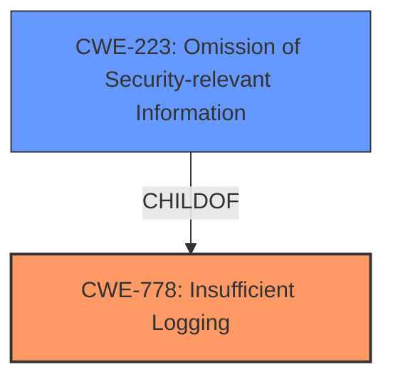

# Final Resolution for CVE-2021-21568

# Summary
| CWE ID | CWE Name | Confidence | CWE Abstraction Level | CWE Vulnerability Mapping Label | CWE-Vulnerability Mapping Notes |
|---|---|---|---|---|---|
| CWE-778 | Insufficient Logging | 0.95 | Base | Allowed | Primary CWE. The product either does not record the event or omits important details about the event when logging it. |
| CWE-223 | Omission of Security-relevant Information | 0.75 | Base | Allowed | Secondary CWE. The product does not record security-relevant information. |

## Evidence and Confidence

*   **Confidence Score:** 0.90
*   **Evidence Strength:** HIGH

## Relationship Analysis
The primary relationship impacting the decision is the ParentOf relationship between CWE-223 and CWE-778. CWE-223 (Omission of Security-relevant Information) is a child of CWE-778 (Insufficient Logging). This suggests that CWE-223 could be a more specific classification than CWE-778. However, in this particular case, the vulnerability description explicitly mentions "insufficient logging", making CWE-778 a direct and appropriate match. CWE-223 is still useful as a secondary weakness, since the audit logs are missing security-relevant information.

## Vulnerability Chain
The vulnerability chain starts with the **ROOTCAUSE** of **CWE-778: Insufficient Logging**. Because of the **WEAKNESS** in logging, authenticated users can make un-audited configuration changes. This leads to a lack of accountability and makes it difficult to detect or prevent unauthorized modifications, represented by **CWE-223: Omission of Security-relevant Information**. The ultimate impact is a potential compromise of system security due to the inability to track configuration changes.

## Summary of Analysis
The initial analysis correctly identified **CWE-778 (Insufficient Logging)** as the primary **WEAKNESS**. The vulnerability description clearly states "insufficient logging" and the CVE Reference Links Content Summary reinforces this. The retriever result also supports this with a score of 1945.75.

The criticism suggested considering alternative CWEs and increasing specificity. Based on the provided information, **CWE-223 (Omission of Security-relevant Information)** is chosen as the secondary **WEAKNESS** because it represents more accurately the type of logging issue.

The selection is based on:

1.  **Content Matching:** The vulnerability states that configuration changes are un-audited and un-trackable. This directly means that security-relevant information about those changes is being omitted.
2.  **Relationship Analysis:** CWE-223 is a child of CWE-778, which suggests a more specific classification.
3.  **Evidence-Based Decision Making:** The vulnerability description and the relationship between the CWEs justify the choice of CWE-223 as a secondary weakness.

The selected CWEs are at the optimal level of specificity because they accurately represent the **ROOTCAUSE** of the vulnerability based on the evidence provided.