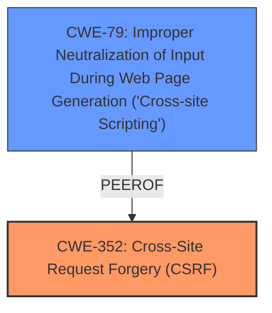

# Final Resolution for CVE-2021-21678

# Summary
| CWE ID | CWE Name | Confidence | CWE Abstraction Level | CWE Vulnerability Mapping Label | CWE-Vulnerability Mapping Notes |
|---|---|---|---|---|---|
| CWE-352 | Cross-Site Request Forgery (CSRF) | 0.95 | Compound | Primary | Allowed |
| CWE-79 | Improper Neutralization of Input During Web Page Generation ('Cross-site Scripting') | 0.3 | Base | Secondary | Allowed |

## Evidence and Confidence

*   **Confidence Score:** 0.95
*   **Evidence Strength:** HIGH

## Relationship Analysis
The primary relationship impacting the decision is that CWE-79 can be a peer of CWE-352, and can be used to bypass CSRF protections. While the primary issue is the **bypass of CSRF protection**, the potential for XSS to exacerbate the issue warrants its inclusion as a secondary CWE. The abstraction levels influenced the selection, as CWE-352 is a compound weakness that accurately reflects the complex nature of CSRF vulnerabilities.

## Vulnerability Chain
The vulnerability chain starts with the **root cause** being the overly permissive implementation of an extension point that disables CSRF protection. This leads to the **weakness** of allowing attackers to craft URLs that bypass CSRF protection (CWE-352). A potential secondary weakness is the presence of XSS vulnerabilities (CWE-79), which could further compromise the system by allowing attackers to bypass CSRF defenses. The impact is that attackers can perform actions on behalf of legitimate users without their consent.

## Summary of Analysis
The initial analysis and criticism both converge on the appropriateness of CWE-352 as the primary CWE. The vulnerability description explicitly mentions the **bypass of CSRF protection**, which aligns directly with the definition of CWE-352. The analysis also considered alternative CWEs but correctly dismissed them as primary mappings because they don't directly address the core issue of CSRF protection **bypass**. The criticism suggested including CWE-79 as a secondary concern, which I agree with given the potential for XSS to be chained with CSRF.

The graph relationships influenced the final selection by highlighting the potential interaction between CWE-79 and CWE-352. While the primary issue is the **CSRF bypass**, the presence of XSS vulnerabilities could significantly amplify the impact of an attack.

The selected CWEs are at the optimal level of specificity. CWE-352 is a compound weakness that accurately captures the complex nature of CSRF vulnerabilities. CWE-79 is a base weakness that highlights the potential for XSS to be chained with CSRF. The evidence strongly supports this mapping, as the plugin **weakness** directly enables CSRF attacks by allowing the **bypass CSRF protection**. I am adjusting the confidence score to 0.95 to reflect the additional insight gained from the criticism regarding chaining potential with XSS.