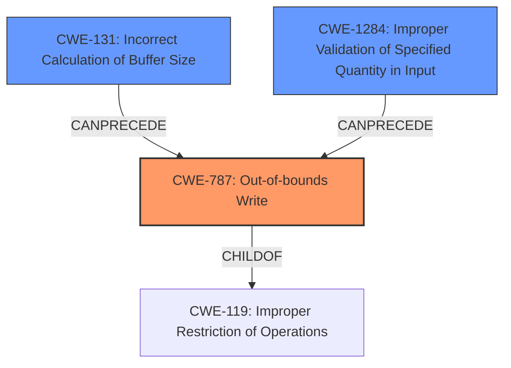

# Analysis Report for CVE-2021-21776

# Vulnerability Analysis Report: CVE-2021-21776

## Description

An out-of-bounds write vulnerability exists in the SGI Format Buffer Size Processing functionality of Accusoft ImageGear 19.8. A specially crafted malformed file can lead to memory corruption. An attacker can provide a malicious file to trigger this vulnerability.

## Vulnerability Description Key Phrases

**Rootcause:** out-of-bounds write
**Impact:** memory corruption
**Vector:** specially crafted malformed file
**Attacker:** attacker
**Product:** Accusoft ImageGear
**Version:** 19.8
**Component:** SGI Format Buffer Size Processing functionality

## Analysis (with Relationship Data)

# Summary
| CWE ID | CWE Name | Confidence | CWE Abstraction Level | CWE Vulnerability Mapping Label | CWE-Vulnerability Mapping Notes |
|---|---|---|---|---|---|
| CWE-787 | Out-of-bounds Write | 1.0 | Base | Primary | Allowed |
| CWE-131 | Incorrect Calculation of Buffer Size | 0.8 | Base | Secondary | Allowed |
| CWE-1284 | Improper Validation of Specified Quantity in Input | 0.7 | Base | Secondary | Allowed |

## Evidence and Confidence

*   **Confidence Score:** 0.9
*   **Evidence Strength:** HIGH

- **Analysis and Justification:**  
  - *Explanation:* The primary **weakness** is clearly an **out-of-bounds write**, as stated in the vulnerability description. The CVE reference summary explicitly states the root cause involves an incorrect buffer size calculation and a subsequent `memcpy` operation that writes beyond the allocated buffer due to missing bounds checking. This directly maps to CWE-787 (Out-of-bounds Write), which is a Base level weakness and has ALLOWED usage according to MITRE mapping guidance. The high retriever score and its identification as the Primary CWE Match for similar CVE descriptions further support this choice. CWE-131 (Incorrect Calculation of Buffer Size) is a contributing factor, as the size calculation `SMALL_BUFFER_SIZE = 2 * SGI_XSIZE + 1` is used to allocate the buffer, but a later `memcpy` uses a size argument from the file without validation. CWE-1284 is also relevant because the size argument from the file body is not validated which is used by memcpy.

  - *Relationship Analysis:* CWE-787 is a child of CWE-119 (Improper Restriction of Operations within the Bounds of a Memory Buffer), indicating a more specific type of memory buffer issue. It can also follow other weaknesses like uninitialized variables (CWE-824). CWE-131 can precede CWE-119 by leading to a buffer overflow if the calculated size is too small and data exceeds that boundary.

- **Confidence Score:**  
  - Confidence: 1.0 (The vulnerability description, CVE reference, and retriever results provide strong evidence for this mapping.)
---

## Criticism of Analysis

Okay, here's a review of the provided CWE analysis, incorporating the full CWE specifications:

**Overall Assessment:**

The analysis is well-structured and demonstrates a good understanding of the vulnerability and the relevant CWEs. The reasoning is sound, and the confidence scores are justified. The inclusion of evidence and relationship analysis further strengthens the mappings.  The use of CWE specifications is appropriate and shows an effort to apply them correctly.

**Detailed Critique:**

**1. CWE-787: Out-of-bounds Write (Primary)**

*   **Assessment:** Correct and well-justified.
*   **Justification:** The analysis correctly identifies the core issue as an out-of-bounds write. The vulnerability description explicitly states this, and the CVE reference summary provides details on how the `memcpy` operation writes beyond the allocated buffer.
*   **Specification Alignment:** The analysis adheres to the "Allowed" usage guidance for CWE-787 and acknowledges its Base level of abstraction. It also correctly identifies CWE-787 as a child of CWE-119, demonstrating an understanding of the CWE hierarchy.
*   **Mitigation Considerations:** The potential mitigations listed in the CWE-787 specification (language selection, using safer libraries, compiler-based overflow detection) are all relevant in this case. Using a memory-safe language or libraries with built-in bounds checking would have prevented this vulnerability. Compiler-based detection might have caught the overflow during development.
*   **Confidence:** 1.0 is appropriate, given the strong evidence.

**2. CWE-131: Incorrect Calculation of Buffer Size (Secondary)**

*   **Assessment:** Correct and appropriate as a secondary CWE.
*   **Justification:** The analysis correctly identifies that the buffer's size is based on `SGI_XSIZE`, but this calculation does not account for the size of the data that will *actually* be copied via `memcpy`. This highlights an incorrect calculation.
*   **Specification Alignment:** The analysis correctly identifies CWE-131 as a contributing factor that "CanPrecede -> CWE-119". The analysis notes that this CWE is used for a range of calculation errors, including updating parallel counters and not accounting for size differences when "transforming" one input to another format.
*   **Mitigation Considerations:** The mitigations listed in CWE-131 (allocate enough memory for the largest possible encoding, understand language representation, input validation on numeric input) are all relevant. The vulnerability could have been prevented by calculating a buffer size large enough for the data given.
*   **Confidence:** 0.8 is reasonable. While the OOB Write is the direct cause, the incorrect size calculation sets the stage for it.

**3. CWE-1284: Improper Validation of Specified Quantity in Input (Secondary)**

*   **Assessment:** Correct and appropriate as a secondary CWE.
*   **Justification:** The size argument from the file body that is used in `memcpy` is not validated against the allocated buffer size. An attacker can control this size.
*   **Specification Alignment:** The analysis correctly notes that an attacker is using untrusted input when deciding the size to write using `memcpy`. The usage guidance allows CWE-1284 and the mitigations are useful, such as assuming all input is malicious and using an accept-known-good input validation strategy.
*   **Mitigation Considerations:** An input validation step that checked whether the size argument from the file body was within the allocated buffer size would have prevented the exploit.
*   **Confidence:** 0.7 is appropriate. While related, the lack of *any* validation makes this less direct than the other two issues.

**Minor Improvements:**

*   **CWE-119: Mention in Justification of CWE-787:** It's good practice to explicitly state why a more general CWE like CWE-119 *isn't* the most appropriate mapping. The analysis does this implicitly, but it could be stated more directly: "While CWE-119 (Improper Restriction of Operations within the Bounds of a Memory Buffer) is a parent of CWE-787, CWE-787 is a more specific and accurate description of the vulnerability because it involves writing beyond the bounds of the buffer."

**Summary Table Review:**

The summary table is accurate and reflects the analysis in detail.

**Conclusion:**

This is a solid CWE analysis. The selected CWEs are accurate, the justifications are clear, and the analysis demonstrates a strong understanding of the underlying vulnerability. The inclusion of CWE specifications and mitigation considerations adds significant value. The confidence scores are well-supported by the evidence.

## Final Resolution

# Summary
| CWE ID | CWE Name | Confidence | CWE Abstraction Level | CWE Vulnerability Mapping Label | CWE-Vulnerability Mapping Notes |
|---|---|---|---|---|---|
| **CWE-787** | **Out-of-bounds Write** | 1.0 | Base | Primary | Allowed |
| **CWE-1284** | **Improper Validation of Specified Quantity in Input** | 0.9 | Base | Secondary | Allowed |
| **CWE-131** | **Incorrect Calculation of Buffer Size** | 0.8 | Base | Secondary | Allowed |

## Evidence and Confidence

*   **Confidence Score:** 0.95
*   **Evidence Strength:** HIGH

## Relationship Analysis
The primary **weakness** is **CWE-787 (Out-of-bounds Write)**, which is a child of **CWE-119 (Improper Restriction of Operations within the Bounds of a Memory Buffer)**. This hierarchical relationship indicates that **CWE-787** is a more specific instance of a general buffer handling issue described by **CWE-119**. **CWE-131 (Incorrect Calculation of Buffer Size)** and **CWE-1284 (Improper Validation of Specified Quantity in Input)** can both precede **CWE-787**, forming a chain where an incorrect size calculation or missing input validation leads to an out-of-bounds write. The relationships show how multiple **weaknesses** can interact to create a vulnerability.

## Vulnerability Chain
The vulnerability chain starts with either **CWE-131 (Incorrect Calculation of Buffer Size)** or **CWE-1284 (Improper Validation of Specified Quantity in Input)**. If the buffer size is incorrectly calculated, or the size argument is not validated, then it leads to **CWE-787 (Out-of-bounds Write)** during the `memcpy` operation. The final impact is memory corruption, which can lead to arbitrary code execution or denial of service.

## Summary of Analysis
The initial analysis correctly identified **CWE-787** as the primary **weakness**, given the vulnerability description explicitly mentions an **out-of-bounds write**. The analysis also accurately pinpointed **CWE-131** and **CWE-1284** as contributing factors. The criticism reinforces this assessment and suggests clarifying why **CWE-119** is not the most appropriate mapping, which is a good point.

The evidence from the vulnerability description ("An out-of-bounds write vulnerability exists... A specially crafted malformed file can lead to memory corruption") directly supports the selection of **CWE-787**. The additional context from the CVE reference about the incorrect buffer size calculation and missing bounds checking further validates the inclusion of **CWE-131** and **CWE-1284**.

Based on the provided information and the relationships between the CWEs, the final determination is to keep **CWE-787** as the primary **weakness** and **CWE-1284** and **CWE-131** as secondary factors. **CWE-1284** is moved up to a confidence of 0.9 since the size argument from the file body is directly used in `memcpy` without validation. These CWEs are at the optimal level of specificity because they accurately reflect the root cause and contributing factors of the vulnerability.

*Report generated on 2025-03-17 22:51:21*
