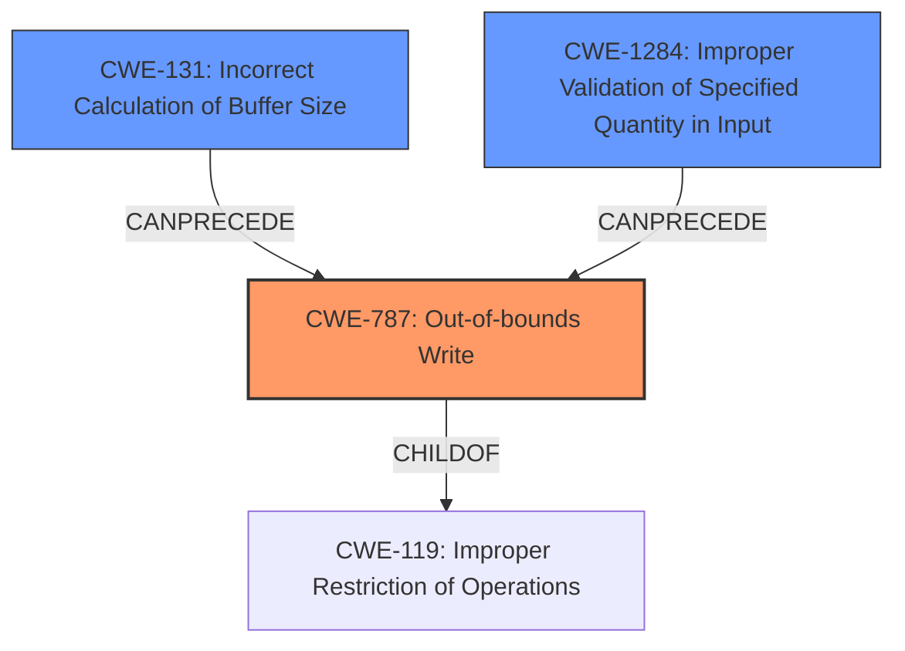

# Final Resolution for CVE-2021-21776

# Summary
| CWE ID | CWE Name | Confidence | CWE Abstraction Level | CWE Vulnerability Mapping Label | CWE-Vulnerability Mapping Notes |
|---|---|---|---|---|---|
| **CWE-787** | **Out-of-bounds Write** | 1.0 | Base | Primary | Allowed |
| **CWE-1284** | **Improper Validation of Specified Quantity in Input** | 0.9 | Base | Secondary | Allowed |
| **CWE-131** | **Incorrect Calculation of Buffer Size** | 0.8 | Base | Secondary | Allowed |

## Evidence and Confidence

*   **Confidence Score:** 0.95
*   **Evidence Strength:** HIGH

## Relationship Analysis
The primary **weakness** is **CWE-787 (Out-of-bounds Write)**, which is a child of **CWE-119 (Improper Restriction of Operations within the Bounds of a Memory Buffer)**. This hierarchical relationship indicates that **CWE-787** is a more specific instance of a general buffer handling issue described by **CWE-119**. **CWE-131 (Incorrect Calculation of Buffer Size)** and **CWE-1284 (Improper Validation of Specified Quantity in Input)** can both precede **CWE-787**, forming a chain where an incorrect size calculation or missing input validation leads to an out-of-bounds write. The relationships show how multiple **weaknesses** can interact to create a vulnerability.

## Vulnerability Chain
The vulnerability chain starts with either **CWE-131 (Incorrect Calculation of Buffer Size)** or **CWE-1284 (Improper Validation of Specified Quantity in Input)**. If the buffer size is incorrectly calculated, or the size argument is not validated, then it leads to **CWE-787 (Out-of-bounds Write)** during the `memcpy` operation. The final impact is memory corruption, which can lead to arbitrary code execution or denial of service.

## Summary of Analysis
The initial analysis correctly identified **CWE-787** as the primary **weakness**, given the vulnerability description explicitly mentions an **out-of-bounds write**. The analysis also accurately pinpointed **CWE-131** and **CWE-1284** as contributing factors. The criticism reinforces this assessment and suggests clarifying why **CWE-119** is not the most appropriate mapping, which is a good point.

The evidence from the vulnerability description ("An out-of-bounds write vulnerability exists... A specially crafted malformed file can lead to memory corruption") directly supports the selection of **CWE-787**. The additional context from the CVE reference about the incorrect buffer size calculation and missing bounds checking further validates the inclusion of **CWE-131** and **CWE-1284**.

Based on the provided information and the relationships between the CWEs, the final determination is to keep **CWE-787** as the primary **weakness** and **CWE-1284** and **CWE-131** as secondary factors. **CWE-1284** is moved up to a confidence of 0.9 since the size argument from the file body is directly used in `memcpy` without validation. These CWEs are at the optimal level of specificity because they accurately reflect the root cause and contributing factors of the vulnerability.