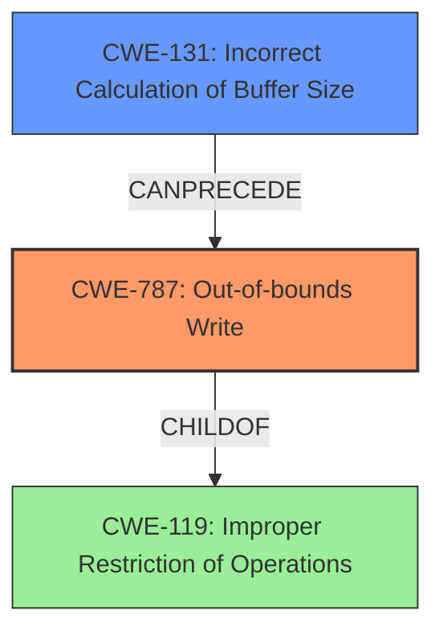

# Analysis Report for CVE-2021-21793

# Vulnerability Analysis Report: CVE-2021-21793

## Description

An out-of-bounds write vulnerability exists in the JPG sof_nb_comp header processing functionality of Accusoft ImageGear 19.8 and 19.9. A specially crafted malformed file can lead to memory corruption. An attacker can provide a malicious file to trigger this vulnerability.

## Vulnerability Description Key Phrases

**Rootcause:** out-of-bounds write
**Impact:** memory corruption
**Vector:** specially crafted malformed file
**Attacker:** attacker
**Product:** Accusoft ImageGear
**Version:** 19.8 and 19.9
**Component:** JPG sof_nb_comp header processing functionality

## Analysis (with Relationship Data)

# Summary
| CWE ID | CWE Name | Confidence | CWE Abstraction Level | CWE Vulnerability Mapping Label | CWE-Vulnerability Mapping Notes |
|---|---|---|---|---|---|
| CWE-787 | Out-of-bounds Write | 1.0 | Base | Allowed | Primary CWE. The root cause is an out-of-bounds write. |
| CWE-131 | Incorrect Calculation of Buffer Size | 0.9 | Base | Allowed | Secondary CWE. The buffer size is incorrectly calculated, leading to the out-of-bounds write. |

## Evidence and Confidence

*   **Confidence Score:** 0.95
*   **Evidence Strength:** HIGH

- **Analysis and Justification:**  
  - *Explanation:* The vulnerability is described as an **out-of-bounds write** in the JPG `sof_nb_comp` header processing functionality of Accusoft ImageGear. The **root cause** is a missing size check when allocating a buffer for color table data. A small buffer (1 byte) is allocated when a value read from the file is null. A subsequent loop writes data exceeding this buffer size, leading to **memory corruption**. This directly matches the description of CWE-787 (Out-of-bounds Write), which is a Base level weakness and is ALLOWED according to MITRE mapping guidance.
  - *Relationship Analysis:* CWE-787 is directly related to buffer overflows and memory corruption issues.

- **Confidence Score:**
  - Confidence: 1.0 (Strong evidence from vulnerability description, root cause analysis, and CVE reference summary.)

---

- **Analysis and Justification:**  
  - *Explanation:* The analysis of the CVE reference links content summary shows that the **incorrect calculation of the buffer size** is a contributing factor to the vulnerability. A buffer of 1 byte is allocated based on an unchecked value from the file. This aligns with CWE-131 (Incorrect Calculation of Buffer Size), which is a Base level weakness and is ALLOWED according to MITRE mapping guidance. The **out-of-bounds write** is a direct consequence of the incorrectly sized buffer.
  - *Relationship Analysis:* CWE-131 can precede CWE-787 since an incorrect buffer size calculation often leads to out-of-bounds writes.

- **Confidence Score:**
  - Confidence: 0.9 (High confidence due to the clear relationship between the incorrect buffer size and the out-of-bounds write.)

---

## Criticism of Analysis

Okay, I've reviewed your analysis and the provided CWE specifications. Here's my critique:

**Overall Assessment:**

The analysis is generally strong and well-reasoned. The primary and secondary CWE assignments are accurate and justified based on the vulnerability description and CVE reference information. The confidence scores are also appropriate. The use of information from the CVE reference links content summary is excellent for providing context and justification.

**Specific Comments and Suggestions:**

*   **CWE-787: Out-of-bounds Write (Primary)**

    *   **Strengths:** The mapping to CWE-787 is the most accurate and critical element of this analysis. The description aligns directly with the core issue: the product writes data outside the bounds of allocated memory.
    *   **Justification:** The provided evidence thoroughly supports the assignment of CWE-787. The vulnerability description explicitly states "out-of-bounds write", and the CVE reference summary confirms that data is written beyond the intended buffer.
    *   **Confidence:** The Confidence of 1.0 is well-deserved given the direct and explicit nature of the vulnerability.
    *   **Mitigations:** You could optionally mention some of the specific mitigation strategies from the CWE-787 specification:
        *   *Language Selection:* Suggest using languages with built-in memory management or overflow protection.
        *   *Libraries/Frameworks:* Suggest using safe string handling libraries.
        *   *Environment Hardening:* Mention compiler-based overflow detection mechanisms.

*   **CWE-131: Incorrect Calculation of Buffer Size (Secondary)**

    *   **Strengths:** Identifying CWE-131 as a contributing factor is accurate. The vulnerability stems from the initial allocation of an insufficient buffer due to missing size checks.
    *   **Justification:** The reference links summary highlights the "incorrect buffer size calculation" directly. The allocation of a 1-byte buffer when a null value is read from the file directly supports this.
    *   **Confidence:** A Confidence level of 0.9 is justified, as it is a crucial contributing factor to the out-of-bounds write.
     *   **Relationship Analysis:** The analysis clearly explains how CWE-131 precedes and enables CWE-787.
    *   **Mitigations:** You could enrich the analysis by including suggestions from the CWE-131 specification:
        *   *Implementation:* Allocate enough memory to handle the largest possible encoding/transformation.
        *   *Implementation:* Validate numeric inputs to ensure they are within the expected range.

*   **Other CWEs to Consider (But Ultimately Correct to Exclude):**

    *   **CWE-119: Improper Restriction of Operations within the Bounds of a Memory Buffer:** As the analysis notes, it's crucial to be more specific than CWE-119.  Mapping guidance for CWE-119 states it should be avoided in favor of more specific CWEs like CWE-787. You correctly chose CWE-787.
    *   **CWE-125: Out-of-bounds Read:** While *memory corruption* is mentioned, the vulnerability explicitly involves a *write*, so excluding CWE-125 is correct.
    *   **CWE-190: Integer Overflow or Wraparound:** It's *possible* an integer overflow *could* be involved in calculating the buffer size, but without specific evidence of this (e.g., an untrusted value being multiplied or added without proper bounds checking), it's best to exclude it. The initial allocation logic based on a null check doesn't directly point to an integer overflow.
    *   **CWE-129/1285/1284: Improper Validation of Array Index/Index, Position, or Offset/Specified Quantity:** These CWEs are related to improper input validation. While improper input validation *is* related to the root cause, CWE-131 is a more accurate and specific description. The core of the vulnerability is not that *an index* is wrong but that the *overall size of the buffer* was calculated incorrectly, leading to a later out-of-bounds access when writing to what *would have been* a valid index if the buffer was sized correctly.

**Suggestions for Improvement:**

1.  **Briefly Mention Mitigations:** While your primary focus is on identifying the CWEs, briefly mentioning 1-2 mitigations for each CWE from the specification would strengthen the analysis and make it more actionable.
2.  **Elaborate Exclusion Reasons:** Even though you chose the correct CWEs, adding a short sentence *explaining why* you excluded some of the other highly ranked CWEs (like CWE-190 or CWE-129) would make the analysis more robust and demonstrate a deeper understanding of the vulnerability.

**Example additions to the analysis (incorporating suggestions):**

**CWE-787:**

```
... (Existing analysis) ...

**Mitigations:**  Applying languages with built-in memory management and utilizing automatic buffer overflow detection mechanisms offered by compilers can mitigate this vulnerability.
```

**CWE-131:**

```
... (Existing analysis) ...

**Mitigations:** This can be mitigated by always validating numeric inputs to ensure they are within the expected range and allocating sufficient memory for the largest possible data transformation.  This includes ensuring the input meets both the minimum and maximum requirements for the expected range.
```

**Overall, your analysis is well-done. Incorporating the suggestions above would make it even more complete and valuable.**

## Final Resolution

# Summary
| CWE ID | CWE Name | Confidence | CWE Abstraction Level | CWE Vulnerability Mapping Label | CWE-Vulnerability Mapping Notes |
|---|---|---|---|---|---|
| **CWE-787** | **Out-of-bounds Write** | 1.0 | Base | Allowed | Primary CWE. The **root cause** is an **out-of-bounds write**. |
| **CWE-131** | **Incorrect Calculation of Buffer Size** | 0.9 | Base | Allowed | Secondary CWE. The buffer size is **incorrectly calculated**, leading to the **out-of-bounds write**. |

## Evidence and Confidence

*   **Confidence Score:** 0.95
*   **Evidence Strength:** HIGH

## Relationship Analysis
The primary relationship influencing the selection is the "CanPrecede" relationship between **CWE-131 (Incorrect Calculation of Buffer Size)** and **CWE-787 (Out-of-bounds Write)**. **Incorrectly calculating the buffer size** leads directly to the possibility of writing beyond the allocated buffer's boundaries. While other CWEs like **CWE-119 (Improper Restriction of Operations within the Bounds of a Memory Buffer)** could be considered, **CWE-787** is more specific and thus more appropriate, as recommended by its mapping guidance. Both **CWE-131** and **CWE-787** are Base level CWEs which is the ideal abstraction level.



## Vulnerability Chain
The vulnerability chain starts with the **incorrect calculation of a buffer size (CWE-131)**. A small buffer (1 byte) is allocated when a value read from the file is null, indicating a missing size check when allocating a buffer for color table data. This leads to an **out-of-bounds write (CWE-787)** when a subsequent loop attempts to write more data than the buffer can hold. The final impact is **memory corruption**, as stated in the vulnerability description.

## Summary of Analysis
The initial analysis and criticism are well-reasoned and accurate. The primary assignment of **CWE-787 (Out-of-bounds Write)** is strongly supported by the vulnerability description, which explicitly states "out-of-bounds write." The secondary assignment of **CWE-131 (Incorrect Calculation of Buffer Size)** is justified by the CVE reference links content summary, which highlights the "incorrect buffer size calculation" as a contributing factor. The relationship between these two CWEs is clear: the **incorrect buffer size** directly leads to the **out-of-bounds write**.

The decision to exclude other potential CWEs like **CWE-119 (Improper Restriction of Operations within the Bounds of a Memory Buffer)** is also correct, as **CWE-787** provides a more specific and accurate description of the vulnerability. While **CWE-119** could broadly apply, the mapping guidance discourages its use when more specific CWEs are available.

The selected CWEs are at the optimal level of specificity, with both being at the Base level. This ensures that the classification is granular enough to accurately represent the **root cause** of the vulnerability while still being general enough to be applicable to a range of similar vulnerabilities. The vulnerability description "An **out-of-bounds write** vulnerability exists in the JPG `sof_nb_comp` header processing functionality of Accusoft ImageGear 19.8 and 19.9. A specially crafted malformed file can lead to **memory corruption**. An attacker can provide a malicious file to trigger this vulnerability" and CVE reference information regarding the **incorrect calculation of the buffer size** provides sufficient evidence.


*Report generated on 2025-03-17 22:52:47*
