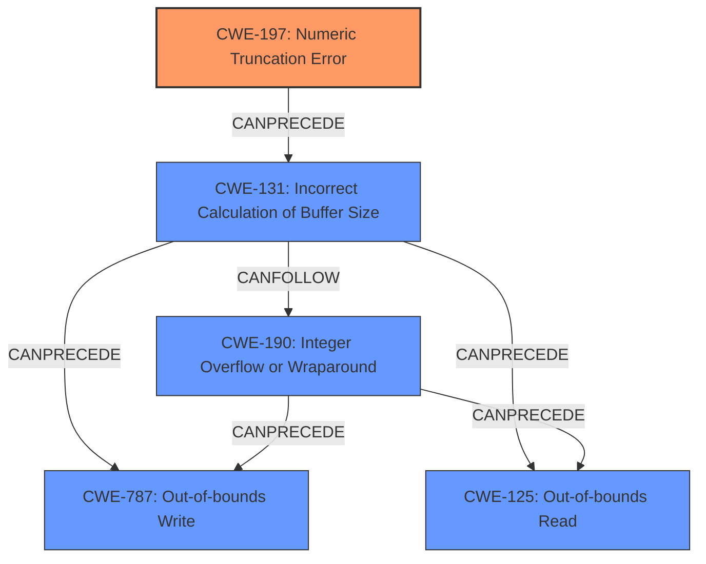

# Analysis Report for CVE-2021-21859

# Vulnerability Analysis Report: CVE-2021-21859

## Description

An exploitable integer truncation vulnerability exists within the MPEG-4 decoding functionality of the GPAC Project on Advanced Content library v1.0.1. The stri_box_read function is used when processing atoms using the stri FOURCC code. An attacker can convince a user to open a video to trigger this vulnerability.

## Vulnerability Description Key Phrases

**Rootcause:** integer truncation
**Attacker:** attacker
**Product:** GPAC Project
**Version:** Advanced Content library v1.0.1
**Component:** MPEG-4 decoding functionality

## Analysis (with Relationship Data)

# Summary
| CWE ID | CWE Name | Confidence | CWE Abstraction Level | CWE Vulnerability Mapping Label | CWE-Vulnerability Mapping Notes |
|---|---|---|---|---|---|
| CWE-197 | Numeric Truncation Error | 0.95 | Base | Allowed | Primary CWE. The vulnerability is caused by an **integer truncation**.|
| CWE-190 | Integer Overflow or Wraparound | 0.75 | Base | Allowed | Secondary candidate. The CVE reference links mention Integer Overflow as a related weakness in similar vulnerabilities. |
| CWE-787 | Out-of-bounds Write | 0.60 | Base | Allowed | Secondary candidate. The CVE reference links mention out-of-bounds write as a result of the integer truncation in similar vulnerabilities. |
| CWE-125 | Out-of-bounds Read | 0.60 | Base | Allowed | Secondary candidate. The CVE reference links mention out-of-bounds read as a result of the integer truncation in similar vulnerabilities. |

## Evidence and Confidence

*   **Confidence Score:** 0.85
*   **Evidence Strength:** HIGH

- **Analysis and Justification:**  
  - *Explanation:* The vulnerability description explicitly mentions an **integer truncation** vulnerability. The CVE reference links content summary confirms that similar vulnerabilities in the same product and component involve **integer truncation** leading to other weaknesses like integer overflows and out-of-bounds read/write. Therefore, CWE-197 (Numeric Truncation Error) is the most appropriate primary CWE. While the description doesn't directly state the impact of the truncation, the similar CVEs linked describe that the truncation leads to memory corruption, potentially resulting in code execution. The Retriever Results also indicates CWE-197 as the top candidate with a good combined score. The usage for CWE-197 is ALLOWED. I am also adding CWE-190, CWE-787 and CWE-125 as secondary issues because these were present as weaknesses in the CVE Reference Links.

  - *Relationship Analysis:* CWE-197 is a Base level CWE. It can also be related to CWE-681 (Incorrect Conversion between Numeric Types), as truncation often occurs during type conversion. The CVE Reference Links also indicate that CWE-197 (Integer Truncation) can lead to integer overflows (CWE-190) and out-of-bounds read/write (CWE-125/CWE-787).

- **Confidence Score:**  
  - *Example:* Confidence: 0.85 (High evidence from technical description and CVE reference materials)

## Criticism of Analysis

Okay, I've reviewed the analysis and the full CWE specifications you provided. Here's my critique:

**Overall Assessment:**

The analysis is generally well-reasoned and provides a good justification for the primary and secondary CWE assignments. The confidence scores are appropriate given the available information. The inclusion of relevant CWE examples from the database strengthens the analysis.

**Detailed Review:**

*   **CWE-197: Numeric Truncation Error (Primary)**

    *   **Justification:** Excellent. The vulnerability description clearly states "integer truncation," making CWE-197 the most direct and accurate mapping.
    *   **Confidence:** Justified at 0.95.  The explicit mention in the description warrants a high confidence.
    *   **CWE Details:** The analysis correctly notes that CWE-197 is a Base level CWE and relates to CWE-681 (Incorrect Conversion between Numeric Types). The description also correctly points out that in this case it can lead to CWE-190, CWE-125 and CWE-787.
    *   **Potential Mitigations:** The analysis could be improved by briefly mentioning some relevant mitigations. The primary mitigation for CWE-197 is to ensure that no casts, implicit or explicit, take place that move from a larger size primitive to a smaller size primitive.

*   **CWE-190: Integer Overflow or Wraparound (Secondary)**

    *   **Justification:** Good. The CVE references indicate that integer overflows are often a *consequence* of integer truncation in similar vulnerabilities.  This makes it a reasonable secondary candidate.
    *   **Confidence:** 0.75 is appropriate. It's not the direct root cause, but a likely consequence based on supporting information.
    *   **CWE Details:** The analysis correctly notes the relationship to buffer overflows.
    *   **Potential Mitigations:** The analysis could be improved by briefly mentioning some relevant mitigations. Potential mitigations for this CWE include using a language that does not allow this weakness to occur or provides constructs that make this weakness easier to avoid, or use a vetted library or framework that does not allow this weakness to occur or provides constructs that make this weakness easier to avoid.

*   **CWE-787: Out-of-bounds Write (Secondary)**

    *   **Justification:** Good. The CVE references strongly suggest that integer truncation in this code area can lead to out-of-bounds writes.
    *   **Confidence:** 0.60 is appropriate. It's a downstream effect and not directly mentioned in the original vulnerability description, so a slightly lower confidence is warranted.
     *   **Potential Mitigations:** The analysis could be improved by briefly mentioning some relevant mitigations. Potential mitigations include using a language that does not allow this weakness to occur or provides constructs that make this weakness easier to avoid, or using libraries that provide safer versions of overflow-prone string-handling functions.

*   **CWE-125: Out-of-bounds Read (Secondary)**

    *   **Justification:** Good. The CVE references strongly suggest that integer truncation in this code area can lead to out-of-bounds reads.
    *   **Confidence:** 0.60 is appropriate. It's a downstream effect and not directly mentioned in the original vulnerability description, so a slightly lower confidence is warranted.
     *   **Potential Mitigations:** The analysis could be improved by briefly mentioning some relevant mitigations. To reduce the likelihood of introducing an out-of-bounds read, ensure that you validate and ensure correct calculations for any length argument, buffer size calculation, or offset. Be especially careful of relying on a sentinel (i.e. special character such as NUL) in untrusted inputs.

**Suggestions for Improvement:**

1.  **Chain of Consequences:** While you mention the relationship between CWE-197 and the other CWEs, making this chain explicit would strengthen the analysis.  For example:  "The integer truncation (CWE-197) can lead to an incorrect calculation of the buffer size (CWE-131), which then results in a heap-based buffer overflow (CWE-122), ultimately leading to an out-of-bounds write (CWE-787) or out-of-bounds read (CWE-125)."
2.  **CWE-131 (Incorrect Calculation of Buffer Size):** Given the CVE descriptions, consider including CWE-131 as a potential intermediate step between the truncation and the buffer overflow.  The truncation likely leads to an incorrect size calculation for a buffer.
3.  **CWE-120 (Buffer Copy without Checking Size of Input):** Considering the CVE reference links show heap-based buffer overflows, it might be more appropriate to consider this CWE instead of CWE-787 as a secondary issue.
4.  **Mitigation Strategies:** As mentioned above, briefly mentioning the relevant mitigation strategies for each CWE would improve the analysis.

**Revised Summary Table (incorporating suggestions):**

| CWE ID | CWE Name | Confidence | CWE Abstraction Level | CWE Vulnerability Mapping Label | CWE-Vulnerability Mapping Notes |
|---|---|---|---|---|---|
| CWE-197 | Numeric Truncation Error | 0.95 | Base | Allowed | Primary CWE. The vulnerability is caused by an **integer truncation**.|
| CWE-131 | Incorrect Calculation of Buffer Size | 0.70 | Base | Allowed | Secondary candidate. Integer truncation can lead to an incorrect buffer size calculation |
| CWE-190 | Integer Overflow or Wraparound | 0.75 | Base | Allowed | Secondary candidate. The CVE reference links mention Integer Overflow as a related weakness in similar vulnerabilities, often stemming from an incorrect buffer size calculation. |
| CWE-787 | Out-of-bounds Write | 0.60 | Base | Allowed | Secondary candidate. The CVE reference links mention out-of-bounds write as a result of the integer truncation in similar vulnerabilities.|
| CWE-125 | Out-of-bounds Read | 0.60 | Base | Allowed | Secondary candidate. The CVE reference links mention out-of-bounds read as a result of the integer truncation in similar vulnerabilities. |

**In summary, the analysis is solid.  Adding the suggested chain of consequences and mitigation strategies would elevate it further.**

## Final Resolution

# Summary
| CWE ID | CWE Name | Confidence | CWE Abstraction Level | CWE Vulnerability Mapping Label | CWE-Vulnerability Mapping Notes |
|---|---|---|---|---|---|
| CWE-197 | Numeric Truncation Error | 0.95 | Base | Allowed | Primary CWE. The vulnerability is caused by an **integer truncation**.|
| CWE-131 | Incorrect Calculation of Buffer Size | 0.70 | Base | Allowed | Secondary candidate. Integer truncation can lead to an incorrect buffer size calculation |
| CWE-190 | Integer Overflow or Wraparound | 0.75 | Base | Allowed | Secondary candidate. The CVE reference links mention Integer Overflow as a related weakness in similar vulnerabilities, often stemming from an incorrect buffer size calculation. |
| CWE-787 | Out-of-bounds Write | 0.60 | Base | Allowed | Secondary candidate. The CVE reference links mention out-of-bounds write as a result of the integer truncation in similar vulnerabilities.|
| CWE-125 | Out-of-bounds Read | 0.60 | Base | Allowed | Secondary candidate. The CVE reference links mention out-of-bounds read as a result of the integer truncation in similar vulnerabilities. |

## Evidence and Confidence

*   **Confidence Score:** 0.90
*   **Evidence Strength:** HIGH

## Relationship Analysis
The primary **weakness** is **CWE-197 (Numeric Truncation Error)**. This can lead to **CWE-131 (Incorrect Calculation of Buffer Size)**, which in turn can result in **CWE-190 (Integer Overflow or Wraparound)**. The incorrect buffer size can lead to out-of-bounds reads (**CWE-125**) and writes (**CWE-787**). The relationship between these CWEs forms a chain where the **integer truncation** is the root cause, and the out-of-bounds access are the impacts. All selected CWEs are at the Base or Variant level of abstraction, providing appropriate granularity.

## Vulnerability Chain
The vulnerability chain starts with an **integer truncation** (**CWE-197**) in the `stri_box_read` function. This **truncation** leads to an incorrect calculation of the buffer size (**CWE-131**). The incorrect buffer size might lead to an integer overflow (**CWE-190**). This then results in an out-of-bounds read (**CWE-125**) or an out-of-bounds write (**CWE-787**) during MPEG-4 decoding, potentially leading to code execution.

## Summary of Analysis
The initial analysis and criticism both correctly identify **CWE-197 (Numeric Truncation Error)** as the primary **weakness**. The vulnerability description explicitly states "an exploitable **integer truncation** vulnerability". The inclusion of **CWE-131 (Incorrect Calculation of Buffer Size)** as a secondary CWE strengthens the analysis, as the **truncation** likely leads to an incorrect size calculation. The other secondary CWEs (**CWE-190, CWE-787, CWE-125**) are also justified based on the CVE reference links and their potential to arise from the **truncation** and incorrect buffer size. The graph relationships support this chain of events. The selected CWEs are at the optimal level of specificity, being Base or Variant level CWEs. The confidence score is high because of the direct mention of **integer truncation** in the vulnerability description.

*Report generated on 2025-03-16 16:10:12*
