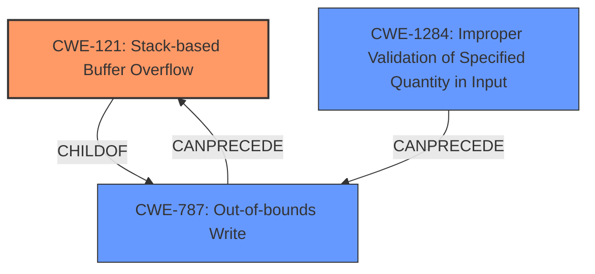

# Final Resolution for CVE-2021-21887

# Summary
| CWE ID | CWE Name | Confidence | CWE Abstraction Level | CWE Vulnerability Mapping Label | CWE-Vulnerability Mapping Notes |
|---|---|---|---|---|---|
| CWE-121 | CWE-121: Stack-based Buffer Overflow | 0.95 | Variant | Primary | The primary **weakness** is a **stack-based buffer overflow** due to the use of `strcat` without proper bounds checking. |
| CWE-787 | CWE-787: Out-of-bounds Write | 0.75 | Base | Secondary | A consequence of the **stack-based buffer overflow**, where data is written beyond the allocated buffer due to the unsafe use of `strcat`. |
| CWE-1284 | CWE-1284: Improper Validation of Specified Quantity in Input | 0.65 | Base | Secondary | A contributing factor as the lack of validation of input parameters' length leads to the buffer overflow. |

## Evidence and Confidence

*   **Confidence Score:** 0.85
*   **Evidence Strength:** HIGH

## Relationship Analysis
The primary **weakness** is CWE-121 (**Stack-based Buffer Overflow**), which is a variant of a buffer overflow. CWE-787 (**Out-of-bounds Write**) describes the mechanism by which the buffer overflow occurs. CWE-1284 (**Improper Validation of Specified Quantity in Input**) describes the lack of input validation that contributes to the **vulnerability**. The relationships show a clear progression: the lack of input validation regarding the quantity of input (CWE-1284) leads to an **out-of-bounds write** (CWE-787), which manifests as a **stack-based buffer overflow** (CWE-121).

## Vulnerability Chain
The chain of **root cause** and **weaknesses** is as follows:
1.  The **root cause** is the use of `strcat` without checking the size of the input.
2.  This leads to CWE-1284 (**Improper Validation of Specified Quantity in Input**), as the length of the input parameters is not validated.
3.  This results in CWE-787 (**Out-of-bounds Write**), as data is written beyond the allocated buffer on the stack.
4.  Finally, this manifests as CWE-121 (**Stack-based Buffer Overflow**).

## Summary of Analysis
The initial analysis correctly identifies CWE-121 as the primary **weakness**. The criticism correctly points out that CWE-20 is too broad and suggests replacing it with CWE-1284. The revised analysis incorporates this suggestion and provides a stronger justification for each CWE. The evidence from the vulnerability description and the CVE reference materials supports the classification. The graph relationships clearly show the progression from lack of input validation to **out-of-bounds write** to **stack-based buffer overflow**. The selected CWEs are at the optimal level of specificity, with CWE-121 being a variant and CWE-787 and CWE-1284 being base-level CWEs.

The decision to use CWE-1284 instead of CWE-20 is based on the CWE guidance to avoid overusing general CWEs when more specific CWEs are available. The description of CWE-1284 accurately reflects the **weakness** in the code, which is the lack of validation of the length of the input parameters.
        
Confidence: 0.85