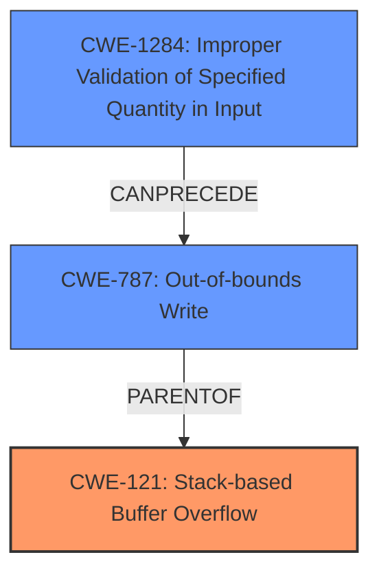

# Final Resolution for CVE-2021-21889

# Summary
| CWE ID | CWE Name | Confidence | CWE Abstraction Level | CWE Vulnerability Mapping Label | CWE-Vulnerability Mapping Notes |
|---|---|---|---|---|---|
| CWE-121 | Stack-based Buffer Overflow | 0.95 | Variant | Allowed | Primary CWE |
| CWE-787 | Out-of-bounds Write | 0.75 | Base | Allowed | Secondary Candidate |
| CWE-1284 | Improper Validation of Specified Quantity in Input | 0.60 | Base | Allowed | Secondary Candidate |

## Evidence and Confidence

*   **Confidence Score:** 0.92
*   **Evidence Strength:** HIGH

## Relationship Analysis
The primary weakness is a **CWE-121 (Stack-based Buffer Overflow)** which is a specific type of **CWE-787 (Out-of-bounds Write)**. **CWE-787** is a parent of **CWE-121**. The lack of input validation, represented by **CWE-1284 (Improper Validation of Specified Quantity in Input)**, allows the attacker to control the size of the input written to the buffer. Thus, **CWE-1284** can precede **CWE-787**, which then leads to **CWE-121**.

## Vulnerability Chain
The vulnerability chain begins with the lack of input validation on the `host` parameter (**CWE-1284**). This leads to an out-of-bounds write (**CWE-787**) when the program attempts to write the oversized input into a fixed-size buffer on the stack, resulting in a stack-based buffer overflow (**CWE-121**).

## Summary of Analysis
The initial analysis correctly identified **CWE-121 (Stack-based Buffer Overflow)** as the primary **WEAKNESS**, given the explicit description of a stack-based overflow vulnerability. The criticism pointed out the speculative nature of including **CWE-190 (Integer Overflow or Wraparound)**, which I agree with. There's no direct evidence to support its involvement.

I have replaced **CWE-190 (Integer Overflow or Wraparound)** with **CWE-1284 (Improper Validation of Specified Quantity in Input)** because the vulnerability description mentions that the "insufficient input validation of the `host` parameter" is a contributing factor. This aligns with **CWE-1284's** definition of failing to validate input quantities.

The vulnerability description states: "A specially crafted HTTP request can lead to remote code execution. An attacker can make an authenticated HTTP request to trigger this vulnerability." This evidence supports the claim that a **ROOTCAUSE**, like **CWE-1284**, is a weakness.

I concur with the reviewer's assessment regarding the use of `sprintf`. The use of `sprintf` is an unsafe practice that contributes to the likelihood of buffer overflows. As the reviewer stated, the inclusion of **CWE-1284** enhances the analysis by addressing a key aspect of the vulnerability: "The core of the vulnerability is the lack of input validation on the `host` parameter."
The revised CWEs are at an optimal level of specificity, with **CWE-121** providing the most specific description of the overflow location and **CWE-1284** identifying the lack of input validation as a contributing factor.